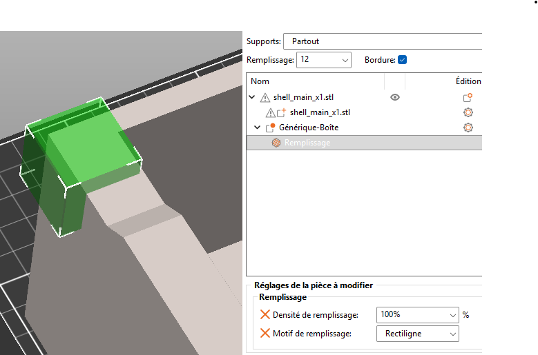

---
date:
  created: 2025-09-17
categories:
  - Logiciels
  - 3D
tags:
  - Logiciels
  - 3D
authors:
  - thomas
slug: software_Prussa
---

# Prussa et imprimante 3D

Prise en main de Prussa et de l'Anycubic kobra 2.  

<!-- more -->

## modification locale de l'infill 

Je compte faire fondre le PLA en certaines zones pour y insérer un fillet pouvant acceuillir une visse. Pour garder un temps d'impression correct la majeur partie de l'impression 3D ce fera à 12% de remplissage.  
On peut ajouter des zones locales à 100% de remplissage.    

   
    
     

## paramètres d'impression  

Dans Prussa sous l'onglet **réglage du filament** indiquer la température de la première couche et des suivantes. Pour l'EcoPLA de 3DJack j'utilise **205 C° pour le filament** et **55 C° pour le plateau**.  
Un **emplissage à 10%** en grille est assez solide.    
Sur l'imprimante je garde une **vitesse de 100%** et une **hauteur en Z de -2.15** c'est Ok d'avoir la fenêtre ouverte pour aérer (je crois que ça poserais problèmes avec l'ABS).  

  
Une **jupe de 3mm** aide à décoller l'impression à la fin.  
  

## routine  
1) nettoyer le plateau à l'alcool isopropylique et chiffon en microfibre où papier ménage.  
2) paramètres auto level. (durée 6 min)   
3) filament -> extruder. 
4) impression.
5) retour de la tête d'impression en position x home.  
6) filament -> retracter  
7) filament -> extruder.

