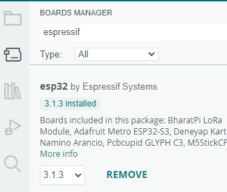
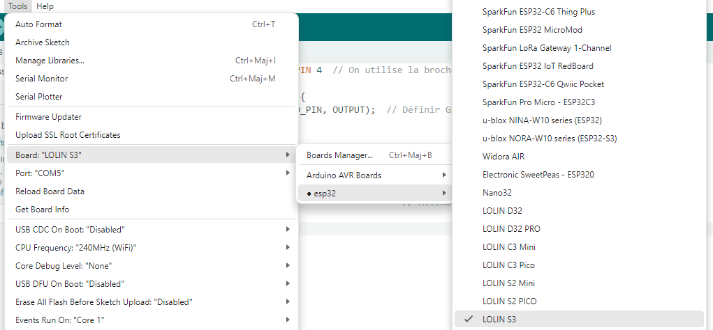
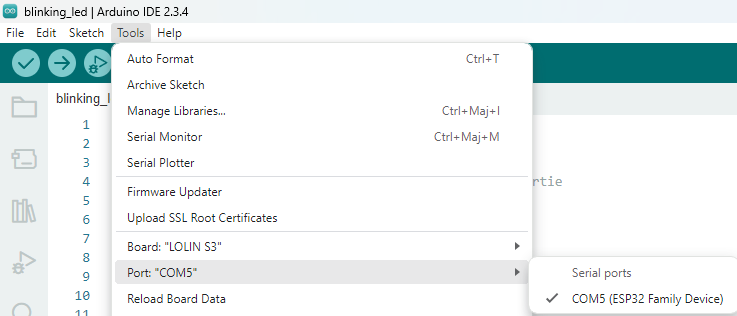
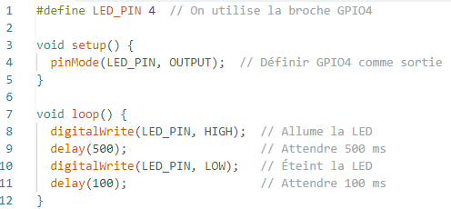
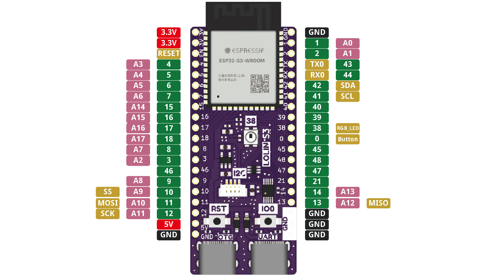

---
date:
  created: 2025-03-09
categories:
  - Logiciels
tags:
  - Logiciel
authors:
  - thomas
slug: Arduino IDE
---

# Arduino IDE set up et utilisatoin 
Initialisation de l'environnement de développement intégré Arduino pour notre ESP32 s3

<!-- more -->

## Set up   

Une fois l'[arduino IDE](https://www.arduino.cc/en/software) téléchargé, il va falloir lui indiquer quel modèle de microcontrôleur on utilise. On est sur un ESP32 S3. 
La nommination correcte est: carte de dévellopement - board - produite par Lolin intégrant un microcontrôleur dévellopé par espressif. 

Il faut télécharger les bibliothèques nécessaires à l'ESP32.  
File -> préférences -> https://dl.espressif.com/dl/package_esp32_index.json
  
installer ESP32 by espressif system  
  
puis dans tool -> board chercher notre modèle d'ESP32, ici le S3 de Lolin  
  
⚠️Reste à lui indiquer le port.  
tool -> port -> 
    
On écrit notre code, ici on défini qu'on travaille avec la pin 4 et qu'on va allumer 500 ms puis éteindre 100ms en boucle  
    
reste à uploader le code. Pour ça il est important de brancher l'ESP32 avec l'USB-C du bas. et de cliquer l'icône avec la flêche.  

## Pin ESP32  
sur le site wemos on retrouve les spécification techniques de tous les modèles d'ESP32

  
