---
date:
  created: 2025-03-15
categories:
  - Composants
  - Electronique
tags:
  - Composants
  - Electronique
authors:
  - thomas
slug: Led RGB WS2812
---

# Arduino IDE /Platform IO et composants

Cet article présente la mise en place de l'IDE arduino pour contrôler différents composants.  

<!-- more -->

## signal PWM - Pulse with modulation  
  
Le signal analogue est un signal nuancé pouvant prendre une large palette de valeurs, alors que le signal digital n'a que deux états: 0 où 1, c'est binaire, 0% où 100%.    


⚠️ en courant continue, pour "nuancer" le courant afin d'allumer une led à 80% d'intensité, on alterner rapidement entre éteint et allumée, en allant assez vite on voit pas les coupures, et la led a baissé son intensité d'éclairage. C'est une technique pour obtenir un résultat analogue avec une méthode digitale. Le temps éteind n'est pas forcément égale au temps allumé, ça dépend de l'intensité souhaité. Ce type de signal s'appelle **PWM**, le ratio de temps allumé/éteind s'appelle le **duty cycle**. Un duty cycle de 80% signifie que dans un cycle la lampe est allumée durant 80% du temps puis éteinte 20%.

## modifier l'intensité d'une led
voici notre montage:  
  

La fonction analogWrite permet d'envoyer un signal PWM, concretement la lampe s'éteint et s'allume très vite, le ratio entre le temps éteind et allumé dépend du 2ème argument de la fonction, c'est le duty cycle. 
   

La fonction analogWrite() ne nous donne pas de contrôle sur la fréquence.
Pour rappel la fréquence c'est le nombre de cycle par seconde.
Si on enlevet le commentaire du code dans la boucle et qu'on enleveait la fonction analogWrite dans le corps de la fonction setup, on pourait gérer la durée des cycles avec les delay.

## installation d'une librairie externe  
Dans cet exemple je récupère la librairie du MPU6050, accéléromètre 3 axes incluant un gyroscope sur [github](https://github.com/jarzebski/Arduino-MPU6050).  
je dézipe le dossier et le stock soit dans le dossier Arduino -> Libraries qui a été crée sur mon ordinateur lors de l'installation de l'IDE si je veux pouvoir accéder à cette librairie depuis n'importe quel projet sur mon ordinateur (global) où dans un dossier dédier à mon projet (local) si je souhaite ensuite en faire un repository et le partager sur Git.
Il faut ensuite ajouter #include "libs/MPU6050/MPU6050.h" // On indique le chemin relatif.    
On peut maintenant utiliser les fonctions de la librairie.     
      
L'inconvénient c'est que l'on a pas les fichiers .ino d'exemple comme lorsque l'on passe par la libraire d'Arduino IDE (global)

## inclure une librarie dans Arduino IDE
Attention si la librairie ne contient pas un fichier "library.properties" on ne verra pas la librairie dans le menu librairie de la barre latéral gauche. Pour que les exemples apparaissent dans Fichier > Exemples, le dossier à l'intérieur de la librairie doit s'appeler exactement examples (au pluriel, tout en minuscule).  

Si l'on souhaite que la librairie soit accessible à tous les futures projets arduino sur cet ordinateur on peut opter pour l'installation global, va Sketch -> include Library -> add .ZIP Library. Cela va dézipper la librairie qu'on lui indique dans le dossier Arduino -> Libraries crée lors de l'installation de l'Arduino IDE.   
  
      
Avantage: on a accès aux exemples.
 
## activer une librairie inclue dans l'Arduino IDE
dans l'onglet library chercher NeoPixel d'adafruit    
  
  
On peut ouvrir un projet simple en cliquand sur les 3 petits poins->Examples->simple   
 
Il va mainenant faloir l'inclure, pour ce faire on retourne dans Sketch -> Include Library -> choisir la librairie.  
Attention, ça la fait pas apparaître dans le library manager (icone de livre dans la barre de gauche) ça c'est réservées pour les librairies qui viennent avec l'IDE

Comme on le voit la librairie est incluse dans le projet.
  
Ici on a défini sur quelle pin est câblée la led et on peut définir sa teinte avec pixels.Color(), ici 20/255 de bleu.   

## configurer et flasher le programme  
Arduino IDE a besoin de savoir quel système va acceuillir le programme, via quel port le système est câblé et quel est la vitesse d'update du moniteur.  
Pour la **board de développement**, la sélectionner dans la liste:  
  
Pareil pour le **port**:      
    
Pour la **baud rate** (nombre de bits échangés à la seconde) il faut l'indiquer en tant qu'argument de **Serial.begin()** et sélectionner le même nombre dans le **serial monitor**.
  

## Layers entre l'éditeur de code et le processeur

Arduino IDE est une manière simplifiée de programmer l'ESP32, bien que ESP IDF y soit inclus, il est caché et difficilement accessible. Il y a beaucoup de choses qui sont faites sans qu'on le remarque, automatiquement en arrière plan. L'avantage de retirer la complexité c'est que c'est plus simple, on a moins de choses sur lesquelles se concentrer. L'inconvénient c'est qu'on a moins de contrôle, il y a une perte de finesse et une certaine limitation dans ce qui est faisable.  

ESP IDF est beaucoup plus proche de l'ESP32 (plus "bare metal"), on peut mettre en place FreeRTOS pour le pseudo temps réel, gérer les interruptions etc. L'inconvénient, en plus d'être plus difficile, c'est qu'il a beaucoup moins de bibliothèques écrites par la communautée qu'Arduino.  

Pour tirer le meilleur des deux mondes on peut utiliser Visual Studio Code avec l'extension PlatformIO.  
Il s'agit d'un gestionnaire de construction (Build System), il nous permet d'utiliser le framework arduino, ainsi que les fonctionalités et l'accès aux paramètres plus fins d'ESP IDF.  

Il y a encore une dernière couche avant le processeur: Le HAL (Hardware Abstraction Laye). C'est le layer qui s'occupe d'activer les bon transistors et zones mémoires à partir de notre code, (bare metal) Le HAL adapte le code au microprocesseur, grâce à lui on pourrait par exemple le porter d'un ESP32 vers un STM32.    

Le schéma suivant présente les différentes configurations expérimentés.  
    
A gauche la version la plus complète, permettant l'accès aux librairies Arduino et les fonctions natives de l'ESP.  
Au milieu ce que j'ai utilisé pour le Timer, on enlève la couche de simplification Arduino. On doit construire le code un peu différement, comme point de départ on a pas void setup() où void loop() mais app_main().  
A droite ce que j'utilise pour tester rapidement un composant et sa bibliothèque.  
!! Arduino IDE et Arduino sont deux choses différentes  

  
Pour rappel une API c'est les commandes valides au sein du Framework, les fonctions préfaites inclues dans le framework  
Un wrapper c'est un framework simple qui enveloppe un framework plus complexe afin de présenter une interface plus simple (pour masquer la complexité)      

-> On utilises l'IDE VS Code, le Build System PlatformIO, pour appeler l'API d'une librairie tierce au sein du Framework ESP IDF inclu dans le Framework Arduino(wrapper).

## Mise en place de PlatformIO
   

## Création de projet avec PlatformIO et utilisation
Création d'un nouveau projet avec PlatformIO, comme les images ci dessous l'indique, il faut choisir notre board de développement. Le dossier crée contient tous les sous dossiers nécessaires au développement (include, lib, src etc...) Il se situe dans [user]\Documents\PlatformIO\Projects. De mon côté je vais le déplacer dans le dossier relatif à mon projet de stabilisateur.
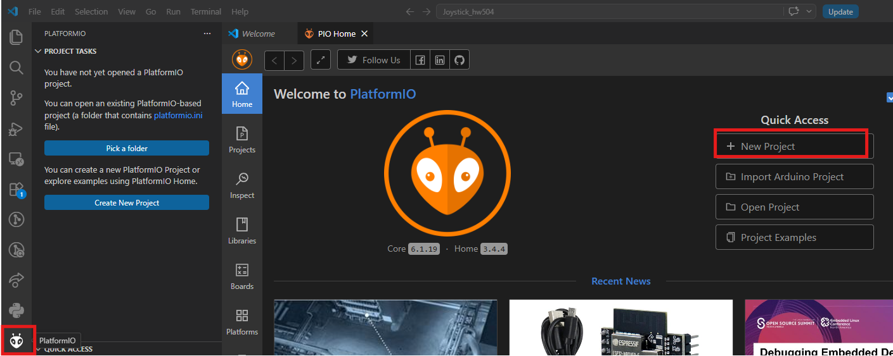    
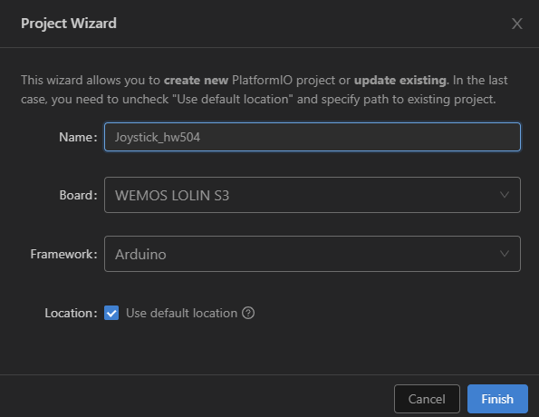    
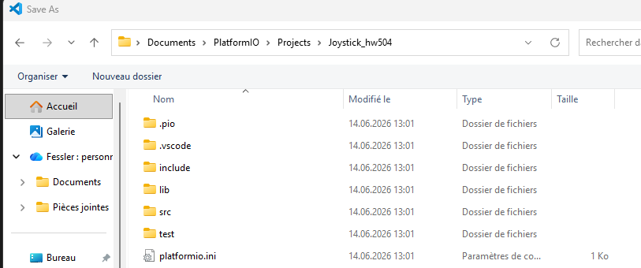  

Pour ne pas s'emêler les pinceau entre l'interface d'ESP IDF et PlatformIO, on peut désactiver ESP IDF:  
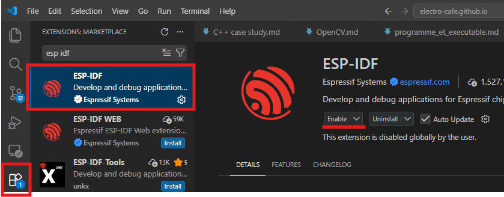  

On configure la baud rate dans le fichier PlatformIO.ini
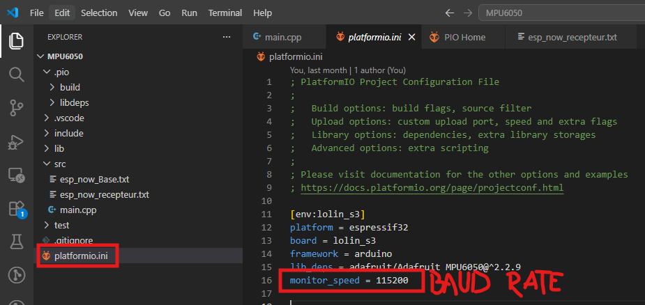   

barre de commandes PlatformIO:  
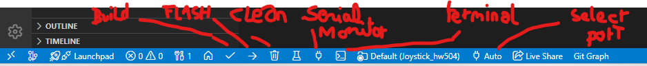  

Ajoute de librairie. PlatformIo cherche la librairie dans notre ordianteur , si il ne la trouve pas il la télécharge et met à jour les fichiers du projet pour qu'on puisse l'utiliser.
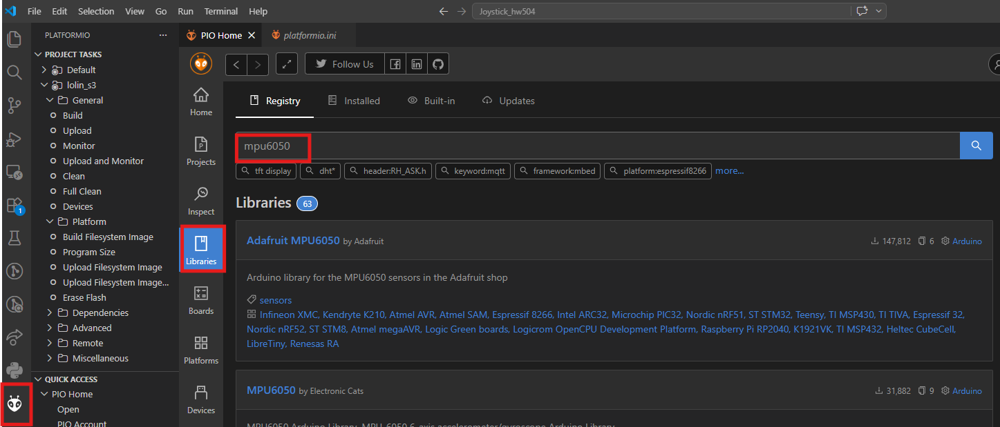  

Contrairement à ESP-IDF, PlatformIO n'utilise pas de fichier CMakeList.txt. A la place, on a le fichier platformio.ini qui gère les bibliothèque, la baud rate, etc. Autre avantage, grâce à lib_deps on peut indiquer le nom et la version de la bibliothèque et PlatformIO se charge d'aller sur le web et de la télécharger. On peut aussi y définir des variables globales avec build_flags et changer / gérer plusieurs board de dev au sein du même fichier. 

## Serial monitor  
Il s'agit d'un outil permettant de voir ce qui se passe dans le microprocesseur de notre ESP 32 où autre board, pour autant que l'on aie utilisé des **Serial.println()** ou **std::cout** dans notre code. Et que le code soit en train de tourner sur notre microprocesseur.
C'est pour ça qu'il faut lui fournir l'emplacement du microprocesseur (ex COM3) la baud rate.
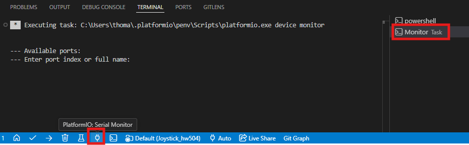  

## Teleplot
Cette extension de Visual studio code permet de visualiser une suite de valeurs dans le temps sous forme de courbe. On a ainsi un graph qui facilite le debuggage.
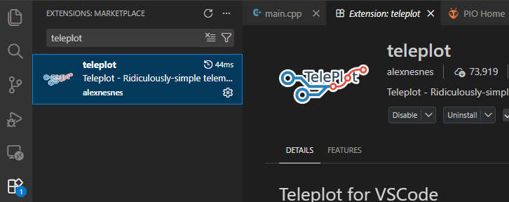  
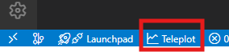  

**ne fonctionne pas si le Serial monitor est ouvert** (une seul entité peut l'écouter le port série à la fois).  
On ne **peut pas flasher ni utiliser le serial monitor lorsque teleplot est ouvert**, il faut cliquer sur close afin de pouvoir flasher le code modifié.
Ne fonctionne pas si le cable USB-C qui relie l'ordinateur à l'ESP lolin S3 est branché dans le port UART.

Pour utiliser teleplot il faut utiliser cette syntaxe: >nom_de_la_courbe:valeur en combinaison avec un Serial.print et un Serial.println.  
">" indique à  teleplot qu'il doit utiliser ce qui va suivre pour faire un graph. Sans lui on a les infos sous forme de texte.  
"nom_de_la_courbe" à nous de donner le nom que l'on souhaite à notre courbe. 
":" séparateur qui indique que la désignation de la courbe est finie et que ce qui suit est la valeur à tracer.  
"valeur" la variable que l'on veut voir évoluer dans le graph.  
exemple:    
```cpp
Serial.print(">mycurve:");
Serial.println(myvariable);
```     

Sélectionner le serial port 
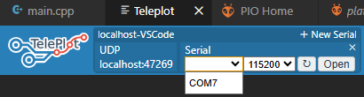
Dans cet exemple une partie du code dédié à teleplot ne comporte pas de chevron > c'est pour ça qu'on a aussi des valeurs sous forme textuelle.  
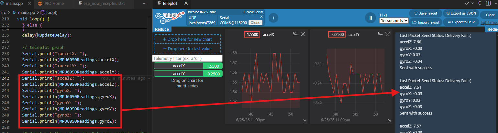  

Les graph adaptent leur échelle y à la plus haute valeur enregistré, c'est embêtant de se retrouver avec plusieurs graph liés au même capteurs mais avec des échelles différentes.
 On peut régler ça en glissant les graph dans le même graph afin qu'ils partagent la même échelle.  
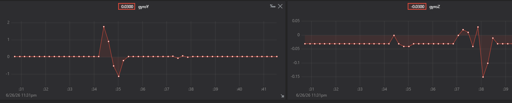
On peut zoomer dans un graph avec clic + drag et revenir au niveau initial avec double clic.
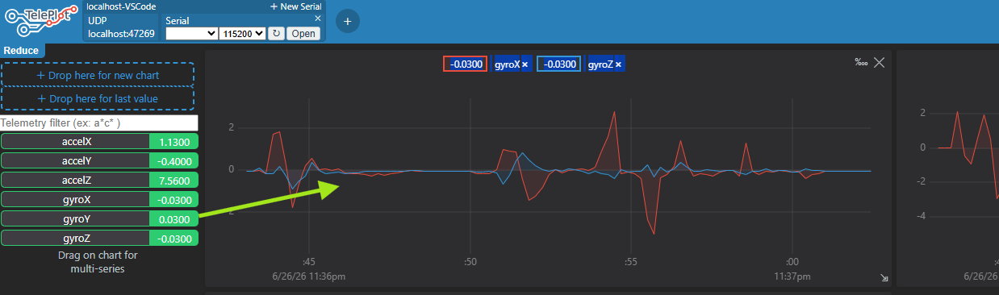

## Questions

Je m'attendais à mesurer 3.3v dans l'exemple avec la diode pourquoi le multimètre me donne t'il une valeur inférieur ?
>le signal PWM et l'intensité défini dans **analogWrite(LED_PIN, 20)** font que le multimètre nous donne la valeur moyenne de la tenssion (un oscilloscope nous donnerait la valeur en fonction du temps et on verrait 0v puis 3.3v etc)  

Quelle est la fréquence de pulsation ?
>ça dépend de la méthode, avec un signal PWM on a pas la main dessus, à priori 5000 herz soit 5000 cycles par secondes 

comment chainer 2 led au niveau du câblage ?  
>simplement relier les sorties dout de la 1ère led à la 2ème. J'étais confus sur quoi faire avec les sorties dout de la 2ème led, il ne faut pas les relier au gnd.   
 
  

Pourquoi les WS2812 n'on pas de résistance dans le circuit comme avec la diode ?
>En fait il ne s'agit pas d'une simple led, il y a un contrôleur intégré possèdent un circuit interne qui contrôle la tension, le signal PWM et l'ampérage de chaque led qui la compose (afin de produire les couleurs rvb elles ne sont pas identiques au niveau de leur composants). Elles nécessitent entre 1.8v et 3.4v (rvb n'ont pas les même besoins) avec 20 ampères par couleur.  

Les leds WS2812 sont elles en parralèle où en série ?
>3 choses portent à confusion:  
-- les 3 Leds r g et b composant la WS2812 sont connectés en série, les modules WS2812 sont connectés en parallèle. Sur internet on dit qu'on les daisy chain.  

>-- le fait que les fils entrent dans le module puis en ressortent pour entrer dans le prochain module, visuellement on dirait qu'elles sont branchées en série car on ne vois pas de noeud / boucle. 
Pourtant lorsque l'on mesure la résistance de l'entrée de l'allimentation et sa sortie avec l'ohm mètre on a un signal qui nous dit que ça communique. On peut donc représenter la connection comme ceci:

> 
(on a représenté que l'alimentation)

 
Ici le câblage prête un peu moins à confusion.

> le câble transmettant le signal de donné (fil du milieu) est connecté en série.  

chaque element de ws2812 reçoit 5v car elles sont en parallèle. si elles étaient en série elles auraient  combien ? 

>  $$
    \frac {\text{tension totale}}{\text{nombre d'élément}} 
  $$

## Utilisation d'un bouton 3 points

Le but est de modifier le comportement de la led en fonction de la position du bouton 3 points.  
Il va falloir définir une fonction pour chaque position du bouton et câbler les éléments correctement.  
On va asigner une pin à un booléan, si elle lit une valeur de courant élevé (HIGH) le bool est true, si elle lit une valeur basse (LOW) il est false.
Il existe un seuil à partir duquel la valeur est HIGH où LOW on peut le consulter page 53 de la [documentation de l'Esp32 par Espressif]( https://www.espressif.com/sites/default/files/documentation/esp32_datasheet_en.pdf)
Pour 3.3V entre **75 - 100%** du voltage on lit **HIGH**, entre **0 - 25%** on lit **LOW**.    

Si la pin n'est relié à rien la présence de champ electromagnétique peut influencer la valeur lue par le microprocesseur. On dit que la valeur est **flottante**.  
  
  
.

On peut faire un montage avec une résistance après l'alimentation, on parle de **pull up** car on tire la tension vers le haut dans la lecture de la pin lorsque le circuit est ouvert
 
. 


Où mettre la résistance avant l'alimentation, on parle de **pull down** car on tire la tension vers le bas dans la lecture de la pin lorsque le circuit est ouvert
    
.
 

Dans la pratique l'Esp32 a des **résistance interne**. Il faut par contre définir si la pine est au bénéfice d'une résistance pull up où pull down.

  

.

Voici comment cabler notre interupteur 3 points en pull down si l'on n'utilise pas de pull down interne  
  

Voici le schéma de montage 
  

##Diviseur de tension
notre montage resemble à un diviseur de tension


  
.

Voici comment la 1ère et la 2ème résistance influence la tension intermédiaire
  
.

Démonstration de la formule du diviseur de tension
  

## MPU6050
accéléromètre incluant un gyroscope.
les sorties SCL SDA permettent d'échanger les données du gyroscope vers notre board de dévloppement, On appelle ça le bus I2C.  
Le SDA pour Serial DAta, transmet les données d'angles et d'accélération, le SCL pour Serial CLock, est l'horloge qui donne le rythme afin que le MPU et l'ESP32S3 se synchronisent. ça permet de lire les données au bon rythme, sans quoi le SDA serait illisible.
La sortie INT transmet un signal beaucoup moins complexe que SDA SCL, juste Haut où Bas (en fonction du voltage). ça sert à informer l'ESP32 qu'on a des données pour lui, ainsi on peut le décharger de l'écoute du MPU6050 quand on en a pas besoin et il peut faire autre chose. Cette pin permet également à l'ESP32 de vider la mémoire FIFO (First in, first out) du MPU6050 et ainsi lire les données les plus récentes (car FIFO c'est que la 1ère donées que l'on lit est la 1ère à avoir été stocké, ce qui en fait la plus ancienne).  
Le MPU possède un DMP (Digital Motion Processor), cette unitée de calcul utilise un algorithme proche du filtre de Kalman pour filter le bruit (fausses mesures) et tirer le meilleur du compo accéléromètre (stable à long terme mais bruyant à court terme) et gyroscope (précis à court terme mais qui dérive dans le temps). La librairie d'ElectronicCats possède une fonction qui utilise le DMP

## GM5208  
C'est un moteur triphasé (il doit être alimenté via 3 phases avec du courant alternatif dont les pics sont décallés), la modulation du courant dans les bobines fait tourner le champ magnétique interne ce qui entraine le mouvement du moteur. Si il indique 0.09 Ampères d'intensité dans sa datasheet, cette valeur n'est pas tout à fait exacte car elle s'applique quand le moteur est en mouvement. Il a une crête plus élevé lors du démarage car comme les aimants ne bougent pas encore par rapport aux bobines, aucune force contre électromotrice n'est créée pour s'opposer au courant. La seule chose qui limite le courant, c'est la toute petite résistance électrique du fil de cuivre de ta bobine. Résultat : le courant s'engouffre au maximum, l'ampérage explose. C'est d'ailleurs pour cela que si tu bloques l'axe d'un moteur avec tes doigts pendant qu'il est alimenté, il se met à chauffer très vite et peut griller : en l'empêchant de tourner, tu annules la FCEM, et le courant explose à nouveau comme au démarrage, mais cette fois-ci en continu !
24N / 22P, cela signigie 24 Nail, soit 24 bobines dans la partie fixe (stator) et 22 Poles sur le rotor. ce ratio élevé permet un couple élevé à basse vitesse et un mouvement fluide.  
AWG 24, American Wire Gauge, c'est une norme internationale de diamètre des fil de cuivre. 24 correspond à environ 0.5mm de diamètre. Plus le numéro AWG est grand plus le fil est fin. Plus le fil est fin plus la résistance est grande.
Fonctionne avec 20V, 0.09A à vide et 1A en charge. Puissance = 20*1 = 20 watt heure lorsqu'il tourne avec une charge. Si on l'alimente avec une batterie de 20V 2000 mAh on peut calculer l'autonomie comme suit: Autonomie = Puissance moteur / Puissance batterie. On a dit que notre batterie fait 2000 mAh (miliampère heure), on peut mulitplier par 1000 pour obtenir des ampère heure. Ce qui fait 20V * 2Ah = 40 Watt heures.  Autonomie: 40 Wh / 20 W = 2H. Les micro ajustement du moteur consomment probablement moins que si il tournait en continu donc l'autonomie sera plus élevée.

Le code commenté de la librairy SimpleFOC (voir articl C++ case study) explique ce qui se passe au niveau du champ magnétique et du voltage dans le moteur. Pour faire simple on défini le voltage max.  

⚠️Attention: Si on utilise l'exemple open loop de la librairie OpenLoop on ne peut pas connaître l'ampérage au sein du moteur donc si on l'utilise il faut insérer des valeurs basses et ne pas chercher la vitesse afin de ne pas l'endommager où le bruller.

On peut combiner différentes board SimpleFoc avec différent senseur et microcontrôleur.  
Je vais essayer de partir sur la simpleFOC Shield car elle permet de mesurer le courant dans le moteur plutôt que de l'estimer. ceci afin de mettre en place un système évitant que le moteur tire trop d'énergie et surchauffe (ce qui peut arriver si le moteur bloque mais que le programme ne le voit pas, alors il n'y a plus de FCEM mais le programme fournit le voltage en quantité afin de contrer la FCEM qu'il s'attend a avoir dans le moteur) L'ESP32 support la manière Inline du controler pour lire le courant. On partira donc sur la librairie current_sense -> InlineCurrentSense.cpp/h   

Avant d'attaquer le code il faut récolter ces données physiques:
**max ampérage du moteur**:  
**max voltage du moteur**:  
**résistance phases du moteur**:  15 ohm. Obtenu avec un multimètre entre 2 phases du moteur. Le problème c'est qu'il faut savoir si il est câblé en étoile où delta et modifier cette valeur respectivement en la divisant par 2 où multipliant par 1.5. Si le fabriquant de le dit pas il faut le tester avec la valeur comme si il est en étoile 

**KV rating** (vitesse du moteur à vide par volte):  Se mesure avec un encodeur et sert à optimiser les dernier pourcent de performance (vitesse et torque) quand le moteur est poussé dans ses retranchements. si on en a pas d'encodeur, on peut prendre le RPM moyen du moteur et le divisé par le volatge du moteur. 416/20 = 21.     

**Inductance**(décrit le courant qui est "stocké" dans le champ magnétique.) paramètre le moins important. On peut le laisser tombier si le fournisseur ne le fournit pas. C'est utile uniquement si on veut maximiser les performances de vitesse.

[mesurer paramètres physiques du moteur + test des valeurs mesurées](https://docs.simplefoc.com/phase_resistance)


[configuration physique par soudure SimpleFOC Shield](https://docs.simplefoc.com/pads_soldering_v3)

[choix, mesure et marche a suivre SimpleFOC](https://docs.simplefoc.com/estimated_current_mode#pure-voltage-control)
Partir sur le mode: Estimated current control with Back-EMF compensation

[implémentation d'un sensor personalisé](https://docs.simplefoc.com/generic_sensor)

[batterie](https://www.galaxus.ch/fr/s1/product/noname-batterie-1-pcs-specifique-a-lappareil-3400-mah-batteries-piles-23547688)


## SimpleFOCmini 
Board open source née du projet SimpleFOC, j'en ai acheté une du fabriquant DFRobot (référence DRI0058), c'est un pilote de moteur à courant continu sans balais (BLDC -> brushless direct current) basé sur la technique de contrôle en champ orienté (Field oriented control). Contrairement aux contrôleurs sans balais traditionnels (ESCs) qui utilisent la commutation par bloc, la carte hache le courant via PWM afin que l'évolution de sa tension soit similaire à une courbe sinusoîdale, comme l'on aurait avec du courant alternatif. Elle décale les phases du courant des câbles d'alimentation pour générer un champ magnétique tournant au sein du moteu. Elle peut contrôler une variété de moteur demandant entre 8 et 30volts avec un ampérage max. de 2.5A par phase.
Ce modèle est supporté par la librairie Arduino SimpleFOClibrary.  

Générer un dossier de projet avec la librairie simpleFOC via PlatformIO : 
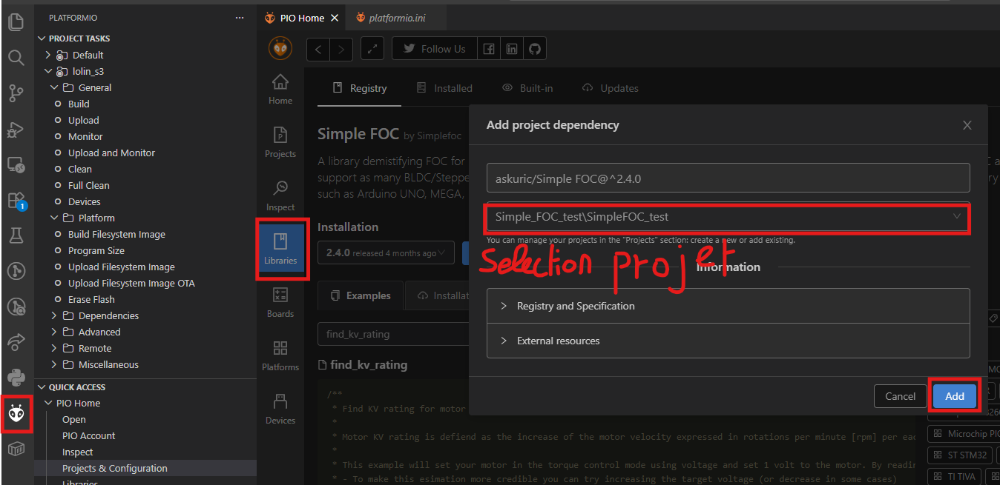  
Lorsqu'on ouvre le dossier ainsi crée, on voit bien que les fichiers de la librairie sont présent. Il faut cependant ajouter la ligne **lib_archive = false** dans le fichier .ini afin que la compilation se passe sans accros avec PlatformIO. Je change aussi la ligne "lib_deps = askuric/Simple FOC@^2.4.0" pour "**askuric/Simple FOC @ 2.3.2**", ceci afin de ne pas avoir de problème de compatibilité de version. SimpleFOC 2.4.0 a besoin de ESP-IDF 5.x mais PlatformIO ne l'a pas encore intégré. En retrograndant SimpleFOC pour la 2.3.2, la version d'ESP-IDF présente sur platform IO est compatible:
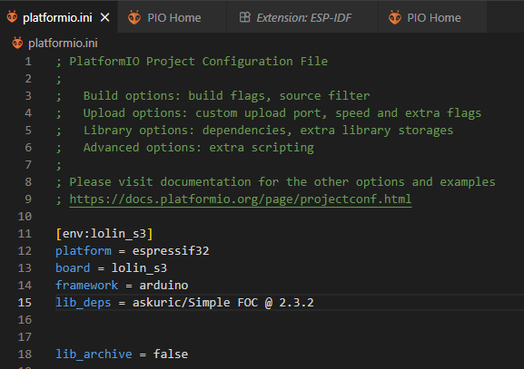  
On remarquera que le dossier lib est vide, la librairie simpleFOC et les exemple se situe en fait dans le dossier **.pio**, ceci afin de ne pas "polluer la librairie"
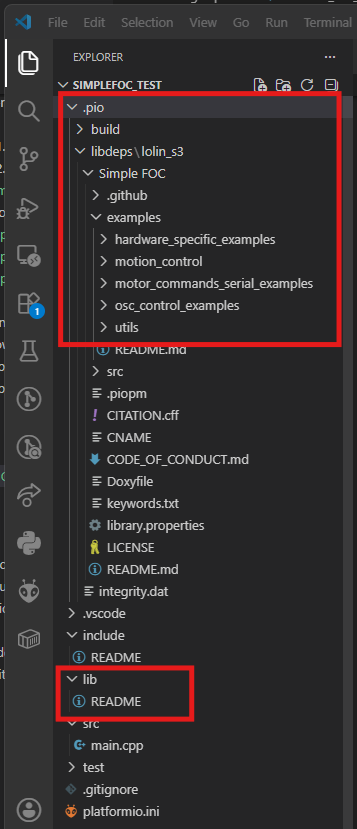  
L'idée derrière cela c'est que le fichier .ini télécharge les librairies indiquées à la compilation. Ainsi on peut partager notre projet avec quelqu'un ne possédant pas la librairie sur son ordinateur. Cela permet également de séparer les librairies provenant de l'extérieur de celles que l'on a écrit soi même que l'on rangera dans lib.  

Maintenant que tout est en place on peut parcourir les exemple pour comprendre comment marche et ce que peut faire simpleFOC. Rien qu'avec le nom des fichiers d'exemple on comprend que le contrôle se base sur la lecture des capteurs d'encodage de position (perso je m'en passerai, c'est mon gyroscope MPU6050 qui dira au moteur de tourner / de se stopper), l'angle de rotation (ex: tourne de 20 degrés), la vélocité de la rotation et le torque (le couple aka la force). Il faudra aussi voir si le moteur va le plus vite possible à sa position puis s'arrête net, du fait de l'inertie il continuera sa cours et il faudra le faire tourner en sens inverse pour compenser l'overshoot. L'autre méthode est de faire baisser la vitesse du moteur lorsqu'il arrive proche de sa destination, c'est possible grâce au régulateur PID (Proportional Integral Derivative) de simpleFOC, un algorithme qui ajuste la vitesse.

Je compte utiliser ESP Now pour la communication sans fil entre le joystick de commande et les moteurs mais il est aussi possible de les controller via OSC (voir les bibliothèque osc_control_examples).  
OSC (Open Sound Control) permet à notre ESP de se connecter au réseau Wi-Fi où de créer son propre point d'accès Wifi dans les 2 cas notre smartphone peut aussi s'y connecter. La différence avec ESP-Now c'est qu'on dépend du wifi. l'avantage c'est que notre smartphone peut venir se greffer dans la boucle et l'on profite alors d'une interface graphique.  

[installation SimpleFOC sur platform IO]( https://docs.simplefoc.com/library_platformio)

## PeakTech 6226
Alimentation de labo pouvant fournir 0-30 V et 0 - 5 A de courant continu.  
Les molettes de réglage peuvent être pressées pour modifier les dixième de l'untité.    
Presser les 2 molettes durant 3 secondes permet de verrouiller les réglages.  
Le bouton output permet de basculer entre C.V. (constant voltage) et C.C (constant current) ainsi que de délivrer le courant dans le système relié au PeakTech. Si il n'y a pas de charge connectée. Output n'affichera pas l'ampérage, uniquement le voltage.   
Le mode courant constant signifie que l'alimentation de labo fera baisser la tension pour maintenir l'ampérage à son niveau. Un changement d'ampérage peut survenir si la résistance de la charge change. En fait le mode C.C. s'active que quand la valeur d'ampérage tirée par le composant dépasse le plafond fixé.  
Le mode C.V. fait l'inverse, il maintient la tension fixe en abaissant/relevant l'ampérage.

Attention avec les moteurs électriques: leur rotation peut créer une forece contre électromagnétique capable d'endomager le PeakTech lorsqu'ils y sont reliés si il n'y a pas un driver avec des capacitor où une diode fly wheel capable d'absorber le choc. Voici les 2 cas de figure pouvant générer une FCEM:  
-> pas d'alimentation de la part du PeakTech, nous faisons tourner rapidement le moteur à la main. Il agit comme un générateur et envoie un courant en amont.   
-> Le PeakTech alimente le moteur et le fait tourner rapidement, si on baisse rapidement la tension, l'inertie transforme le moteur en générateur.  

Marche à suivre alimentation et désalimentation moteur:  

-> Allumer la machine via le bouton ON/OFF.    
-> sélectionner la tension / l'ampérage et le mode C.V. ou C.C.
-> Brancher le moteur.  
-> Appuyer sur le bouton Output. ça va faire le lien entre le PeakTech et le composant.  
-> Activer le mouvement du moteur via le logiciel qui le contrôle.    
.  
.  Pour modifier le courant et la tension tourner **lentement** les molettes et bien vérifier quel chiffre clignote. Puisque la molette controle les unités et les dizaines.
.  
-> Stopper le mouvement du moteur via le logiciel qui le contrôle.  
-> Appuyer sur le bouton Output. ça va désolidariser l'électronique du Peaktech. Le moteur est maintenant isolé.  
-> Débrancher le moteur.
-> Éteignez la machine via le bouton ON/OFF.  

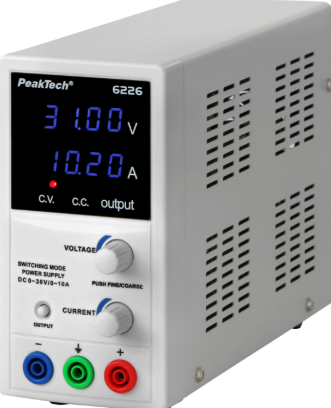  


## HW 504 joystick
composé de 2 potentiomètre et d'un bouton. Au niveau du pinout **VRX** et **VRY** retournent la valeur analogique des potentiomètres sur l'axe x et y. Pour rappel un potentiomètre contient une lanquette se déplaçant sur une piste résistante. Plus la languette (qui fait office de sortie) est loin de l'entrée de la piste résistante, plus la tension du courant baisse. **SW** est le bouton.
On va relier VRX et VRY à des pins ADC (Analog Digital Converters) de notre ESP32 ça nous permettra de convertir la valeur analogique mesurée (la tension) en valeur digitale. On ne peut pas lire des valeurs de tension supérieur à 3.3V. On a une plage de 4095 int pour exprimer la tension, comme nous le montre ce graph, l'ADC n'est pas linéaire. L'esp ne fait pas la différence entre 0 et 0.1V, cette plage se voit attribuée la valeur 0. Pareil pour 3.2 et 3.3V qui partagent la valeur 4095. Consulter la datasheet pinout du modèle d'ESP ou Arduino pour voir quelles pins sont ADC
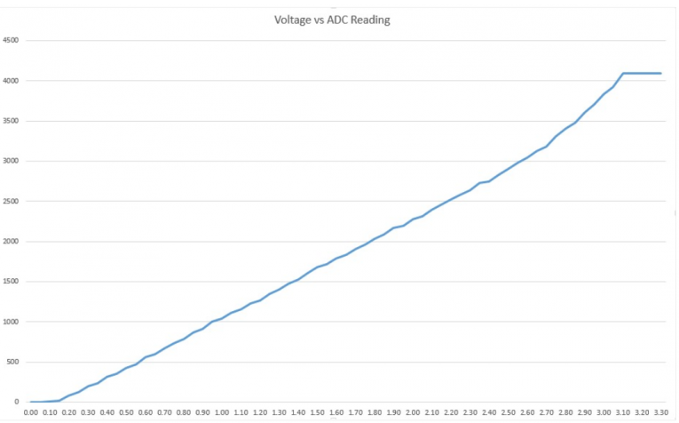  

<figcaption>Ceci est le commentaire dans le rectangle grisé sous l'image.</figcaption>
</figure>