---
date:
  created: 2026-05-25
categories:
  - site
  - AR
tags:
  - site
  - AR
authors:
  - thomas
slug: AR

draft: true 
---

enlever draft: true pour afficher en ligne

# 8th Wall augmented réality
début 2026 8th wall est passé opensource, permettant de créer une expérience AR sans abonnement.

<!-- more -->
 
## Set up
Pour commencer se rendre sur le site [8th wall](https://adresseduliens.ch) pour télécharger le programme.  
[j'ai suivi les instructions d'installation mais je n'arrive plus à les retrouver, peut etre sont elle disponible uniquement au moment du téléchargement de 8th wall ?]
Il nous faudra également [node.js](https://nodejs.org/fr/download) qui est disponible sur ce site. Je l'ai téléchargé avec ces options:
   

## 8th wall desktop  
On retrouve des formes primitives dans l'onglet de gauche. Les traductions françaises sont mauvaises (avion à la place de plan).  
Afin que notre smartphone se comporte comme la caméra dans la scène 3D il faut mettre cete dernière en mode **monde AR**.  
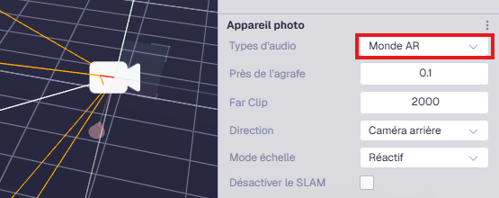   

## Import de modèle 3D personalisé
Dans blender, exporter notre mesh en .glb, gITF binary et embeded fonctionnent
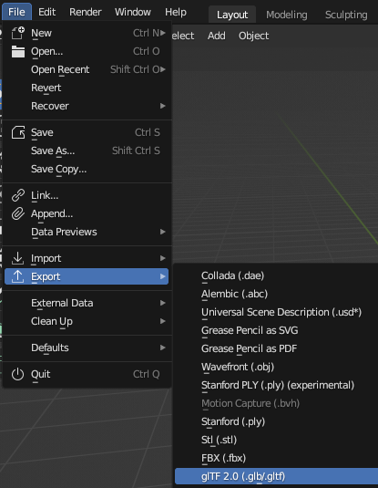  
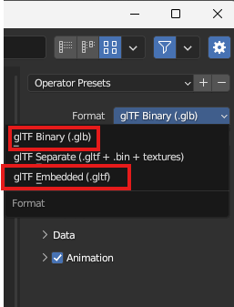  
Dans 8th wall, Drag and drop les fichiers dans l'onglet de gauche, section du bas (ça ne marchera pas si on les dépose dans le chutier du haut)  
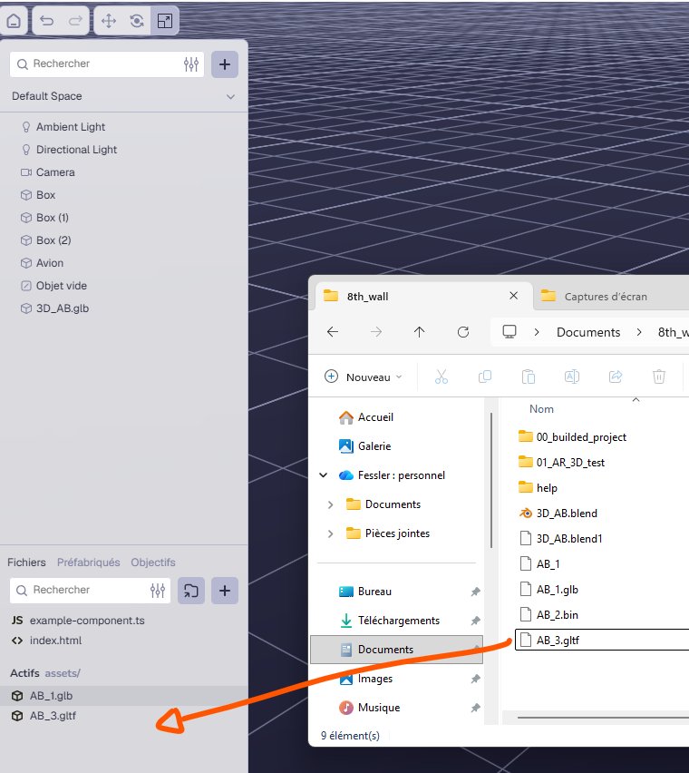    
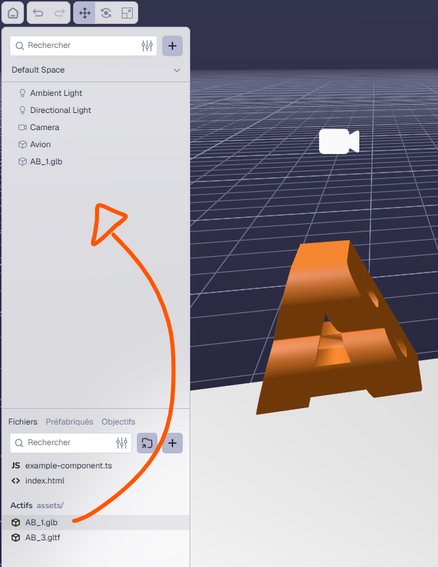    

 ## Ombres
 Se gère dans les assets créant la lumière directionel (normal c'est eux qui "créent" les ombres). 
 Les ombres diffuses avec un soft edge ne sont pas terrible, mieux vaut baker les ombres depuis blender.
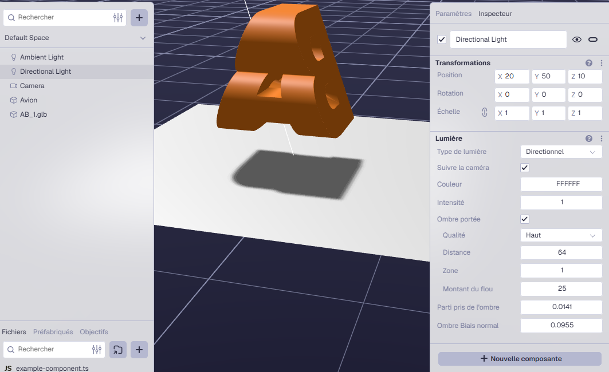  

## workflow
Set up notre scène 3D dans 8th wall. Cliquer sur Publier
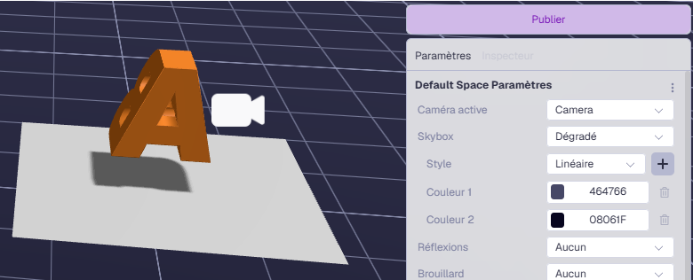 
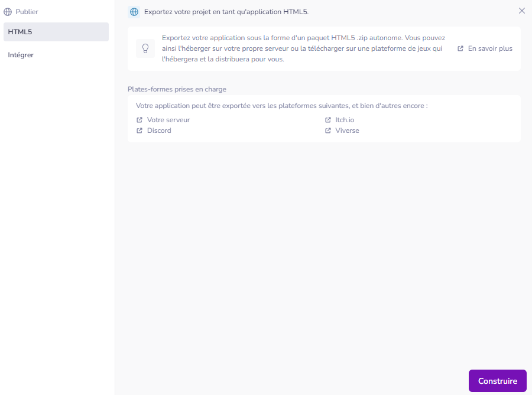   
Lors de la 1ère publication, un dossier nommé 8th Wall est crée dans notre dossier document. Un fichier zip est aussi crée dans téléchargement. Le dossier 8th Wall contient toutes les ressources du projet (assets, image target, etc) le fichier zip est un build que l'on peut publier. Dans l'exemple ci-dessous comme j'ai 2 projet 8th wall j'ai aussi 2 dossiers 8th wall:  
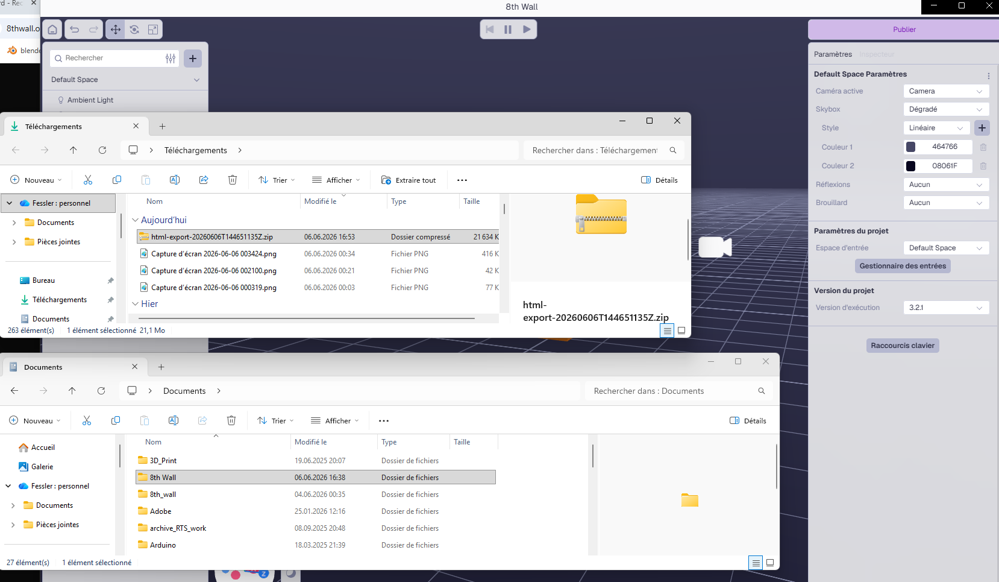  
Extraire le fichier zippé. Ici je range le contenu du .zip dans un dossier que je nomme builded project. Je fais ça pour qu'il y ait moins de confusion entre le dossier de travail et le dossier de code compilé. Peut être serait il mieux d'inclure le dossier code compilé dans le dossier de travail.
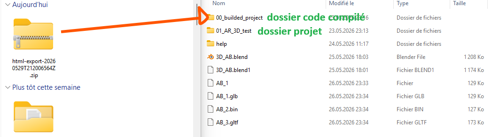 
Comme j'ai crée un repository Github, je peux utiliser le terminal pour me mettre dans le dossier de code compilé et le synchroniser sur git via les commandes suivantes pour le 1er commit:  
cd "path de mon dossier de code compilé"  
git init //à faire la première fois afin d'initialiser un dépot git local qui suit les modifications futures  
git commit -m "message de commit"  
git remote add origin <URL du repo git> // lie le dépot local au repository github
git push -u origin main   
git push origin main --force // en générale on ne fait pas ça car ça supprime le contenu du repo github et y dépose le contenu de notre git local. donc risque de perde. Dans le cas de 8th wall qui rebuild un zip dont je place le contenu dans un dossier déjà existant c'est mieux de forcer le push plutôt que de récupérer le contenu git avant le push.
-> architecture de dossier a modifier, build dans projet, projet sync sur git
-> liste de commande git a clarifier

git init
git add .
git remote add origin https://xxx    //url du repo github
git commit -m "message"
git push origin main --force

Afin de voir le site web et non les fichiers sources hébergés sur Github il nous faut aller dans **settings** -> **pages**
L'opération a fonctionnée si après un petit moment on voit "Your site is live at "https://url" en haut de la page.
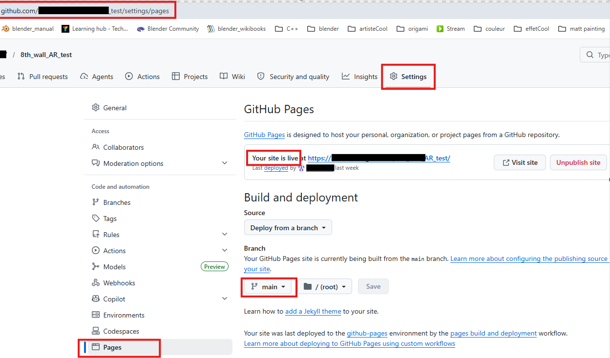 
On peut récupérer l'URL de cette page et générer un code QR avec.  
Scanner le code QR ouvrira l'expérience AR une fois que l'utilisateur aura authorisé l'accès caméra

## image target
[Tutoriel de référence](https://www.youtube.com/watch?v=-WLfXuZNy4g)    
Note: 8th wall open source a un peu évolué depuis la parution de la vidéo. Par exemple les images targets apparaissent maintenant dans l'interface.  

Dans 8th wall il nous faut ajouter une image target (cible d'image en français) dans le panneau gauche inférieur:  
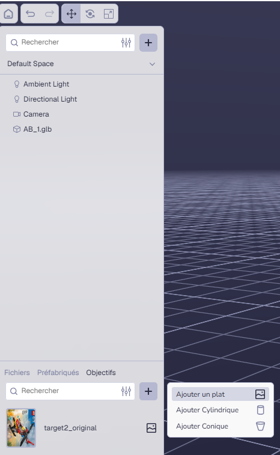     
En arrière plan ça nous crée un dossier image-targets et le rempli avec les fichiers dont aura besoin notre smartphone pour détecter l'image ainsi qu'un fichier .js que l'on ne voit pas sur cette capture.  
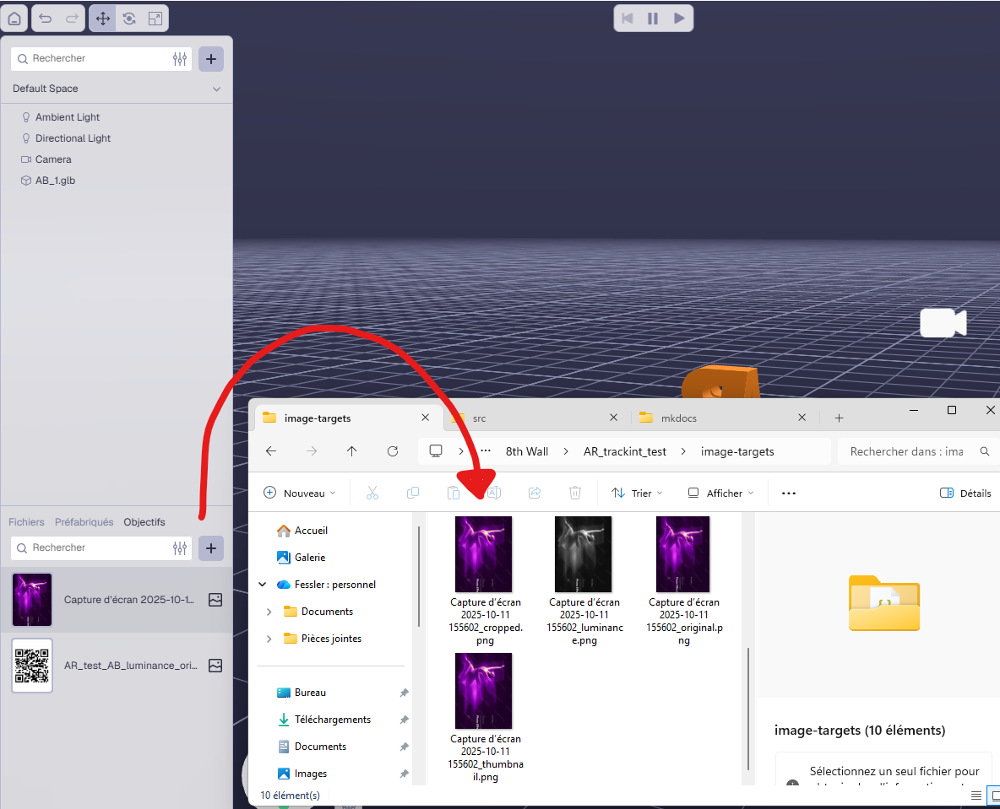    

Puis dans l'onglet default space ajouter le composant image target à la scène.
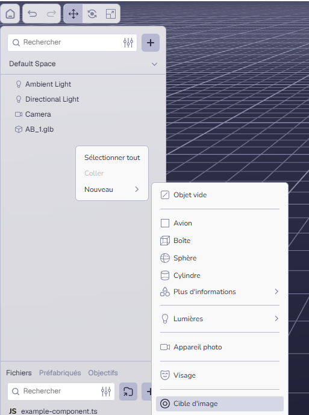   

L'image target doit comporter des contrastes importants, des variations de textures et éviter les répétitions. Un QR est idéal..
Il va nous falloir convertir l'image que l'on shouhaite utiliser comme point d'ancrage dans un format qu'8th wall puisse détecter:
[convertisseur d'images en image target](https://8thwallimagetarget.pratikmane.tech)    
Si on désactive default crop, on est libre de définir le format grâce à un clic maintenu sur la zone de l'image. Format 3:4 imposé
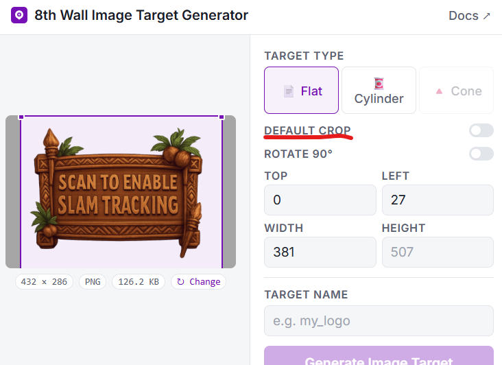     
L'outil est un peu pénible, tant qu'on aura pas entré un nom sous target name, que l'image ne fait pas 480px de large minimum et si la zone de crop dépasse de l'image nous ne pourrons pas générer l'image target.   
On peut télécharger le fichier zip
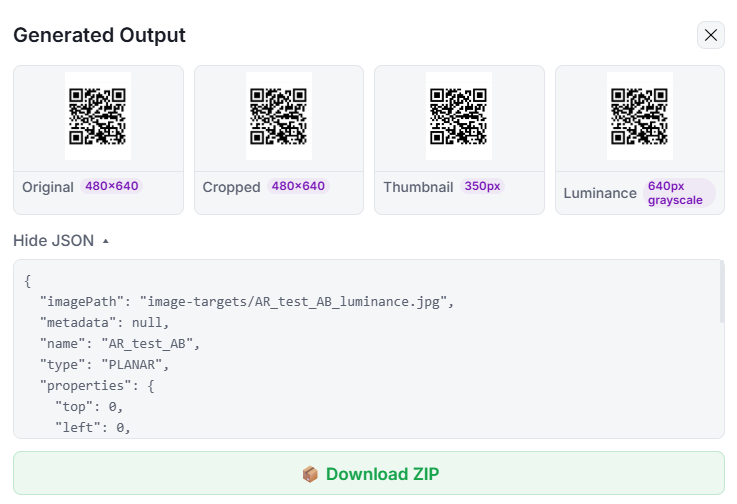  
Puis créer un dossier "image-targets" à la racine de notre dossier de projet et y extraire le fichier zip.  
On peut maintenant faire le liens entre le composant image target qu'on a ajouté sur 8th wall et les images targets qu'on vient de générer:  
 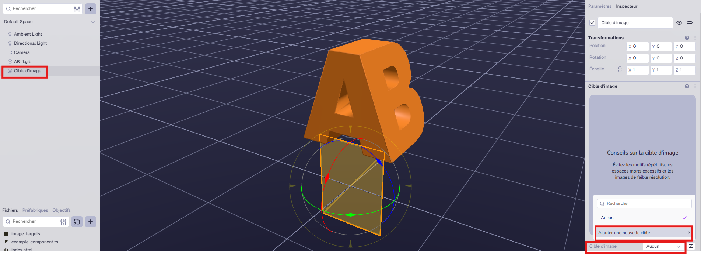  
 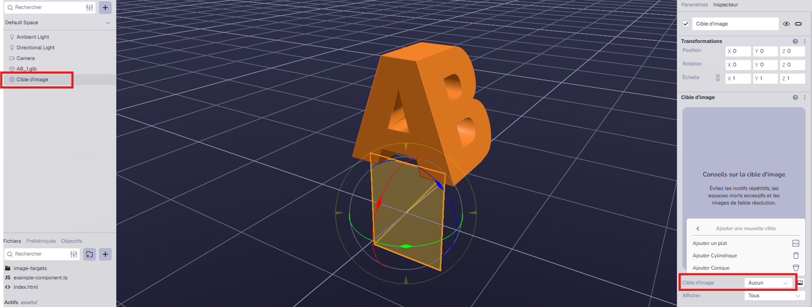  
 Je choisi l'image luminance car c'est à partir d'elle que s'effectue les calcul de tracking (luminance est une version noir et blanc de l'image, l'algorithme cherche des points de fort contrast pour se repérer dans l'image a faible coût)  
  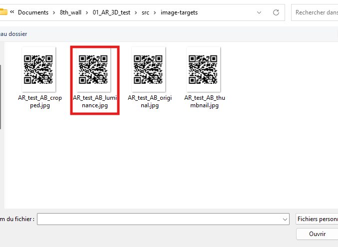    
  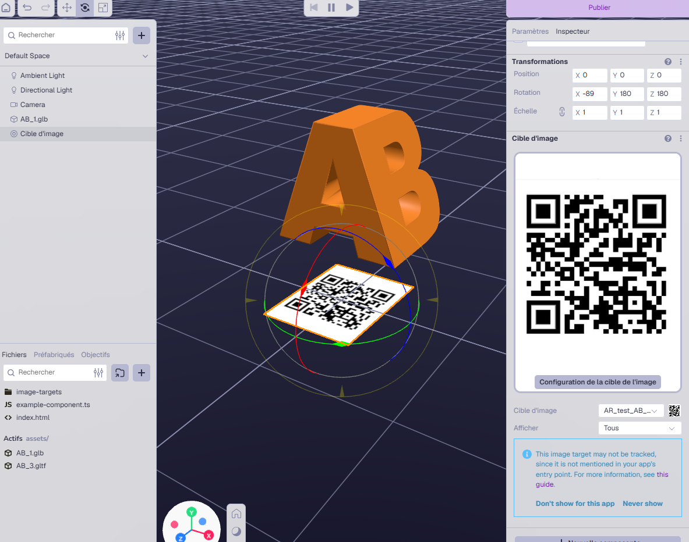    
  Enfin, au niveau de la hierarchie, placer l'objet que l'on veut tracker dans l'image target. ça paraît anecdotique mais c'est ce qui lie l'objet à l'image de tracking. 
 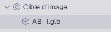    

## Quick preview
NPM demandera les autorisation administrateur pour être installé de manière global. Mieux vaut utiliser la commande **xxxx** pour **xxxx** localement dans le dossier de travail lié aux projets 8th wall. Tant que la fenêtre du terminal où l'on vient de taper cette commande est ouverte, les appareils connecés au même réseau peuvent consulter le contenu du dossier. Ainsi on a fait de notre dossier un mini serveur. NPM permet de faire de notre ordinateur un serveur web. Les appareils sur le même wifi peuvent consulter son contenu (où un dossier spécifique si NPM est activé dans un dossier local). Pour commencer je m'en suis passé et je me contente d'héberger mon projet sur github

->ngrock où tailscale et ce que ça fait. 
->reorganisser architecture dossier pour que le build soit dans le dossier du projet.
->faire un build sans passer par le GUI afin de pouvoir automatiser avec les github actions.
->se renseigner fonctionalités cloudflare 

