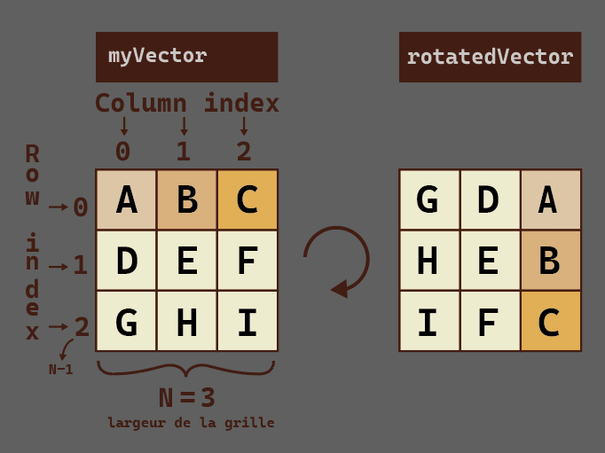
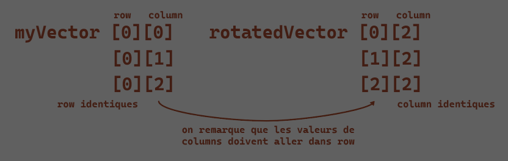
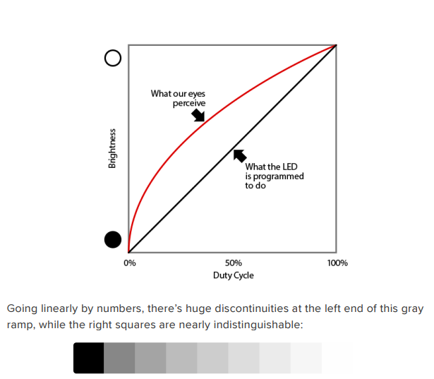
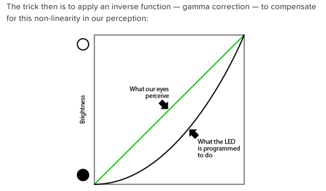
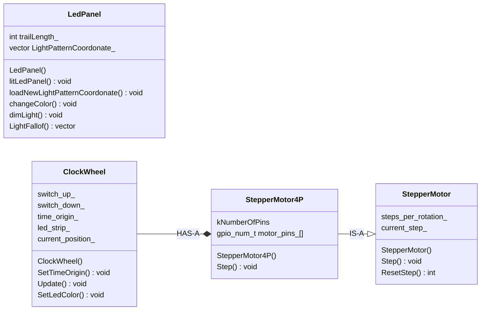
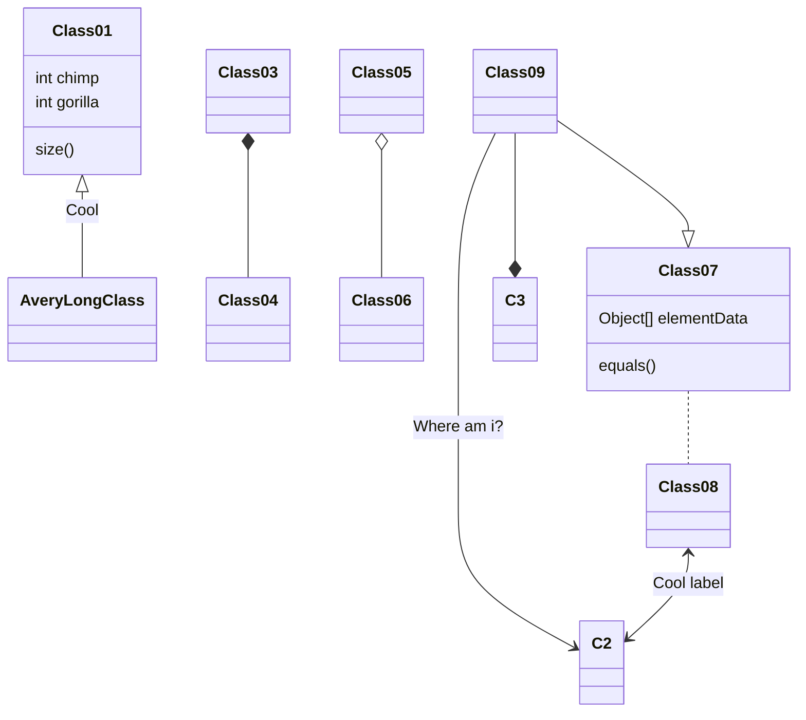

---
date:
  created: 2026-01-23
categories:
  - C++
  - Informatique
tags:
  - c++
authors:
  - thomas
slug: c++
---

# C++ case study

Cet article présente différents cas d'école de la programmation en C++  

<!-- more -->
## Rotation d'une grille  
Il existe plusieurs façon de faire, j'aborde ici la manière la plus facilement compréhensible. Elle utilise deux grille. Le problème leetcode 48 demande de le faire sans utiliser une 2ème matrice.

Voici les éléments à prendre en compte:
  

et les observations qui nous permettront de résoudre ce problème:


Principe: lire chaque ligne de la grille de base, durant la lecture d'une ligne on lit la valeur à chaque colonne. Row 0 column 0/1/2 puis row 1 column 0/1/2. Cela se fera grâce à une loop dans une loop. Il faut un système qui parcour chaque élément des lignes de la grille de base et parcour chaque colonne de la grille rotationnée en parallèle. On transfert la valeur lue au coordonées de la 1ère grille aux coordonées de la 2ème.  

Le code ci récupère la matrice de base, la fait tourner de 90 degrés clockwise et en génère une nouvelle matrice
```cpp
#include <iostream>
#include <vector>
#include <algorithm> // Pour std::vector

// Fonction pour faire pivoter une matrice N x N de 90 degrés dans le sens horaire
// en utilisant une nouvelle matrice (tableau intermédiaire).
std::vector<std::vector<int>> rotateMatrixWithIntermediate(const std::vector<std::vector<int>>& originalMatrix) {
    int n = originalMatrix.size();
    if (n == 0) {
        return {};
    }

    // Crée une nouvelle matrice N x N initialisée à zéro
    std::vector<std::vector<int>> rotatedMatrix(n, std::vector<int>(n));

    // Copie les éléments de l'ancienne matrice vers la nouvelle matrice
    for (int i = 0; i < n; ++i) { // i est l'indice de ligne (row)
        for (int j = 0; j < n; ++j) { // j est l'indice de colonne (column)
            // Nouvelle_Ligne = Ancienne_Colonne
            // Nouvelle_Colonne = N - 1 - Ancienne_Ligne
            rotatedMatrix[j][n - 1 - i] = originalMatrix[i][j];
        }
    }

    return rotatedMatrix;
}

// Helper function pour afficher la matrice (réutilisée)
void printMatrix(const std::vector<std::vector<int>>& matrix) {
    for (const auto& row : matrix) {
        for (int element : row) {
            std::cout << element << " ";
        }
        std::cout << std::endl;
    }
}

int main() {
    std::vector<std::vector<int>> mat = {
        {1, 2, 3},
        {4, 5, 6},
        {7, 8, 9}
    };

    std::cout << "Matrice Originale:" << std::endl;
    printMatrix(mat);

    // Appel de la fonction qui crée un tableau intermédiaire
    std::vector<std::vector<int>> rotated_mat = rotateMatrixWithIntermediate(mat);

    std::cout << "\nMatrice apres rotation 90 degres (avec intermediaire):" << std::endl;
    printMatrix(rotated_mat);

    return 0;
}
```
Pour **tourner de 90 degrés counterclockwise** (-90 degrés c'est comme 3x 90 degrés) avec ce code, il faut appeler une première fois la fonction qui la fait tourner de 90 degrée, puis une deuxième fois sur la grille retournée par la 1ère fonction puis une troisième fois sur la grille retournée par la 2ème fonctions. C'est fastidieux. Pour créer une fonction rotateCounterClockWise() On peut regarder les coordonées de la 1ère ligne de la grille de base et les comparés à celle de la 1ère colonne de la grille rotationnée.
Voici les nombres à disposition:    
  
[i][j]  
[0][0]  ->  [2][0]  indice du loop: 0   
[0][1]  ->  [1][0]  indice du loop: 1  
[0][2]  ->  [0][0]  indice du loop: 2  
N = 2  

Pour les coordonées en 0 c'est facile, les coordonnées du row de la grille de base iront dans les coordonées de colonne de la grille rotationnée.
Pour faire correspondre les coordonnées restante on utilise la formule **N - 1 - j**.


## Gamma correction  
L'on peut définir une couleur en RGB où HSB (Hue, saturation, brightness). Je souhaite définir plusieurs valeurs de luminosité qui décroissent de façon linaire. Le problème c'est que la brightness n'est pas une fonction linéaire. Si j'allume une chaine de led grace à une loop qui soustrait 50 à la brightness à chaque incrémentation de i, visuellement le fade de la luminosité ne sera pas linéaire. En gros nos yeux sont plus sensible aux variations de luminosités dans certaine plage. On perçoit les changement d'intensité dans les zones les plus sombres et lumineuse avec plus de sensibilité. Cela fait que pour que la luminosité ait l'air de se comporter "normalement" (de manière linaire) on doit compenser sa valeur.   
    
    
    

Pour obtenir cette courbe il y a plusieurs manière, on peut utiliser une look-up table qui map chaque valeur de brightness physique à la brightness nécéssaire pour qu'une fois compensé par nos yeux on se retrouve sur une évolution linéaire.  

```cpp
const uint8_t PROGMEM gamma8[] = {
 0, 0, 0, 0, 0, 0, 0, 0, 0, 0, 0, 0, 0, 0, 0, 0,
 0, 0, 0, 0, 0, 0, 0, 0, 0, 0, 0, 0, 1, 1, 1, 1,
 1, 1, 1, 1, 1, 1, 1, 1, 1, 2, 2, 2, 2, 2, 2, 2,
 2, 3, 3, 3, 3, 3, 3, 3, 4, 4, 4, 4, 4, 5, 5, 5,
 5, 6, 6, 6, 6, 7, 7, 7, 7, 8, 8, 8, 9, 9, 9, 10,
 10, 10, 11, 11, 11, 12, 12, 13, 13, 13, 14, 14, 15, 15, 16, 16,
 17, 17, 18, 18, 19, 19, 20, 20, 21, 21, 22, 22, 23, 24, 24, 25,
 25, 26, 27, 27, 28, 29, 29, 30, 31, 32, 32, 33, 34, 35, 35, 36,
 37, 38, 39, 39, 40, 41, 42, 43, 44, 45, 46, 47, 48, 49, 50, 50,
 51, 52, 54, 55, 56, 57, 58, 59, 60, 61, 62, 63, 64, 66, 67, 68,
 69, 70, 72, 73, 74, 75, 77, 78, 79, 81, 82, 83, 85, 86, 87, 89,
 90, 92, 93, 95, 96, 98, 99,101,102,104,105,107,109,110,112,114,
 115,117,119,120,122,124,126,127,129,131,133,135,137,138,140,142,
 144,146,148,150,152,154,156,158,160,162,164,167,169,171,173,175,
 177,180,182,184,186,189,191,193,196,198,200,203,205,208,210,213,
 215,218,220,223,225,228,231,233,236,239,241,244,247,249,252,255 };
```  

On peut utiliser cette fonction qui nous retourne une valeur précise:  

```cpp
#include <cmath>

int applyGamma(int input, float gamma = 2.8f) {
    // On normalise l'entrée entre 0.0 et 1.0, on applique la puissance,
    // puis on remet à l'échelle 0-255.
    return (int)(pow((float)input / 255.0f, gamma) * 255.0f + 0.5f);
}

// Utilisation :
setpixelhsb(0, h, s, applyGamma(250)); // Très brillant
setpixelhsb(1, h, s, applyGamma(200)); // Un peu moins
```    

Où cette fonction moins précise mais plus simple:  

```cpp
int applyGammaFast(int input) {
    // Équivalent à un gamma de 2.0
    return (input * input) / 255;
}
```  

## fonction dans une fonction dans une fonction
Ma classe LedPanel possède une méthode qui définit des attributs, parcour une grille et décrémente la valeur lue dans la case de la grille. J'ai une autre méthode qui parcour une grille et met à jour l'attribut brightness avec la valeur sur chaque case de la grille. Mon idée était de simplifier le tout en effaçant le code de parcour de grille qui est en doublon, d'en faire une méthode et de l'appeller en tant que callback. Mais cette méthode doit à son tour appeller un callback... ça complexifie le tout.

Pour réaliser ceci, il aurait fallu faire appel à un lambda:  
```cpp
parcourirGrille([&](int i, int j) {
    ledPanelMatrix_[i][j]--; // Sans le [&], la lambda ne saurait pas ce qu'est "ledPanelMatrix_"
});
```    

## timer diagram  


## element utile pour écrire le blog  



[NomDuLiens](https://adresseduliens.ch)

  

⚠️ 

```cpp
int speed = 16;
```

| Fonction                                      | Classe                                         |
|----------------------------------------------|------------------------------------------------|
| Conserve la valeur entre les appels          | Partagé entre toutes les instances             |
| N'est initialisée qu'une seule fois          | Peut être accédé sans objet : Classe::membre   |
| Est locale en visibilité, globale en durée de vie | Partage la même valeur pour tous les objets |
