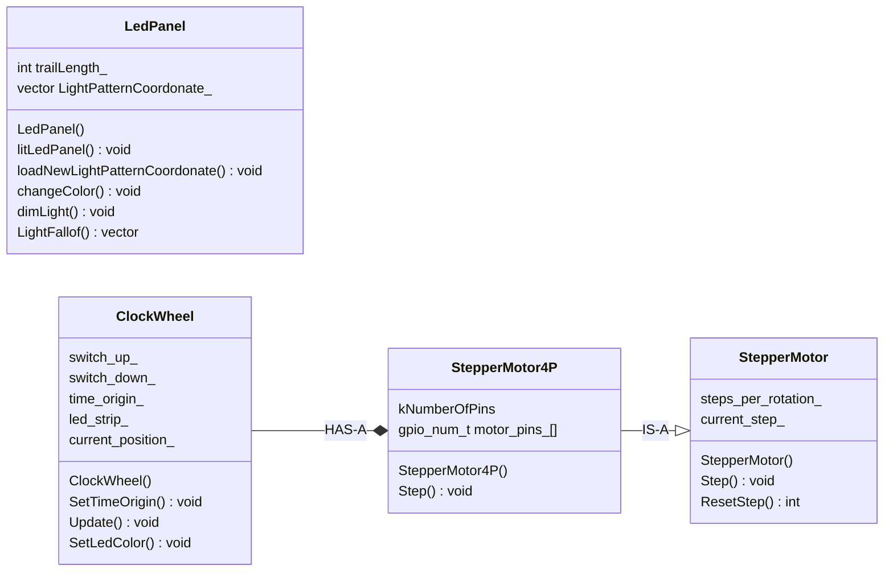
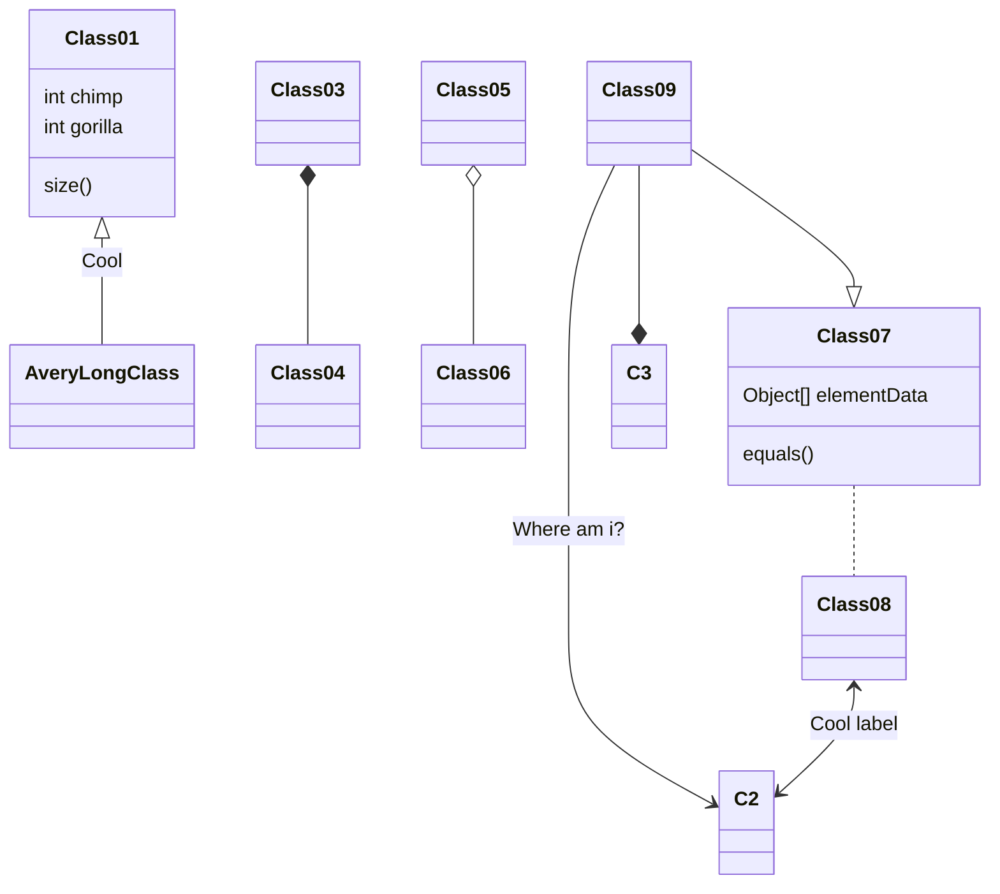

---
date:
  created: 2026-01-23
categories:
  - C++
  - Informatique
tags:
  - c++
authors:
  - thomas
slug: c++
---

# C++ case study

Cet article présente différents cas d'école de la programmation en C++  ainsi que des librairies commentées relatives aux différents que j'ai intégrés sur mes projets

<!-- more -->
## Rotation d'une grille  
Il existe plusieurs façon de faire, j'aborde ici la manière la plus facilement compréhensible. Elle utilise deux grille. Le problème leetcode 48 demande de le faire sans utiliser une 2ème matrice.

Voici les éléments à prendre en compte:
  

et les observations qui nous permettront de résoudre ce problème:


Principe: lire chaque ligne de la grille de base, durant la lecture d'une ligne on lit la valeur à chaque colonne. Row 0 column 0/1/2 puis row 1 column 0/1/2. Cela se fera grâce à une loop dans une loop. Il faut un système qui parcour chaque élément des lignes de la grille de base et parcour chaque colonne de la grille rotationnée en parallèle. On transfert la valeur lue au coordonées de la 1ère grille aux coordonées de la 2ème.  

Le code ci récupère la matrice de base, la fait tourner de 90 degrés clockwise et en génère une nouvelle matrice
```cpp
#include <iostream>
#include <vector>
#include <algorithm> // Pour std::vector

// Fonction pour faire pivoter une matrice N x N de 90 degrés dans le sens horaire
// en utilisant une nouvelle matrice (tableau intermédiaire).
std::vector<std::vector<int>> rotateMatrixWithIntermediate(const std::vector<std::vector<int>>& originalMatrix) {
    int n = originalMatrix.size();
    if (n == 0) {
        return {};
    }

    // Crée une nouvelle matrice N x N initialisée à zéro
    std::vector<std::vector<int>> rotatedMatrix(n, std::vector<int>(n));

    // Copie les éléments de l'ancienne matrice vers la nouvelle matrice
    for (int i = 0; i < n; ++i) { // i est l'indice de ligne (row)
        for (int j = 0; j < n; ++j) { // j est l'indice de colonne (column)
            // Nouvelle_Ligne = Ancienne_Colonne
            // Nouvelle_Colonne = N - 1 - Ancienne_Ligne
            rotatedMatrix[j][n - 1 - i] = originalMatrix[i][j];
        }
    }

    return rotatedMatrix;
}

// Helper function pour afficher la matrice (réutilisée)
void printMatrix(const std::vector<std::vector<int>>& matrix) {
    for (const auto& row : matrix) {
        for (int element : row) {
            std::cout << element << " ";
        }
        std::cout << std::endl;
    }
}

int main() {
    std::vector<std::vector<int>> mat = {
        {1, 2, 3},
        {4, 5, 6},
        {7, 8, 9}
    };

    std::cout << "Matrice Originale:" << std::endl;
    printMatrix(mat);

    // Appel de la fonction qui crée un tableau intermédiaire
    std::vector<std::vector<int>> rotated_mat = rotateMatrixWithIntermediate(mat);

    std::cout << "\nMatrice apres rotation 90 degres (avec intermediaire):" << std::endl;
    printMatrix(rotated_mat);

    return 0;
}
```
Pour **tourner de 90 degrés counterclockwise** (-90 degrés c'est comme 3x 90 degrés) avec ce code, il faut appeler une première fois la fonction qui la fait tourner de 90 degrée, puis une deuxième fois sur la grille retournée par la 1ère fonction puis une troisième fois sur la grille retournée par la 2ème fonctions. C'est fastidieux. Pour créer une fonction rotateCounterClockWise() On peut regarder les coordonées de la 1ère ligne de la grille de base et les comparés à celle de la 1ère colonne de la grille rotationnée.
Voici les nombres à disposition:    
  
[i][j]  
[0][0]  ->  [2][0]  indice du loop: 0   
[0][1]  ->  [1][0]  indice du loop: 1  
[0][2]  ->  [0][0]  indice du loop: 2  
N = 2  

Pour les coordonées en 0 c'est facile, les coordonnées du row de la grille de base iront dans les coordonées de colonne de la grille rotationnée.
Pour faire correspondre les coordonnées restante on utilise la formule **N - 1 - j**.


## Gamma correction  
L'on peut définir une couleur en RGB où HSB (Hue, saturation, brightness). Je souhaite définir plusieurs valeurs de luminosité qui décroissent de façon linaire. Le problème c'est que la brightness n'est pas une fonction linéaire. Si j'allume une chaine de led grace à une loop qui soustrait 50 à la brightness à chaque incrémentation de i, visuellement le fade de la luminosité ne sera pas linéaire. En gros nos yeux sont plus sensible aux variations de luminosités dans certaine plage. On perçoit les changement d'intensité dans les zones les plus sombres et lumineuse avec plus de sensibilité. Cela fait que pour que la luminosité ait l'air de se comporter "normalement" (de manière linaire) on doit compenser sa valeur.   
    
    
    

Pour obtenir cette courbe il y a plusieurs manière, on peut utiliser une look-up table qui map chaque valeur de brightness physique à la brightness nécéssaire pour qu'une fois compensé par nos yeux on se retrouve sur une évolution linéaire.  

```cpp
const uint8_t PROGMEM gamma8[] = {
 0, 0, 0, 0, 0, 0, 0, 0, 0, 0, 0, 0, 0, 0, 0, 0,
 0, 0, 0, 0, 0, 0, 0, 0, 0, 0, 0, 0, 1, 1, 1, 1,
 1, 1, 1, 1, 1, 1, 1, 1, 1, 2, 2, 2, 2, 2, 2, 2,
 2, 3, 3, 3, 3, 3, 3, 3, 4, 4, 4, 4, 4, 5, 5, 5,
 5, 6, 6, 6, 6, 7, 7, 7, 7, 8, 8, 8, 9, 9, 9, 10,
 10, 10, 11, 11, 11, 12, 12, 13, 13, 13, 14, 14, 15, 15, 16, 16,
 17, 17, 18, 18, 19, 19, 20, 20, 21, 21, 22, 22, 23, 24, 24, 25,
 25, 26, 27, 27, 28, 29, 29, 30, 31, 32, 32, 33, 34, 35, 35, 36,
 37, 38, 39, 39, 40, 41, 42, 43, 44, 45, 46, 47, 48, 49, 50, 50,
 51, 52, 54, 55, 56, 57, 58, 59, 60, 61, 62, 63, 64, 66, 67, 68,
 69, 70, 72, 73, 74, 75, 77, 78, 79, 81, 82, 83, 85, 86, 87, 89,
 90, 92, 93, 95, 96, 98, 99,101,102,104,105,107,109,110,112,114,
 115,117,119,120,122,124,126,127,129,131,133,135,137,138,140,142,
 144,146,148,150,152,154,156,158,160,162,164,167,169,171,173,175,
 177,180,182,184,186,189,191,193,196,198,200,203,205,208,210,213,
 215,218,220,223,225,228,231,233,236,239,241,244,247,249,252,255 };
```  

On peut utiliser cette fonction qui nous retourne une valeur précise:  

```cpp
#include <cmath>

int applyGamma(int input, float gamma = 2.8f) {
    // On normalise l'entrée entre 0.0 et 1.0, on applique la puissance,
    // puis on remet à l'échelle 0-255.
    return (int)(pow((float)input / 255.0f, gamma) * 255.0f + 0.5f);
}

// Utilisation :
setpixelhsb(0, h, s, applyGamma(250)); // Très brillant
setpixelhsb(1, h, s, applyGamma(200)); // Un peu moins
```    

Où cette fonction moins précise mais plus simple:  

```cpp
int applyGammaFast(int input) {
    // Équivalent à un gamma de 2.0
    return (input * input) / 255;
}
```  

## fonction dans une fonction dans une fonction
Ma classe LedPanel possède une méthode qui définit des attributs, parcour une grille et décrémente la valeur lue dans la case de la grille. J'ai une autre méthode qui parcour une grille et met à jour l'attribut brightness avec la valeur sur chaque case de la grille. Mon idée était de simplifier le tout en effaçant le code de parcour de grille qui est en doublon, d'en faire une méthode et de l'appeller en tant que callback. Mais cette méthode doit à son tour appeller un callback... ça complexifie le tout.

Pour réaliser ceci, il aurait fallu faire appel à un lambda:  
```cpp
parcourirGrille([&](int i, int j) {
    ledPanelMatrix_[i][j]--; // Sans le [&], la lambda ne saurait pas ce qu'est "ledPanelMatrix_"
});
```    

## timer diagram  


## simpleFOC
voir l'article Arduino_IDE_Platform_IO_et_composants pour une description du moteur gimbol GM5208 de IFlight et du SimpleFOCmini de DFRobot
  [NomDuLiens](https://docs.simplefoc.com/mini_code#step-1-testing-the-sensor  
  )

  Open loop position commenté:  
```cpp
// Open loop motor control example
// Open loop = pas de capteur d'encodage de position, on ne sait pas où est le
// moteur, on lui dit juste de tourner à une certaine vitesse ou d'aller à une
// certaine position. moins précis et consomme plus de batterie.
// en close loop un capteur mesure et corrige en continue la position du moteur.
#include <SimpleFOC.h>

// BLDC motor & driver instance
// BLDCMotor motor = BLDCMotor(pole pair number); //l'argument représente le
// nombre de paires de pôles du rotor, soit le nombre d'aimant visible / 2
BLDCMotor motor = BLDCMotor(11);
// BLDCDriver3PWM driver = BLDCDriver3PWM(pwmA, pwmB, pwmC, Enable(optional));
// correspond aux pins IN2 / IN2 / IN3du microcontroleur qui vont envoyer le
// signal PWM au driver. Le driver va ensuite envoyer la tension requise sur les
// cables liés aux moteur. La 4ème pin est optionnelle, elle permet d'activer ou
// désactiver le driver, donc le moteur. Utile à des fins d'économie d'énergie
// si on a un mode veille par ex.
BLDCDriver3PWM driver = BLDCDriver3PWM(9, 5, 6, 8);

// Stepper motor & driver instance
// StepperMotor motor = StepperMotor(50);
// StepperDriver4PWM driver = StepperDriver4PWM(9, 5, 10, 6,  8);

// target variable
// la position que l'on veut que le moteur atteigne, en radiant.
// 1 tour complet = 2*PI rad
float target_position = 0;

// instantiate the commander
// en gros c'est un objet qui va nous permettre de communiquer avec le moteur
// via le terminal. Dans setup on va définir des lettres qui seront reconnues et
// permettront de changer des variables du moteur. ex T20
// Commander command -> création d'un objet de type comander;
// commander(Serial) -> constructeur de l'objet, on lui passe en paramètre
// Serial. ça veux dire qu'on peut utiliser le terminal pour communiquer
Commander command = Commander(Serial);
// cmd stock ce qu'on écrit dans le terminal et .scalar va transformer le string
// en float et le stocker dans target_position
void doTarget(char *cmd) { command.scalar(&target_position, cmd); }
void doLimit(char *cmd) { command.scalar(&motor.voltage_limit, cmd); }
void doVelocity(char *cmd) { command.scalar(&motor.velocity_limit, cmd); }

void setup() {

  // driver config
  // power supply voltage [V]

  // comme le driver utilise le pwm pour faire varier la tension, il faut lui
  // dire quelle est la tension qu'il reçoit afin qu'il puisse le temps de
  // hachage pour obtenir la tension de sortie souhaitée. ex si on veut 6V en
  // sortie et que le driver reçoit 12V, il faut un rapport de 0.5, donc le pwm
  // sera à 50% de son temps de hachage.
  driver.voltage_power_supply = 12;
  // limit the maximal dc voltage the driver can set
  // as a protection measure for the low-resistance motors
  // this value is fixed on startup
  driver.voltage_limit = 6;
  // cette fonction va initialiser le driver, c'est obligatoire de l'appeler
  // avant de pouvoir utiliser le driver
  driver.init();
  // link the motor and the driver
  motor.linkDriver(&driver);

  // limiting motor movements
  // limit the voltage to be set to the motor
  // start very low for high resistance motors to avoid high currents and
  // overheating
  // current = resistance*voltage, so try to be well under 1Amp
  // ça aurait été plus simple de mettre la limite d'ampérage, mais le simple
  // FOC Mini n'a pas de capteur de courant, donc on ne peut pas.
  // en mode close loop, l'ampérage est estimé grâce au capteur de position, la
  // vitesse de rotation du moteur et la force contre électromotrice.
  motor.voltage_limit = 3; // [V]
  // limit/set the velocity of the transition in between
  // target angles
  // cette valeur n'est pas donnée par le fabriquant, c'est à nous de la fine
  // tuner.
  motor.velocity_limit = 5; // [rad/s] un tour complet = 2*PI rad
  // open loop control config
  motor.controller = MotionControlType::angle_openloop;

  // init motor hardware
  motor.init();

  //  On est dans le set up. command.add dit  command.run d'appeler la
  //  fonction
  //  doTarget quand il voit T dans le terminal ('T' = lettre de déclanchement,
  //  doTarget =fonction qui met à jour la variable, "target angle" = text
  //  indicatif pour renseigner l'utilisateur lors de l'utilisation de la
  //  command help ou automatiquement lorsque la variable target angle est
  //  modifiée. Du code non présent ici va récupérer ce text et l'afficher dans
  //  le terminal avec la nouvelle valeur.))
  // position cible en radiant-
  command.add('T', doTarget, "target angle");
  // torque. plus la valeur est grande plus le moteur a de
  // force, consomme d'énergie et chauffe
  command.add('L', doLimit, "voltage limit");
  // corrigé, le code de base indiquait doLimit au lieu de doVelocity.
  // vitesse de rotation du champ magnétique. change la fréquence d'alternance
  // des phases u v w. Ne change pas directement le voltage et la consommation
  // electrique. mais plus le champ magnétique tourne vite plus il génère de
  // force contre électromotrice et il a moins d'emprise sur le rotor donc il
  // faut augmenter le voltage pour compenser.
  command.add('V', doVelocity, "movement velocity");

  Serial.begin(115200);
  Serial.println("Motor ready!");
  Serial.println(
      "Set target position [rad]"); // message indiquant à l'utilisateur comment
                                    // communiquer avec le moteur en radiant
  _delay(1000);
}

void loop() {
  // open  loop angle movements
  // using motor.voltage_limit and motor.velocity_limit
  // angles can be positive or negative, negative angles correspond to opposite
  // motor direction
  // actionne le moteur pour qu'il se déplace vers la position target_position,
  // en utilisant la vitesse et la tension.
  motor.move(target_position);

  // user communication
  // regarde si l'utilisateur a envoyé un message via le terminal commençant par
  // les lettres de déclanchement, si oui, il va le décoder et changer les
  // variables du moteur en conséquence
  command.run();
}
```

  Open loop velocity commenté:   
```cpp
  // Open loop motor control example
#include <SimpleFOC.h>

// BLDC motor & driver instance
// BLDCMotor motor = BLDCMotor(pole pair number);
BLDCMotor motor = BLDCMotor(11);
// BLDCDriver3PWM driver = BLDCDriver3PWM(pwmA, pwmB, pwmC, Enable(optional));
BLDCDriver3PWM driver = BLDCDriver3PWM(9, 5, 6, 8);

// Stepper motor & driver instance
// StepperMotor motor = StepperMotor(50);
// StepperDriver4PWM driver = StepperDriver4PWM(9, 5, 10, 6,  8);

// target variable
float target_velocity = 0;

// instantiate the commander
Commander command = Commander(Serial);
// fait en sorte qu'on puisse passer du texte dans le terminal et qu'il mette à
// jour les variables du programme. ex T20 va mettre target_velocity à 20. en
// gros la fonction dotTarget va passer le text qu'on lui donne en paramètre à
// la fonction scalar de l'objet command. command va mettre à jour la variable
// target_Velocity avec la valeur qu'on lui a donné.
void doTarget(char *cmd) { command.scalar(&target_velocity, cmd); }
void doLimit(char *cmd) { command.scalar(&motor.voltage_limit, cmd); }

void setup() {

  // driver config
  // voltage de l'alimentation du driver [V]
  driver.voltage_power_supply = 20;
  // limit the maximal dc voltage the driver can set
  // as a protection measure for the low-resistance motors
  // this value is fixed on startup. Parametrer selon datasheet du driver FOC.
  driver.voltage_limit = 20;
  driver.init();
  // link the motor and the driver
  motor.linkDriver(&driver);

  // limiting motor movements
  // limit the voltage to be set to the motor
  // start very low for high resistance motors
  // current = voltage / resistance, so try to be well under 1Amp
  motor.voltage_limit = 3; // [V]

  // open loop control config
  motor.controller = MotionControlType::velocity_openloop;

  // init motor hardware
  motor.init();

  // On est dans le set up. command.add dit  command.run d'appeler la fonction
  // doTarget quand il voit T dans le terminal ('T' = lettre de déclanchement,
  // doTarget =fonction qui met à jour la variable, "target velocity" = text
  // indicatif pour renseigner l'utilisateur lors de l'utilisation de la command
  // help ou automatiquement lorsque la variable target velocity est modifiée.
  // Du code non présent ici va récupérer ce text et l'afficher dans le terminal
  // avec la nouvelle valeur.))
  command.add('T', doTarget, "target velocity");
  command.add('L', doLimit, "voltage limit");

  Serial.begin(115200);
  Serial.println("Motor ready!");
  Serial.println("Set target velocity [rad/s]");
  _delay(1000);
}

void loop() {

  // open loop velocity movement
  // using motor.voltage_limit and motor.velocity_limit
  // to turn the motor "backwards", just set a negative target_velocity
  motor.move(target_velocity);

  // user communication
  command.run();
}

// du code contenu dans command.run analyse le texte qu'on lui passe et va
// appeler la fonction doTarget où dot limit en fonction de la lettre qu'on lui
// a donné. Ces fonctions mettent à jour les variables target_velocity et
// motor.voltage_limit. Ensuite, motor.move va utiliser ces variables pour faire
// tourner le moteur à la vitesse souhaitée.
```  


## mise en place de test du moteur, simple foc, alimentation de labo

Contrairement à un simple stepper motor pouvant directement être piloté par l'esp32, un moteur de type gimball brushless nessessite une plus grande alimentation (donc une alimentation de labo pour les tests), un driver, la librairie simple FOC, éventuellement encoder. Tout ceci car l'on va controller le champ magnétique (voltage / vitesse de rotation) plutôt que la position du rotor avec 2 simples coils. De plus, une fois tout le matériel en place, la librairie simpleFOC reste complexe quand on la découvre, de même que les aspects du champ électromagnétique. Ci dessous je traite de la librairie open_loop_velocity_exemple.

Grace à l'alimentation de labo fixé à 20 V 1 ampère on évite que le FOCmini tire trop d'ampère lorsque le moteur est à l'arrêt. Comme la fonction de verrouillage du courant (C.C) se déclenche moins rapidement que les actions internes du FOC on peut tout de même avoir un pic non désirable. Le simple FOC ne connait pas la force contre electromotrice en openloop car il n'y a pas d'encodeur pour mesurer la vitesse de rotation du moteur. Ce mode aveugle nécessite que l'utilisateur fixe ces variables avant l'éxecution du programme:  
-> Nombre de paire de pole du moteur.
-> driver.voltage_power_supply = 20; // [V]
-> driver.voltage_limit = 20; // [V]
Lors de l'execution du programme (quand le moteur est alimenté) l'utilisateur peut modifier les valeurs de la limite de tension et de la vitesse de rotation.
-> motor.voltage_limit = 3; // [V] limite la tension que le FOC transmet au moteur. Modifiable par l'utilisateur lors de l'execution du programme.  
-> La variable de la vitesse de rotation va modifier le taux de PWM du FOC ce qui va accélérer la rotation.
Le programme a quelques gardes fous via les variables de voltage de la source d'alimentation et la limite de voltage mais pas au niveau de l'ampérage. Lorsqu'il ne tourne pas le moteur ne doit pas dépasser 0.09A
L'ampérage était un débit de la part des composants, (ce n'est pas la source d'énergie qui pousse l'ampérage, c'est quelquechose qu'elle met juste à disposition) le moteur en soi ne va pas tirer plus que ce qu'il a besoin. Le hic c'est que le moteur ne fait pas ce qu'il veut, il est contrôlé par le FOC c'est lui qui tire l'ampérage pour le donner au moteur et comme indiqué précédement, il est aveugle en mode openloop. Ne pouvant pas estimer la FCEM, il prend ce qu'on lui demande de prendre.
Du fait de la FCEM lié à la vitesse de rotation et du voltage créant le champ magnétique, on est dans un système aux propriétés physiques changeante (la FCEM réduit le courant. Le parallèle avec une résistance n'est pas exact car si dans les 2 cas il y a effectivement moins de voltage, la résistance dissipe l'énergie sous forme de chaleur. La FCEM est une tension opposée à celle de l'alimentation du moteur, elle vient en annuler une partie, ce qui se traduit par un freinage du moteur comparé à la vitesse qu'il aurait du avoir sans FCEM. Il n'y a pas de dissipation de l'énergie sous forme de chaleur.)
Si on indique une vitesse de rotation trop rapide, le driveur va s'executer, si le champ magnétique n'est pas assez puissant (pas assez de voltage pour contrer la FCEM générée par sa rotation et entrainer le rotor), le rotor va décrocher, ayant perdu sa synchronisation avec le champ magnétique. ça se traduit par des tremblement. 
**Si on indique un voltage haut alors que le moteur est à l'arrêt**, la FCEM n'étant pas encore en place, **l'ampérage va lui aussi être élevé et dépassant ainsi les 0.09 A indiqués** à l'arrêt dans la datasheet (sans charge, la charge se référant majoritairement à la FCEM et un petit peu au poid que le moteur met en mouvement)

Pour estimer l'ampérage il nous faut connaître la resistance du moteur. On peut la mesurer entre 2 phase, il faut ensuite diviser cette valeur par 2 si le moteur est cablé en étoile ce qui est souvent le cas. Si il est en Delta il faut multiplier par 1.5 pour connaître la resistance du moteur.

-> la vitesse de rotation du champ magnétique induit une FCEM qui fait diminuer la tension dans les bobines du moteur, ce qui se traduit par une baisse de la force du champ magnétique donc sa prise sur le rotor. Plus la vitesse augmente plus la FCEM augmente. Il faut donc plus de tension afin de conserver le torque.
On contrôle donc le tout via 2 variable: l'une pour la vitesse de rotation du champ magnétique et l'autre pour la tension .
Cest variables s'influencent l'une et l'autre. Comme elles sont également liées mathématiquement à l'ampérage il faut les ajuster avec doigté afin de ne pas tirer un ampérage trop élevé


## element utile pour écrire le blog  



[NomDuLiens](https://adresseduliens.ch)

  

⚠️ 

```cpp
int speed = 16;
```

| Fonction                                      | Classe                                         |
|----------------------------------------------|------------------------------------------------|
| Conserve la valeur entre les appels          | Partagé entre toutes les instances             |
| N'est initialisée qu'une seule fois          | Peut être accédé sans objet : Classe::membre   |
| Est locale en visibilité, globale en durée de vie | Partage la même valeur pour tous les objets |
