---
date:
  created: 2025-02-22
categories:
  - C++
  - Informatique
tags:
  - c++
authors:
  - thomas
slug: c++
---

# C++ 

Cet article explique les différents éléments du language C++  

<!-- more -->
## Note générale  
J'essaye d'être le plus concis possible tout en incluant les principaux cas d'utilisation et différenciant chaque élément. Si les éléments de base sont simple, leur assemblage permet des structures complexes. L'apprentissage des éléments et de leur assemblage est lui aussi complexe.   
Je ne pense pas qu'il y ait une méthode allant du point A au point B permettant d'apprendre et comprendre la programmation C++.
Je suis parti de 0 et j'y suis souvent retourné, à chaque boucle je comprend un peu mieux les différents principes et composants, ainsi que les liens qui les lient.  
Ce qui suit a été réecrits plusieurs fois.

## Liens utiles  
[Geeksforgeeks](https://www.geeksforgeeks.org/cpp/function-overloading-vs-function-overriding-in-cpp/)

## vocabulaire
  
XXXXXXXXXXXXXXXXXXXXXXX ajout note cahier 
XXXXXXXXXXXXXXXXXXXXXXX ajout note natel
XXXXXXXXXXXXXXXXXXXXXXX relire + corriger completer   


**classe** = blueprint définissant les attributs et méthodes partagés par ses instances. Permet de créer des objets.  
**objet** = instance d'une classe. Chaque objet est indépendant à moins que ses attributs et méthodes soient static.   
**member** = méthodes et attributs d'une classe. Les objets en hérité de leur classe parent.  
**méthode** = fonction d'une classe. "Décrit" le comportement de la classe.
**attribut** = variable dans une classe. "Décrit" l'état de la classe.  
**constructeur** = méthode d'une classe instanciant (créant) un objet.    
**destructeur** = méthode détruisant l'objet, à appeller lorsque l'on a plus besoin de l'objet pour ne pas surcharger la mémoire.  
  
**pointeur** = variable pointant vers une adresse.  
**adresse** = emplacement d'un "composant" (variable / fonction / classe / objet) dans la mémoire. L'adresse n'est pas fixe, elle peut changer d'un appel du programme à l'autre.      
**déréférencement** = ce dit du fait de récupérer la valeur d'un composant à partir de son adresse.  
**paramètre** = Ce sont les composants (variable / fonction / classe / objet) qui vont dans la parenthèse qui suit le nom de la fonction dans sa déclaration.  
**argument** = valeur passé à l'appel de la fonction.  
XXXXXXXXXX**passer par référence** = les arguments sont passé grâce à un pointeur, on travail directement avec les originaux.  
XXXXXXXXXX**passer par copie** = les arguments sont copiés dans la fonction, on ne change pas la valeur des originaux, on travaille sur une copie.  
**portée** = ce qu'une fonction peut atteindre. une variable local d'une autre fonction lui sera hors de portée par exemple, à moins que l'on lui donne son adresse.  
**masquage/shadowing**  = nom partager entre 2 entités (fonction/variable/etc), souvent source de complication pour le développeur.  

**const** = mot clé indiquant que l'on ne peut changer la valeur la variable où que la fonction ne peut pas changer la valeur des paramètres reçu par référence.  
**this** = mot clé faisant référence à l'objet. utilisé pour appeller ses membres. this -> member. this est un const.   
**.** =  dot operator, permet l'accps aux membres depuis un objet.  
**->** = arrow operator, permet l'accès aux membres d'un objet via un pointeur vers cet objet.  
**::** = scope resolution operator. Permet l'accès à un membre depuis l'extérieur d'un objet. Aussi utilisé pour marqué l'appartennance à un **namespace** où une **classe**.    
**:** = assignation 
**surcharge** = déclarer la même fonction mais avec des arguments différents.  


**Naming**  
On va utiliser les convention de [nomenclature de google](https://google.github.io/styleguide/cppguide.html#Naming).  
On essaie d'être au plus claire. Ne pas utiliser de verbe pour les variables et booleans.  
Les variables et les paramètres de fonctions sont en snake_case.  
Les membres de classe (= les "variables" d'une classe) sont en snake_case avec un _ à la fin. On dit un trailing underscore.
  
XXXXXXXXXX diff entre variable globale et variable globale static  
**variable globale** = une variable déclaré à l'extérieur d'une classe où fonction. Utilisable partout dans le code cpp (mais seulement le fichier cpp où elle est déclarée). Stocké dans data. Stocké dans bss si non initialisée.    
**variable locale** = une variable déclarée dans une fonction. Elle n'existe pas en dehors de la fonction à moins d'être "static". Lorsque la fonction se termine elle est détruite.  
**variable globale static** = visible que dans le fichier cpp où elle est déclarée.  
**variable locale static** = n'est pas stocké dans la stack mais avec les variables globales. Elle est **visible que dans la fonction dans laquelle elle est déclarée** et **conserve sa valeur entre deux appels** (sa valeur n'est pas reseté à chaque appel).    
**variable dynamique** = crée quand on appelle quelquechose avec **new**. n'existe pas à la compilation, sera cére lors de l'execution du code. Stocké dans la **Heap**, n'est pas effacée automatiquement, il faut appeller un delete pour l'effacer.   
**array** = tableau de taille fixe.  
**vector** = tableau de taille dynamique, on peut y ajouter/enlever des éléments. Nécessite #include <vector>.    
  
**long** = int de minimum 32 bites. max 64. ça peut être intéressant d'utiliser un long à la place d'un int pour plus de précision. les int font max 32 bites, min 16. ça dépend du plateforme -microprocesseur-.  
**unsigned** = valeur non signée, c'est à dire strictement positive (pas de signe négatif). unsigned int = unsigned, on est pas obligé d'écrire int. On ne peut pas avoir d'unsigned float car les floats gprent le signe via le standard IEEE 754. Il n'y a pas d'unsigned double.
  
## #include  
la formule #include est situé au début du fichier et sert à faire le liens entre le fichiers actuel et les ressources dont il a besoin. Cela peut être des librairies où le fichier .h au sein duquel l'on a déclaré les fonction, bref elle insère le contenu d'un fichier externe.   
La formule **#pragma once** permet de ne pas inclure plusieurs fois le même fichier pour éviter les doublons lors de la compilation (ex. si deux .h incluent un même troisième .h).  

Lorsque l'on compile notre programme, le compilateur va chercher les fichiers à inclure dans le fichier qu'il traite et y copier leur contenu. Nous travaillons avec des fichiers séparés pour fragmenter le travail ce qui nous simplifie la vie et organise notre code mais le compilateur travail avec un seul fichier.  

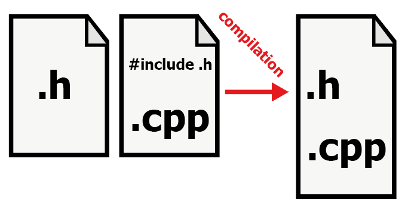  
⚠️ On inclu des .h dans les .cpp mais jamais de .cpp dans un .cpp  
  

Comme l'on travaille avec plusieurs fichiers, il peut vite arriver que l'on utilise des fonctions où variables ayant le même noms dans des fichiers différents, ce qui est source d'erreur lors de la compilation. Imaginons 2 variables globales (c'est à dire déclarées hors fonction) dans 2 fichiers:  
```cpp
int speed = 16;
```
```cpp
int speed = 4;
```   

Lors de la compilation nous aurons une erreur de linkage. Afin de se prémunir on peut déclarer les variables globales comme static, leur portée sera ainsi limité, utiliser un namespace différent pour chaque une d'elles, ne pas en faire des variables globales mais locales en les mettant dans une fonction.
## règles  

Lorsque l'on écrit **type** + **nomDeVariable** le compilateur crée une variable. Il applique cette règle « Si je vois un type suivi d’un identificateur, alors je dois déclarer une nouvelle variable. »  
ça aide à comprendre pouquoi une même variable a un type à certains endroits du code et pas d'autres.
  
## les 3 "etats" d'une fonction
**déclaration** = dit au compileur quelles fonctions, variable et classes existent. Quand on déclare une classe on déclare également ses méthodes et attributs à l'intérieur. Cela se fait dans le fichier .h  
**definition** = donne le corps de la fonctions (ce qu'elles fait). La définition peut être contenue dans la déclaration (donc dans le fichier .h) mais comme ça prend de la place, généralement on met la définition dans le fichier .cpp sous le main().   
**appel** = exécute les fonctions avec les arguments passés dans la parenthèse prévue à cet effet. On peut appeler plusieurs fois la même fonction.  
  
exemple:  
```cpp
int add(int a, int b);   // Déclaration (prototype)
```
```cpp
int add(int a, int b) {  // Définition
    return a + b;
};
```
```cpp
int main() {
    cout << add(2, 3);   // Appel
};
```

## Variable
Une variable se compose d'un type, d'un nom et d'une valeur. Elle sert à conserver des données que l'on souhaite réutiliser ou modifier.
on peut déclarer les variables de deux manières:  
variable initialisée:

```cpp
int speed = 5;
```  

```cpp
int speed(5); //shortform of int speed = 5;
```

variable non initialisée:
```cpp
int speed;
```
⚠️ On a pas attribué de valeur à la variable mais elle en contient tout de même une, ça peut être n'importe quoi et c'est source d'erreur.  
Explication: lorsqu'une variable est déclarée, un emplacement mémoire lui est alloué. Si on n'initialise pas la variable, elle garde le contenu de l'adresse mémoire qu'on lui a donnée.  

Maintenant qu'on les a vu plus en détail on peut donner cette définition des variables: Il s'agit d'un espace mémoire défini par un nom (et une adresse), contenant une valeur d'un certain type.  

Les variables apparaîssent sous d'autres nom suivant la manière dont on les utilises:

|  **nom**   | **def** |
|--------------|----------------------------|
| **parametre** |variable passées à la fonction lors de sa déclaration |
| **argument** | variable passées à la fonction lors de son appel |
| **attribut** | variable d'une classe où d'un objet |

Les paramètres sont des variables à l'intérieur de la fonction. implication durée de vie / copie / sauf si statique
pass by copy / pass by reference
  
## fonction Overload   
Aussi nommé urcharge où polymorphisme. Il s'agit du fait de donner définir plusieurs fois une fonction, en changeant le nombre de paramètre et/où leur type.  
Ne pas confondre aver override.  

## fonction Override
Il s'agit de redéfinir une fonction de classe (donc un membre) dans une classe dérivée (classe enfant).  

## pointeur et adresse
getter / setter

## ⚠️ Static dans une fonction VS dans une classe.  
Static a différentes comportement qui dépendent de son context d'utilisation  

| Fonction                                      | Classe                                         |
|----------------------------------------------|------------------------------------------------|
| Conserve la valeur entre les appels          | Partagé entre toutes les instances             |
| N'est initialisée qu'une seule fois          | Peut être accédé sans objet : Classe::membre   |
| Est locale en visibilité, globale en durée de vie | Partage la même valeur pour tous les objets |

## ⚠️ Static VS const.  
**Dans une fonction** une variable static est initialisé une fois mais peut changer de valeur suivant les opération qu'on lui fait subir. Elle n'est pas réinitialisée d'un appel à l'autre, c'est à dire qu'elle garde en mémoire sa valeur.  
à l'inverse une variable const ne peut être changée et sa valeur n'est pas conservée entre deux appels


```cpp
int counter(int number) {
    static int count = number;
    count++;
    return count;
}

main() {
  counter(4); // 5
  counter(99); // 6. car on ne peut pas initialiser 2x une var static
}
```
>Lors du premier appel, count est initialisé avec number (ex: 4), puis incrémenté à 5.  
Lors du deuxième appel, la ligne static int count = number; n’est pas réévaluée, donc number est ignoré, et count continue depuis sa dernière valeur (5), donc devient 6.
```cpp
int counter(int number) {
    const int count = number;
    count++; // ❌ erreur on ne peut pas modifier une variable const
    return count;
}

main() {
  counter(4); // ❌ erreur de compilation
  counter(99); // ❌ erreur de compilation
}
```

```cpp
int counter(int number) {
    const int count = number;
    return count + 3;
}

main() {
  counter(4); // 7
  counter(99); // 102
}
```  
Maintenant **dans une classe**, static indique que l'attribut (les variables de class sont nommées ainsi) est partagé par tous les objets, si un objet modifie sa valeur, cela changera aussi la valeur dans les autres objets. On peut éviter ça avec un const.    
  


## Utilisation de const
⚠️ **l'emplacement du const** a son importance lorsqu'utilisé avec une adresse:  
```cpp
const int* ptr //valeur du composant pointé non modifiable.
```   
```cpp
int* ptr const //adresse non modifiable.
```   
  

##🔎 différentes formes du constructeur

**constructeur local**:  
```cpp
class Animal {      // <-- Class 
public:             // <-- Access modifier
    int legs;       // <-- Attribute

    Animal(int l) { // <-- Constructor (same name as class, NO return type!)
        legs = l;
    }

    void roar() {   // <-- Method
        // Some code here to roar
    }
};

Animal monkey(4);   // <-- Object 'monkey' created with 4 legs
```  

**constructur hors classe**:  
Pour ne pas surcharger la déclaration d'une classe on peut définir sont constructeur en dehors. (Attention la déclaration de classe possède bien une déclaration de constructeur mais pas de définition de constructeur)  

```cpp
// Declaration inside the header or class  

class Stepper {
public:
    Stepper(); // Constructor declared but not defined !!
    void stepForward(); // Method declared
};
```
et on va la définir **en dehors de la classe**. pour se faire on utilise Stepper::Stepper() qui se lit (de droite à gauche) "c'est le constructeur Stepper() de la classe Stepper"

```cpp
// In the .cpp file:  

Stepper::Stepper() { // Constructor defined outside class
    // Constructor code here
}

void Stepper::stepForward() {
    // Method code here
}

```


**ce qui me perturbe c'est qu'on doit utiliser le nom de la class pour nommer le constructeur (dans sa déclaration) mais on utilise le nom que l'on veux lorsque on l'utilise ex:
Animal(); //déclaration du constructeur par défaut (= sans rien) dans la classe (dans le .h)  

Animal::Animal(int leg){  //définition du constructeur externe (hors .h)
  méthode  
  atributs   
};   

Animal Monkey(4); // création d'objet Monkey (dans .cpp)
Animal::Monkey(4)// création d'objet Monkey. -> je suis perdu es-ce que c'est juste ? quelle est la diférence

aussi les constructeur des classes sont ils utilisés pour créer des classes filles ?
les objets héritent ils des attributs et méthodes de la classe ?
et static dans tout ça ? dans une fonction c'est un mot clé pour appeler la variable que une fois je crois. dans les class c'est un attribut partagé par toutes les instances de la classe (donc les objets ?)**

##classes dérivées

On parle de classe dérivé pour décrire une classe fille qui hérite d'une classe parent.  
La classe fille hérite des attributs et méthodes de son parent. Elle peut avoir de nouveaux attributs et méthodes que le parent ne possède pas. Le constructeur de la classe dérivé fait appel au constructeur du parent car la classe dérivée est composée des membres du parent ainsi que de ces propres membres. Il est possible que la classe dérivé redéfinisse des méthodes hérités de la classe parent, pour ce faire il faut indiquer les méthodes comme **virtual** et les **assigner à 0** dans la classe parent:  
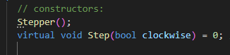      
Si les attributs sont publics, dans une instance de classe (un objet) on peut manipuler les attributs sans méthode. C’est aussi vrai pour les méthodes. L’appel d’une méthode peut se faire depuis l’objet, ou alors il peut se faire deouis une autre méthode.


En mettant ce "**=0**", la méthode devient **abstraite** et on force la classe dérivée à redéfinir la méthode. Il n'est pas obligatoire de l'assigner à 0, on peut aussi lui donner un comportement "par défaut" qui sera celui utilisé si la classe dérivée ne redéfinit pas la méthode.
Ainsi virtual signifie qu'on peut (on peut aussi ne pas le faire) redéfinir la méthode dans une classe dérivée. Utiliser virtual avec =0 signifie qu'on doit la redéfinir dans une classe dérivée.

Si la classe parent possède un constructeur vide (un constructeur sans paramètress et sans corps définissant ses attributs/méthodes) on a pas besoin de faire le liens entre les paramètres du constructeur de la classe fille et la classe parent, mais c'est rarement le cas.  

```cpp
class parent {      // <-- Class 
public:             // <-- Access modifier
    int var_1_;       // <-- Attribute

    parent(int var_1) { // <-- Constructor (same name as class, NO return type!)
    var_1_ = var_1;  //<-- a noter que l'on ne remet pas le type int, sinon ce serait
                     // recréer une nouvelle variable 
    }

    void divide() {   // <-- Method
        // Some code here to divide
    }
};

class enfant : public parent {    // <-- c'est comme ça qu'on crée une classe dérivée.
public:  
  enfant (int child_var_1, int child_var_2) : parent(child_var_1) 
   // liste  d'initialisation. pour faire le liens entre les paramètre 
   // du parent et de l'enfant. 
   // ici on lie le premier argument de l'enfant au premier attribut du parent.
   // En fait lors de  l'appel de la classe enfant (sa création) les arguments 
   // seront passé dans les paramètres du constructeur de l'enfant (logique) 
   // on peut passer ces paramètres à la classe parent en écrivant leur nom 
   // dans la parenthèse du constructeur parent. Ils seront transmis au 
   // constructeur parent en fonction de leur position. 
   // (Le fait que la logique de passage dépende une fois du nom et 
   // une fois de la position porte à confusion) 
   // ces 2 constructeurs vont créer l'objet enfant.

};
```     
 la classe dérivée est composée de la classe parent. Ca porte un peu à confusion de se dire que l'enfant possède le parent mais c'est bien le cas. Les méthodes de la classe dérivée ont accès aux méthodes et attributs du parent si ils sont public ou protected. Les méthodes de la classe dérivée n'ont pas accès aux méthodes et attributs de la classe dérivée (cf Schéma gauche) **à moins que** l'on déclare les méthodes du parent comme virtual et qu'on les assigne à 0. Cela signifie que les méthodes seront redéfinies dans la classe dérivée, on y ajoute le mot clé override (pas obligaoire mais bonne pratique) (cf schéma droite)
    
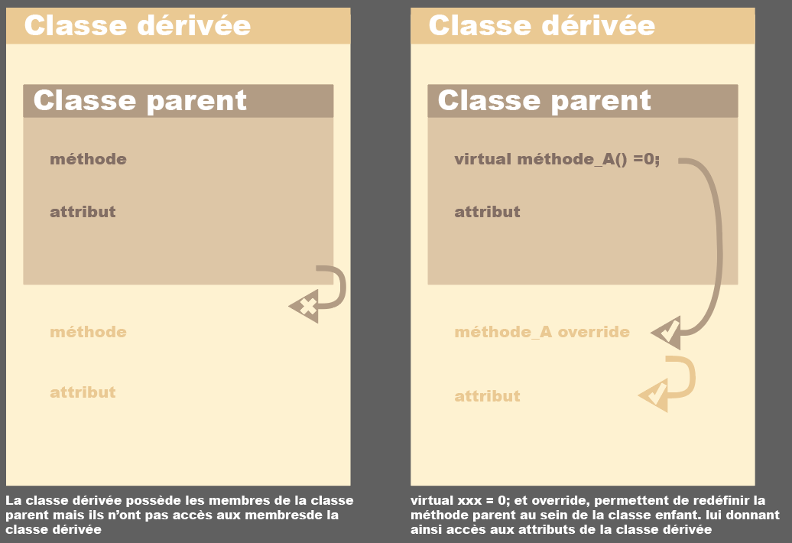         


## liste d'initialisation.
Il s'agit d'un raccourcis d'écriture. Ce schéma explique la logique de passage des paramètres d'un constructeur à l'autre via liste d'initialisation, ici lorsque les constructeurs sont définis dans le fichier.h:  
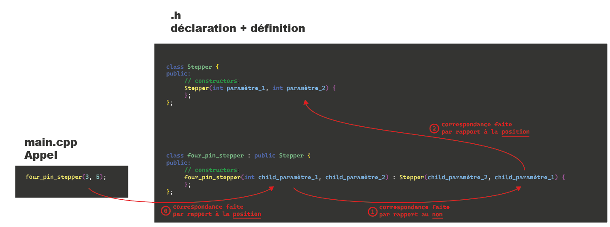     

Ci dessous lorsque les constructeurs ne sont pas définis dans le fichier.h mais dans le .cpp  
Remarque on n'utilise pas d'accoladea après l'appel du constructeur vu qu'il n'y a rien à définir:   
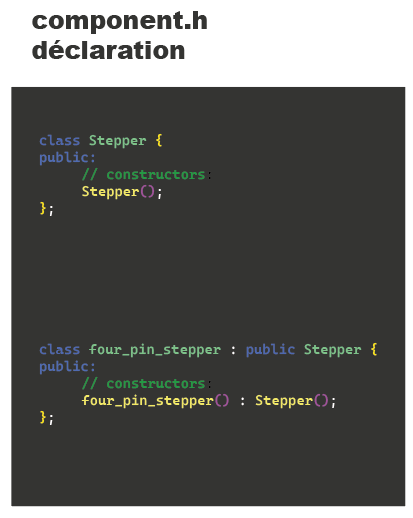     
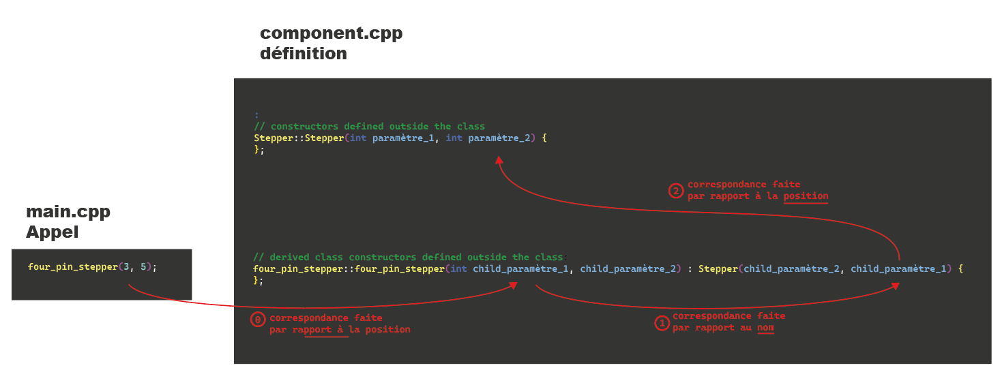       

⚠️ Le constructeur d'une classe dérivée peut avoir plus de paramètres que le constructeur de la classe parent mais il ne peut pas passer plus de paramètre au parent que le nombre de paramètres du parent. 
  
⚠️ Lorsque l'on traite des const et les pointeurs, il faut absoluement utiliser la liste d'initialisation car ils ne peuvent pas exister et voir leur valeur changer (dans le cas des const) où sans valeur attribué (dans le cas des pointeur).    

⚠️ ça paraît inutilement compliqué de mettre des attributs non défini dans une classe, devoir utiliser la notation compliquée d'une liste d'initialisation afin d'y avoir accès et pouvoir les définir dans une classe dérivée. Pourquoi ne pas simplement les supprimer de la classe parent et les avoir que dans les classes dérivées ? Dans certains cas on veut forcer les classes dérivées à posséder certains attributs, par exemple si la méthode speed de la classe parent "vehicule" a besoin de connâitre le poid de la voiture / moto / etc pour calculer la vitesse, avoir un attribut weight non initialisé dans la classe parent fait sens, si demande un poid en tant que paramètre dans le constructeur de la classe parent et qu'on fait le liens avec l'attribut, la classe dérivée est obligé de définir cet attribut. Dans cet exemple le parent a un attribut sans valeur par défaut. comme le constructeur du parent fait le lien entre les paramètres et les attributs, cela force la classe enfant à appeler le constructeur parent et faire le liens avec ses propres paramètres.


## liens paramètres -attributs
Résumé des cas possibles.  
classe sans liste d'initialisation:  
```cpp
class Parent {
public:
    int var_1_;   // attribut

    // constructeur sans liste d'initialisation
    Parent(int var_1) {
        var_1_ = var_1;   // on assigne dans le corps
    }
};

```   
Classe avec liste d'initialisation:
```cpp
class Parent {
public:
    int var_1_;   // attribut

    // constructeur avec liste d’initialisation
    Parent(int var_1) : var_1_(var_1) {
        // rien d'autre à écrire
    }
};

```   
Classe dérivée sans liste d'initialisation:  
```cpp
class Enfant : public Parent {
public:
    int var_2_;

    // constructeur enfant sans liste
    Enfant(int v1, int v2) : Parent(0) { // obligé d'appeler Parent d'une façon
        var_1_ = v1;   // hérité de Parent
        var_2_ = v2;   // propre à Enfant
    }
};

```   
Classe dérivée avec liste d'initialisation:  
```cpp
class Enfant : public Parent {
public:
    int var_2_;

    // constructeur enfant avec liste
    Enfant(int v1, int v2) : Parent(v1), var_2_(v2) {
        // plus rien à écrire
    }
};

```   

##⚠️ Héritage   

|  **Visibilité**   | **Accessibilité par classe fille ?** | **Accessible de l'extérieur ?** | 
|--------------|----------------------------|----------------------------------------------------------|
| **public**  | oui | oui | 
| **protected** | non | non |  
| **private** | non | non |  

##🔎 Is-a VS Has-a

On utilise la question **is-a** / **has-a** pour savoir si une classe hérite d'une autre classe où possède une autre classe ou un objet d'une autre classe ??  

Is-a:
```cpp
class Vehicle {
    // common properties like speed, fuel, etc.
};

class Car : public Vehicle { //création d'une classe fille d'une autre classe
    // Car is-a vehicule because Car inherits everything from Vehicle 
};
```    
  
Has-a:
```cpp
class Engine {
    // Engine details
};

class Car {
public:
    Engine engine; // Car "has a" Engine
}; 
``` 
> attention c'est bien écrit sur 2 lignes  
>public:  //spécificateur d'accès  
>Engine engine;  
>et pas public: Engine engine;

## modulo  

C'est une opération noté x %y qui va nous donner le reste de la division de x par y. Cela permet de créer une boucle allant de 0 à y-1.   
Voici comment ça marche: 10 %4 = 2. On met le plus de fois 4 dans 10 et on regarde ce qu'il reste, le reste est le résultat du modulo. 2 %4 = 2, on ne peut pas mettre 4 dans 2, il reste 2. 4 %4 =0.  
Avec les nombres negatifs le modulo ne donne un résultat négatif dans C++ mais pas forcément dans un autre language de programmation.  
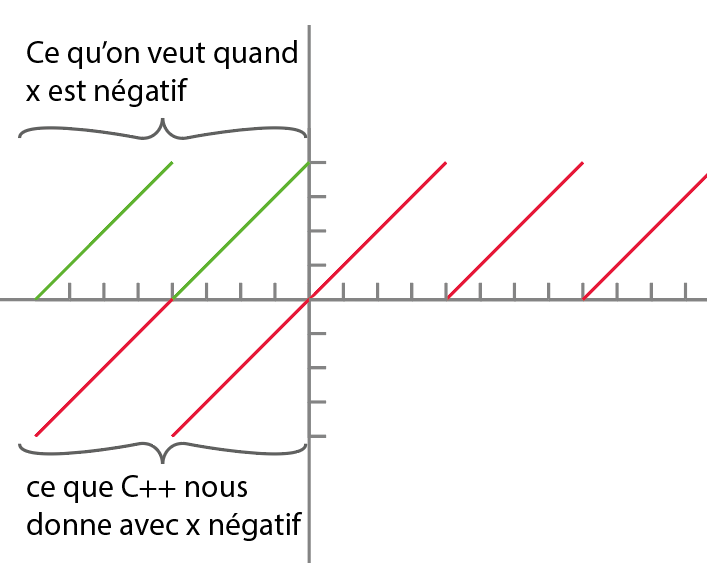  

Il faut recourir à une astuce pour éviter d'avoir à traiter des nombres négatifs:   on va rajouter 4 (la taille de notre cycle) pour revenir dans des nombres positifs et corriger le décallage (lorsque x = -1, sans l'astuce le modulo nous retourne -1, cf trait rouge. Ce qu'on veut c'est 3, donc faire une valeur absolue du modulo n'aurait pas fonctionné). on se retrouve donc avec (x %4 + 4) %4. Exemple:  
```cpp
int stepIndex = ((currentStep_ % 4) + 4) % 4;  
```   

## Look-up table  
A la place d'utiliser un switch avec plusieurs case on peut utiliser une Look-up table (abrégé LUT).  
Si le switch donne du code plus compréhensible à mon niveau, il est aussi moins efficace, moins adaptable et demande au processeur de calculer le résultat de chaque cas à chaque étape. Le principe du look-up table, c'est de faire tous les calculs des cas possible durant l'initialisation et de les stocker dans un tableau. Cela à l'avantage de ne pas avoir besoin de tout calculer à chaque fois. On va juste chercher notre résultat dans le tableau.  
Dans cet exemple de switch case, on décrit quelles pin doivent être alimenté pour faire tourner un moteur selon les 4 cas possibles:  
 
```cpp
switch (currentStep_ % 4) {
  case 0: 
    gpio_set_level(pin1, 1);  
    gpio_set_level(pin2, 0);  
    gpio_set_level(pin3, 1);   
    gpio_set_level(pin4, 0); 
    break;  

  case 1:
   gpio_set_level(pin1, 0); 
   gpio_set_level(pin2, 1); 
   gpio_set_level(pin3, 1); 
   gpio_set_level(pin4, 0); 
   break;

  case 2:
   gpio_set_level(pin1, 0); 
   gpio_set_level(pin2, 1); 
   gpio_set_level(pin3, 0); 
   gpio_set_level(pin4, 1); 
   break;

  case 3: 
   gpio_set_level(pin1, 1); 
   gpio_set_level(pin2, 0); 
   gpio_set_level(pin3, 0); 
   gpio_set_level(pin4, 1); 
   break;
}
```

A la place on va faire une **lecture binaire par décalage de bits à partir d’une Look-up table**. Le principe c'est de récupérer les séquences du moteur, dans notre cas on a 1010, 0110, 0101 et 1001, ce sont les 4 steps qui permettent à notre moteur de tourner. les 1 et les 0 décrivent si la pin est alimenté(1) où non(0). la position du chiffre correspond à la pin 1, 2, 3 où 4. Ces séquences moteurs peuvent être interprété comme un nombre en représentation binaire. 1010 équivaut à 10 en notation décimale (1 x 2^4 + 0 x 2^3 + 1 x 2^2 + 0 x 1^2). 0110, 0101 et 1001 correspondent respectivement à 6, 5 et 9.  
On crée un tablea de 4 entrées auquel on assignes ces 4 nombres:  

```cpp
int sequence[4] = { 10, 6, 5, 9 };  
```  

Pour gagnier en lisibiliter, bien que ça complique un peu le tout on va plutôt stocker nos nombres dans le tableau en représentation binaire. Comme ça on voit quelle pin est allumée. on utilise 0b avant la représentation binaire du nombre, ça indique que ce qui suit est une notation binaire.  

```cpp
int sequence[4] = {0b1010, 0b0110, 0b0101, 0b1001};  // =  0b est juste une notation pour dire aux humains que ce qui suit est un nombre en binaire. là on a 10, 6, 5, 9 en binaire
```  

Ce tableau c'est notre Look-up table.

Current step va nous dire quelle séquence récupérer dans le LUT, avec l'opérande & combiné à un **left shift operator** - c'est ce symbole: << - on va lire que le dernier symbol de la séquence et déterminer si la pin doit être sur ON où OFF. Le fait de lire que un bit de notre séquence est possible grâce à la manipulation de bits via masque binaire (on parle de Bitmasking).   

```cpp
for (int i = 0; i < 4; i++) {                // incrémentation standard de 0 à 3, soit 4 états. Les commentaires détaillent le cas i = 0
    if (sequence[currentStep_] & (1 << i)) {    //on récupère l'entrée 0 du tableau, donc la 1ère séquence. on utilise la logique AND grâce à &. On utilise le masque binaire 0001 grâce à 1 << i. à ce stade le masque est 1 en binaire soit 0001 décalé de 0 vers la gauche donc 0001.
        gpio_set_level(motor_pins[i], 1);  // active la bobine
    } else {
        gpio_set_level(motor_pins[i], 0);  // désactive la bobine
    }
}
```  

en fait (1 << i) veut dire qu'on prend 1 en binaire soit 0001 et qu'on le décale de i vers la gauche, tout en rajoutant i zeros à sa droite. Lorsque i = 0 on reste sur 0001. Quand i = 1, on a 0010. Quand i = 2, on a 0100. Cette partie du code est le **masque binaire**.  Note: j'utilise 4 bit pour représenter la valeur par confort visuel vu qu'on 4 pin qui contrôlent notre moteur et qu'on va aller jusqu'à 1000, mais en fait en interne l'esp utilise un int de 32 bit donc 1 vaut 00000000 00000000 00000000 00000001 en binaire.

 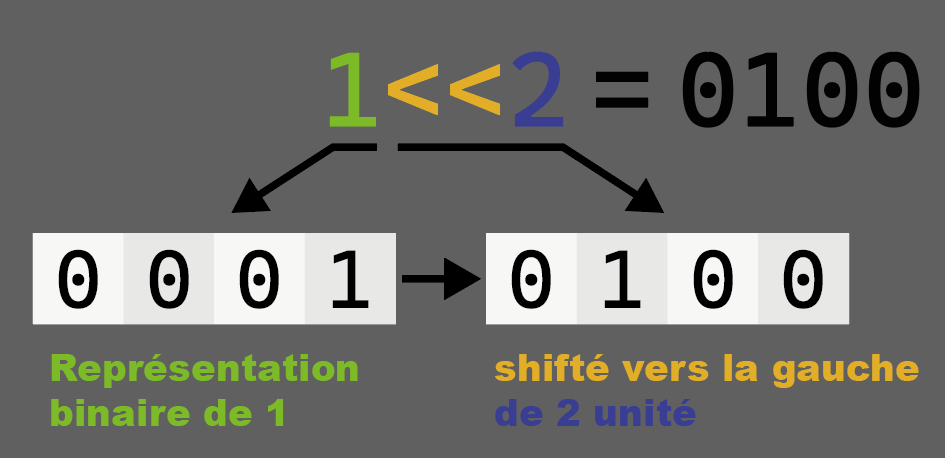     

Notre code va réaliser une opération binaire & avec le bitmask et la séquence actuelle du moteur. Le résultat va déterminer quelles pin pin enverront un signal.    
 ```cpp  
 if (sequence[currentStep_] & (1 << i))
 ```    
  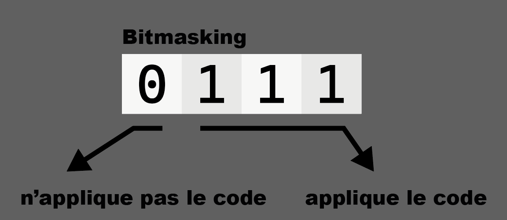
   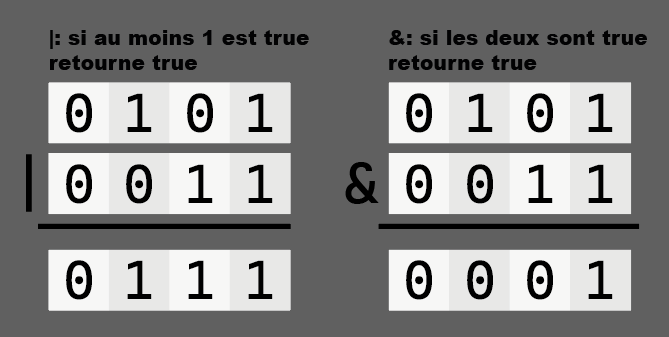 


## opérateurs bitwise
 Aussi nommé logic gate, opérateur bit à bit où opération binaires. Ils manipulent bit par bit des valeurs sous notation binaire (ex: 00110010). Voici leur représentation en électronique:  
 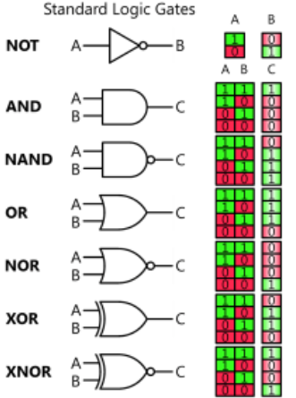    
  

On utilise &, ce qui équivaut à AND. Si les deux inputs sont identiques, l'output sera le même, si les 2 inputs sont différents, l'output sera 0.  
Voici les opérateurs logiques binaires (logic gates) de l'informatique:    

| **NOT** **~** | **0** | **1** |
| ------- | ----- | ----- |
| **0**   | 0     | 1     |
| **1**   | 1     | 0     |  


| **AND** **&** | **0** | **1** |
| ------- | ----- | ----- |
| **0**   | 0     | 0     |
| **1**   | 0     | 1     |  

| **OR** **\|** | **0** | **1** |
| ------ | ----- | ----- |
| **0**  | 0     | 1     |
| **1**  | 1     | 1     |  

| **XOR** **^** | **0** | **1** |
| ------- | ----- | ----- |
| **0**   | 0     | 1     |
| **1**   | 1     | 0     |  
  
L'opérateur NAND n'existe pas directement en C++. On doit le construire avec **~(a & b)**
C'est une inversion du résultat de AND, c'est une combinaison de NOT et AND. :    

| **NAND** | **0** | **1** |
| -------- | ----- | ----- |
| **0**    | 1     | 1     |
| **1**    | 1     | 0     |    

L'opérateur NOR n'existe pas directement en C++. On doit le construire avec **~(a \| b)**
C'est une inversion du résultat de OR, c'est une combinaison de NOT et OR:  

| **NOR** | **0** | **1** |
| ------- | ----- | ----- |
| **0**   | 1     | 0     |
| **1**   | 0     | 0     |  

⚠️ Attention la notation && peut porter à confusion avec l'opérateur &.  
Il s'agit de 2 choses différentes.  
& est un opérateur binaire alors que && est un opérateur logique.  
  
## Opérateur logiques
Noté **&&** pour le **AND logique**, à ne pas confondre avec le AND au niveau du bit (&). Retourne true si les 2 opérandes sont true, false dans les autres cas.
Les 2 opérandes ne sont pas toujours évalué, si la première opérande est false, la deuxième opérande n'est pas évalue (car dans tous les cas l'opérateur logique retournera false). On appelle ça le shortcut où évaluation court-circuit.  

Selon le même principe on a aussi le **OR logique**, noté **\|****\|** qui retourne true si au moins une des opérande est true. Les opérandes utilisés avec l'opérateur logique OR n'ont pas à être du même type, mais elles doivent avoir un type booléen, intégral ou pointeur. Le 2ème opérande n'est évalué que si la première opérande est false, la deuxième opérande n'est pas évalue (car dans tous les cas l'opérateur logique retournera false). évaluation court-circuit.  

Cette aspect de court-circuit a plusieurs avantages: gain de temps de calcul vu qu'on evalue pas la 2ème opérande, bloque les effets d'incrémentation de la 2ème opérande dans les cas non désirés (si la 2ème opérande contient un i++, ça l'empêche d'incrémenter une variable à chaque évaluation plutôt qu'à chaque cas positif). peut prévenir des erreurs ex:  

```cpp
int x = 5;
int y = 0;

if (y != 0 && x / y > 1) {  // 1ère opérande false, activation du court-circuit, on va pas évaluer la 2ème opérande et ainsi éviter une division par 0
}

```  


## utilisation de la mémoire
Après compilation, le programme est stocké dans 3 zones de la mémoire:  

**data** = les variables globales initialisées  
**BSS** (block start by symbol) = les variables globales non initialisées où = à 0.   
ex:int speed;  
**RO**(read only) = les variables constantes (celles qui ont le mot clé **const** et ne peuvent être modifées).
Il y a aussi deux zones dynamiques qui se remplissent et se vident en fonction des besoins, c'est la **stack** et la **heap**. toutes les variables qui seront crées localement par des fonctions viendront dans la **stack**, les variables dynamiques créées avec new iront dans la **heap**.


  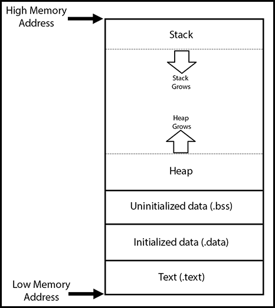

La zone text contient le code compilé du programme, en lecture seule.

## Stack - Heap
  
La stack et la heap occupent et se partagent le reste de la mémoire, il n'y a pas 50% réservé pour la stack et 50% pour la heap, c'est en fonction de nos besoin. on peut se retrouver dans une situation où 80% c'est de la stack et 20% de la heap. Si on a trop de variables locale on peut se retrouver en stack overflow, c'est qu'on a plus de place pour les variables locales.
La **Stack** se remplie du haut vers le bas, il faut imaginer ça comme une pile de livre dont on peut retirer que le livre au sommet de la pile. Ainsi la 1ère variable que l'on entre sera la dernière que l'on sort. A contratio, la dernière variable ajoutée est la plus accessible, on dit **LIFO** "last in first out".
On parle de mémoire dynamique car elle évolue au cours du temps. des éléments y sont ajoutés puis supprimés. Une variable peut se retrouver plusieurs fois dans la stac, chaque fois à un endroit différent durant l'exécution du programme. D'ou l'utilité des pointeurs, qui sont des trackeurs du lieu où sont stockés les variables. Dans certaines applications comme les task freeRTOS il faut spécifier combien de place allouer dans la stack (combien de bits). ça permet à l'ordinateur de savoir que les x bits suivant appartiennent à la même entité.

Chaque appelle de fonction vient remplir la stack avec ses variables locales. une même variable ne sera pas appelée toujours au même endroit, comme on rempli la stack selon LIFO, sa place dépend de ce qu'il y a déjà dans la Stack. Chaque fonction terminé enlève les variables grâce au mot clé **return**.  

La **heap** - le tas - contient les structures dont on ne connaît pas la taille à l'exécution du code, comme un tableau dynamique (= qu'on peut alimenter donc taille variable). il n'y a pas de système LIFO avec la heap. La heap a les désavantages d'être plus lente que la stack, et de ne pas se vider automatiquement. Les smart pointer solvent ce problème.

  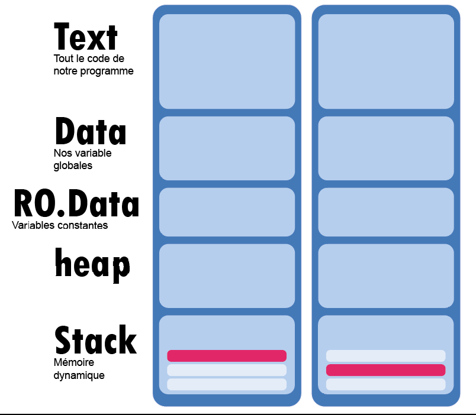
> ici un exemple d'une même variable stocké à 2 endroit différent dans la stack

## Program counter
Il s'agit de la tête de lecture qui parcour le programme (un programme est une liste d'instruction). Un peu comme nous qui lisons les appel de fonctions et devons changer de fichier pour lire leur définition, le Program counter se téléporte vers d'autres parties du programme - il change d'adresse, se déplace dans la mémoire pour lire ce qu'il y a à une autre adresse. Quand il va le faire il récupère l'adresse de la prochaine instruction. ça lui permettra de se téléporter au bon endroit une fois qu'il aurra fini de voir les détails du contenu de l'adresse à laquelle il vient de voyager.    
Exemple: l'instruction 2 lui dit de se référer à une zone de la stack, avant d'y aller il récupère l'adresse de l'instruction 3. une fois la zone de la stack parcourue il peut se déplacer à l'instruction 3 car il a pensé à la stocker avant de se déplacer. Si il ne l'avait pas fait il serait perdu, comme un amnésique qui ne sait pas d'où il vient.

## fonctions

Ce qui est important de savoir c'est **où la variable est stockée** et **où la variable est visible**

## class et objets synthaxe
on utilise le type class pour créer une classe. on lui donne le nom qu'on veut.
```cpp
class Animal {
public:
    int pattes;
    
    Animal(int p) {  // <-- constructeur avec argument
        pattes = p;
    }
};
```
```cpp
Animal Singe(4);  // Construction d'un objet Singe avec pattes = 4

```
> on a crée -on dit instancier- un objet nomé "Singe" à partir de la classe "Animal".  
> il hérite des méthode et attributs de son parent.

Dans ce cas le **constructeur** était défini **dans la classe**.   
Mais on peut aussi définir **le constructeur hors de la classe** pour gagner de la place. On définisse la classe dans le fichier .h et son constructeur dans le fichier .cpp:  
```cpp
Animal::Animal(int l){  //définition du constructeur hors déclaration
  legs = l;
}
```
Création de **classe** Monkey **à partir de la classe** Animal:
```cpp
class Monkey : public Animal {
  //méthodes et attributs aditionelles spécifiques à la classe Monkey
}; 
``` 
Ainsi Monkey hérite des méthodes et attributs de la classe animal tout en pouvant ajouter les méthodes et attributs spécifiques à sa classe  
>On pourrait créer une classe Monkey a partir de la class Animal et un objet Monkey à partir de la classe Animal mais ce n'est pas judicieux de leur donner le même nom, ça porte à confusion.  

exemple de création d'une classe à partir d'une classe (héritage) puis d'objet à partir de la classe fille. L'objet possède un attribut de la classe mère. le constructeur est un peu particulier
```cpp
class Animal {
public:
    Animal(int l) { legs = l; }
    int legs;
};

class Monkey : public Animal {
public:
    Monkey() : Animal(2) {} //constructeur référant le parant
};

Monkey george;  // george est un objet de la classe Monkey, qui hérite de Animal
```

on peut avoir un constructeur qui utilise le constructeur de la classe mère et initialise un attribut ou appelle une méthode spécifique à la classe fille:
```cpp 
  #include <iostream>
using namespace std;

class Animal {
public:
    int legs;

    Animal(int l) {
        legs = l;
        cout << "Animal created with " << legs << " legs\n";
    }
};

class Monkey : public Animal {
public:
    bool hasTail;

    // Constructeur de Monkey avec un paramètre
    Monkey(bool tail) : Animal(2) { // Appelle d'abord le constructeur Animal
        hasTail = tail;
        cout << "Monkey created with tail: " << (hasTail ? "yes" : "no") << "\n";

        // Appel d'une méthode de Monkey à la création
        speak();
    }

    void speak() {
        cout << "Ooh ooh aah aah!\n";
    }
};

int main() {
    Monkey george(true); // Création d’un objet de type Monkey avec queue
    return 0;
}
```


//les objets crée à l'aide du constructeur possèdent automatiquement (inside non-static member functions) le pointeur nommé "this" qui référence l'objet crée. c'est pour ça qu'on peut accéder aux méthodes hérités de sa classe parent avec this->heritedFunction();
// depuis l'extérieur de l'objet pour acceder à ses attributs méthodes on va utiliser. et depuis l'objet lui même pour accéder à ses attributs méthodes on va utiliser-> 

//this->number_of_steps ne va affecter que l'attribut de cet objet. ça va pas le changer dans la class ou les autres objets. donc ce n'est pas une valeur partagée. 
//Si l'on voulait que l'attribut soit partagé  entre tous les objets il fallait utiliser static 
  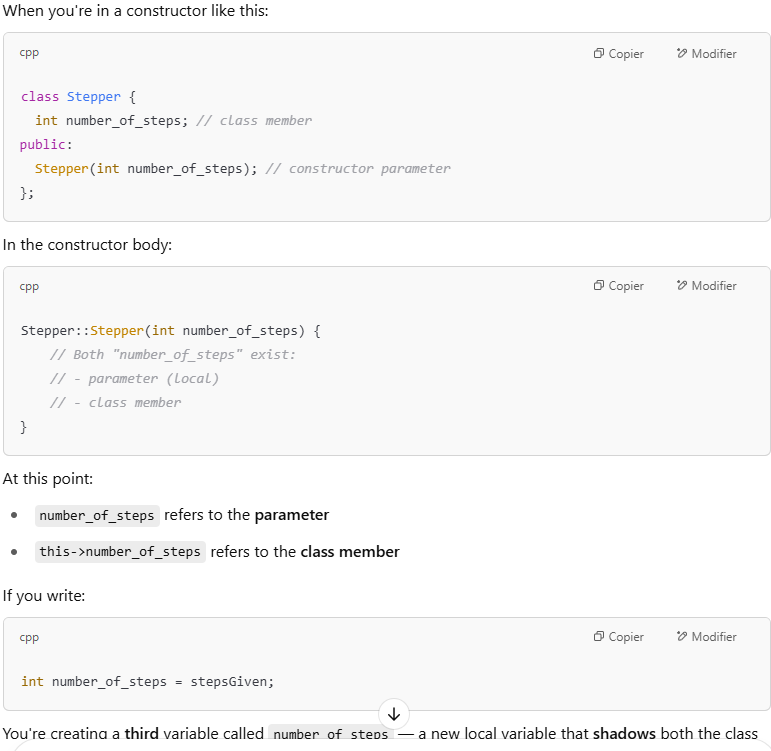

//Stepper::Stepper(...) {
  // corps du constructeur
}
// cCela ne crée pas un objet. Ça définit comment construire un objet.

//Stepper MyStepper1(200, 2, 3, 4, 5); -----> création d'objet
et pas Stepper::MyStepper1(200, 2, 3, 4, 5);

à l'intérieur de l'objet : this->setSpeed(100);
à l'extérieur de l'objet: MySteper1.setSpeed(100);

Stepper::setSpeed(...) 
définition de la méthode setSpeed de la class stepper. cette définition sera partagée par tous les objets mais chacun l'exécutera avec ses propres attributs.
mais tous les objets partagent la même méthode setspeed comme on l'a définie ?
Oui ✅, tous les objets partagent le code de la méthode setSpeed(), mais chacun l’exécute pour lui-même, avec ses propres données internes (attributs).

## Data type

**int** = XXXX
**float** = XXXX voir si l'article sur comment l'ordinateur gère els nombre peut être assigné ici et faire des liens entre eux  
**char** = XXXX  
**char** = XXXX
etc

