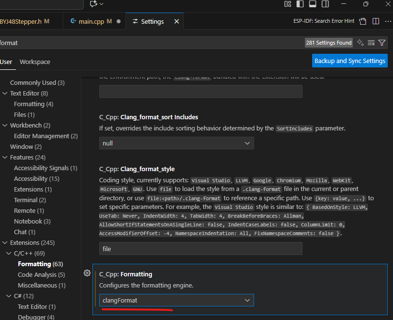

---
date:
  created: 2025-03-09
categories:
  - Logiciels
tags:
  - Logiciel
authors:
  - thomas
slug: Arduino IDE
---

# ESP IDF set up et utilisatoin 
Initialisation de l'environnement de développement intégré ESP


<!-- more -->

## Set up 
dans visual studio code, simplement installer l'extension ESP IDF
  

choisir le mode express
  

Choisir le chemin où enregistrer les fichiers relatifs à ESP-IDF
  

De mon côté ça ne fonctionnait pas encore et il a fallu encore localiser le fichier de commande **install.Bat** et l'exécuter pour réinstaller les dépendances.
 

## ouvrir terminal de commande
quand on utilise des commande dans la barre de recherche (palette de commande) il faut mettre > devant la commande. 
   
Si on utilise **ctrl** + **shift** + **p** ça met notre curseur dans la palette de commande pour que l'on puisse écrire notre commande, le > est déjà inclu.   
     
il faut utiliser la commande **ESP-IDF: Open ESP-IDF Terminal** pour ouvrir le terminal ESP IDF.


## connexion à l'ESP 32
j'ai un ESP32 S3 mini, je le connecte au PC via le câble USB-C, il me faut connaitre son serial port, pour ce faire, dans le gestionnaire de périphériques, chercher Ports 
  

En bas de notre page on a les boutons pour ce qui est de compiler le code et le téléverser vers l'ESP.
On va choisir UART comme flash méthode, sélectioner le port, faire build et flash
  
Afin de voir le code s'executer (ici un hello world qui tourne en boucle) il faut encore cliquer sur monitor device afin de le voir dans le terminal.  
  
 

⚠️ Si la procédure ne marche pas et que l'on a des message d'erreur de type mentionnant clang et/ou 0x00, il se peut que ce soit parce que c'est la **première fois qu'on téléverse du code sur l'ESP**. Dans ce cas il faut effacer le dossier build (ce dossier sera recréer à notre prochain build) et **passer l'ESP en mode download** en maintenant pressé le bouton à droite du port USB-C (lorsqu'on lui fait face), il a l'inscription 0. Tout en maintenant le bouton, connecté le câble USB-C de l'ordinateur à l'ESP. Maintenir 5 secondes. Il va faloir refaire le build et le flash. Mais avant il faut **s'assurer qu'on soit sur le bon port**, en effet il peut avoir changé bien qu'on soit resté sur le même port USB.  

## commandes
Les commandes idf.py sont disponible dans les répertoires (directories en anglais = dossiers) contenant un fichier CMakeList.txt  
On parle de CLI: Command Line Interface (Interface en ligne de commande), cela permet de se passer des menus et interface graphique.

>idf.py build -> revient à cliquer sur l'icone de clée à molette pour build le projet.  
>idf.py build VERBOSE=1 -> build du project mais en activant le mode verbeux, qui donne un peu plus d'information. Plus lent.    
>idf.py -v build -> build du project avec mode verbeux encore plus complet.  
>idf.py menuconfig -> configurer les paramètres système de l'ESP tel que la fréquence du tick (fréquence FreeRTOS)  
>idf.py update-dependencies -> met à jour le projet au niveau des dépendances.  
>idf.py create-project -> crée un nouveau projet ESP IDF.  
>idf.py create component -> crée un nouveau component.  
>idf.py set-target -> définir le type de processeur sur lequel on va flasher notre programme.  

## Debug  
ESP-IDF nous retourne un code si il y a une erreur (de type esp_err_t, exemple **esp_err_t 0x17**)  lors du build où ESP-OK si il n'y en a pas.  
On peut utiliser la fonction **esp_err_to_name()** et lui donner le code d'erreur comme paramètre pour qu'elle nous retourne l'erreur sous forme de text. 
[doc](https://docs.espressif.com/projects/esp-idf/en/stable/esp32/api-guides/error-handling.html#esp-error-check-macro).  

Afin de pouvoir utiliser la fonction esp_err_t 0x17 et avoir plus de contrôle sur les log, il faut ajouter #include "esp_log.h" à notre fichier. On peut paramètrer le niveau de détail des log. Plus ils sont détaillés, plus la compilation prend du temps:  
      
   
 Il est possible d'avoir des log plus détaillés dans une certaine zone du code plutôt que dans tout le code (gain de temps de compilation) en utilisant **log_local_level** dans le CMakeList.txt du composant que l'on souhaite détailler.

 On peut aussi utiliser le principe de Per-log formating pour que les log soient détaillés lorsqu'une certaine valeur est atteinte, on fait ça avec un if (ex: lorsqu'une sonde atteins 70 degrés). 
 [doc log](https://docs.espressif.com/projects/esp-idf/en/stable/esp32/api-reference/system/log.html#_CPPv47esp_log16esp_log_config_tPKcPKcz)  

## Procédure de correction des erreurs du code
Pour les modification des fichiers de type **.c**, **.h** et **.cpp** un ctrl + S suivit d'un build suffit.
Pour les modification de la structure des dossiers / fichiers, comme un ajout de composant, le changement de nom de fichier où la modification d'un fichier CMake, il faut effacer le dossier build puis faire un nouveau build

## ESP Registry
C'est un [site](https://components.espressif.com/) permettant de télécharger des bibliothèques pour faire fonctionner des composants comme les leds WS2812.
On peut aussi créer nos propres component et les partager sur ESP Registry.


## Récupérer un component sur ESP Registry et l'intégrer à un projet / Architecture dossiers
le code principale que l'on écrit se situe dans le dossier main.
Chaque composant sur ESP.Registry comprent une commande permettant de télécharger les fichiers dans notre dossier de projet au sein d'un sous-dossier nommé **managed_components**.  

Pour commencer il faut ouvrir le terminal ESP_IDF (ctrl + shift + p -> Open ESP IDF terminal) et y coller la commande du component que l'on souhaite ajouter au projet, récupérée d'ESP Registry. Autre manière: coller > + la commande du component dans la barre de recherche de Visual studio Code.  
   
> comande à récupérer sur ESP Registry.


Par exemple: **idf.py add-dependency "supcik/status_led^2.0.0"** ça va créer un fichier idf.component.yml au sein du dossier main. le fichier .yml est comme une liste de course lisible/compréhensible par l'ordinateur et l'humain que CMake va interpréter pour télécharger les fichiers voulu lorsque l'on lance la commande **idf.py build**. Si le composant n'est pas ajouté on peut essayer **idf.py reconfigure** qui fait une sorte de refresh.


Résumé des actions de la commande prise sur esp-Registry et idf-py build:   

- créer le fichier .yml qui est une liste de ce dont on a besoin pour intégrer le Component.     

- CMake va traduire la liste pour qu'elle soit lisible par Ninja.    

- Ninja va compiler et executer les instructions.  

- les fichiers du component sont téléchargé dans le dossier managed_component  

J'ai été bloqué à cette étape, je n'avais pas de dossier managed_component. Le problème a pu etre résolu grâce à la commande **idf.py update-dependencies** qui a fait une sorte de rafraichissement, retéléchargé ce qui me manquais, mis à jour les fichiers.  
Attention: Lors de la création de mon projet de test ESP IDF "hello-world" j'ai du cocher une option qui m'a ajouté des component Arduino, ça complique les choses, j'en ai pas besoin pour le moment, j'efface le dossier arduino.

[Création de component et upload sur ESP-Registry](ESP_Registry_creation_de_component.md)

## Clang
Ce compilateur va nous permettre de changer la mise en page de notre code pour qu'elle respecte les règles d'indentation ainsi que nos préférences en matière de longueur de lignes etc. C'est possible car en plus d'être un compilateur il vient avec clang format, outil de formatage de text.
On va commencer par [télécharger Clang pour windows 64](https://github.com/llvm/llvm-project/releases/tag/llvmorg-18.1.8) puis **ajouter l'extension Clang** dans visual studio code, puis dans **file**->**préférences**->**extensions**->**C/C++**->**Formatting** choisir le formatage **clangFormat**.  
   
Ensuite dans **file**->**preference**->**settings**->**save** cocher **format on save** pour qu'à chaque constrôle S, Clang corrige la mise en page.  
Enfin on ajoute un fichier .clang-format à la racine de notre dossier. Voici son contenu:  

```cpp
---
BasedOnStyle: Google
IndentWidth: 4    
---
Language: Cpp
ColumnLimit: 100
DerivePointerAlignment: false
PointerAlignment: Left
BinPackArguments: false
BinPackParameters: false
```


## FreeRTOS
Système d'exploitation temps réel intégré dans ESP-IDF. c'est l'acronyme de Real Time Operating System.
Permet de créer des tâches indépendentes qui vont dialoguer entre elles. Elles tournent en concurrences, c'est à dire que FreeRTOS gère le temps de processeur alloué à chaqu'une, ce qui donne une illusion de parallèlisme (temps réel). Exemple: la 1ère tâche à droit à 20 milisecondes de processeur avant qu'elle soit mise en pause et que la 2ème tâche ait à son tour droit à 20 milisecondes, si elle a besoin de moins elle passe la main dès la fin de ses opérations à la 3ème tâche. La plupart du temps les tâchent prennent moins de temps que le temps à disposition. elles passent donc la main.  
Le scheduleur (ordonnanceur en français) est la partie du programme qui décide quelle est la tâche qui tourne actuellement. Les tâches sont gérées dans une queue.
Le fait d'allouer du temps disponible par tâche est nommé système préemptif, c'est à dire que le système peut arrêter une tâche en cour pour passer à une autre. L'autre forme de système est nommé coopératif, une tâche bloque tout le monde tant qu'elle n'est pas terminé, ça à l'aventage d'être plus rapide dans certains cas mais l'inconvénient de ne pas pouvoir faire de temps réel.
Sur esp-idf le temps alloué par tâche est libre, ex: 1000 Herz, ça veux dire qu'une tâche dure 1'000ème de seconde, soit 1 miliseconde. Plus la valeur est élevé moins elle dure longtemps/plus elle la durée est courte.
On peut modifier cette valeur grace à la commande **idf.py menuconfig** -> Component config -> FreeRTOS -> Kernel    
Les ESP32 et ESP32-S3 ont un système dual core.
Apparement FreeRTOS a été écrit en C, c'est la raison pourlaquelle on ne peut pas uniquement utiliser ce qu'on connaît en C++, certaines fonctionalités de C++ ne peuvent pas être utilisées et il faut passer par C.

## tuto Arduino IDE    
Je me réfère à ce blog: [randomnerdtutorial FreeRTOS](https://randomnerdtutorials.com/esp32-freertos-arduino-tasks/)
TaskHandle_t MyTaskHandleName = NULL; = variable pointant vers une tâche FreeRTOS, nous permettant de controler (reprendre / stopper / effacer) la tâche. [Arduino IDE]
Les tâches  sont des fonctions de type void qui doivent avoir un unique argument (à ce moment ce n'est pas encore une tâche, il nous faudra appeller la fonction xTaskCreatePinnedToCore() avec un set d'argument définissant la tâche que l'on souhaite créer pour faire de notre fonction de type void une tâche). Dans la fonction on construit une loop infinie avec "for (;;) {xxxx}", dans cette loop on utilise "vTaskDelay(1000 / portTICK_PERIOD_MS);" pour introduire une pause si on le veut (ex led clignotante), cette pause n'est pas perdue, d'autres fonctions tourneront durant ce temps. Sur ESP-32 chaque tick dure typiquement 1ms (on utilise portTICK_PERIOD_MS). Dans notre exemple on a donc une pause d'un millième de seconde.
Pour que notre fonction soit effectivement une tâche il faut utiliser cette fonction: "xTaskCreatePinnedToCore()". Les arguments servent à décrire la tâche et à l'identifier.

xTaskCreatePinnedToCore(
  BlinkTask,      // Task function
  "BlinkTask",   // Task name
  10000,           // Stack size (bytes)
  NULL,            // Parameters.  Mettre ici le paramètre de la tâche, si elle n'en a pas mettre NULL
  1,                   // Priority.  Plus le nombre est grand plus la tâche est prioritaire.
  &BlinkTaskHandle,  // Task handle
  1                  // Core 1. le core sur lequel la tâche va tourner
);

On verra plus tard comment calculer la taille de la mémoir à attribuer à notre tâche.

Pour plusieurs tâche il suffit de créer une nouvelle tache et nouvelle TaskHandle_t et définire la nouvelle tâche comme on a fait avec la première. Rien d'autre.

## Mettre en pause et reprendre une tâche ex un bouton qui contrôle une tâche.

Il nous faut définir les **volatile varaibles**, elles seront utiles au **ISR** (interrupt service routine).

```cpp
// Volatile variables for ISR
volatile bool taskSuspended = false;  // bool déterminant si la tâche est suspendue
volatile uint32_t lastInterruptTime = 0; // track le temps depuis la dernière interuption
const uint32_t debounceDelay = 100; // debounce period, suivant les contact d'un bouton, il faut un petit moment pour être sur que le circuit est fermé ou ouvert
```  

la fonction buttonISR() va utiliser les volatile variable. Son rôle est de faire en sorte que le debounce time soit respecté, d'updater les volatile variable et d'appeler la fonction de suspention d'activité où de reprise d'activité.  On a ajouté **IRAM_ATTR** à la définition de la fonction pourqu'elle s'execute sur la RAM.   
On commence par attendre le délais défini par debounceDelay. une fois atteint on met à jour le lastInterruptTime et on inverse la valeur du boolean taskSuspended.
```cpp
void IRAM_ATTR buttonISR() {
  // Debounce
  uint32_t currentTime = millis();
  if (currentTime - lastInterruptTime < debounceDelay) {   // si le temps depuis la dernière interuption - le temps actuel est plus petit que debounceDelay quitte la fonction buttonISR car on va avoir des problème vu que le debounce n'est pas respecté (action du bouton plus rapide que le temps qu'il lui faut pour changer d'état)
    return;
  }
  lastInterruptTime = currentTime;   // met à jour le lastInteruptionTime

  // Toggle task state
  taskSuspended = !taskSuspended;  //change l'état du bool taskSuspended
  if (taskSuspended) {
    vTaskSuspend(BlinkTaskHandle);    //suspend la tâche. On utilise le taskHandle_t BlinkTaskHandle comme argument
    Serial.println("BlinkTask Suspended");
  } else {
    vTaskResume(BlinkTaskHandle);   //reprend la tâche
    Serial.println("BlinkTask Resumed");
  }
}
```
On défini également le bouton comme ceci dans setup()  [arduino IDE]: 

```cpp
attachInterrupt(digitalPinToInterrupt(BUTTON_PIN), buttonISR, FALLING);
```

le tout ensemble ça donne ceci [Arduino IDE]:

```cpp
#define LED1_PIN 2
#define BUTTON_PIN 23

// Task handle
TaskHandle_t BlinkTaskHandle = NULL;

// Volatile variables for ISR
volatile bool taskSuspended = false;
volatile uint32_t lastInterruptTime = 0;
const uint32_t debounceDelay = 100; // debounce period

void IRAM_ATTR buttonISR() {
  // Debounce
  uint32_t currentTime = millis();
  if (currentTime - lastInterruptTime < debounceDelay) {
    return;
  }
  lastInterruptTime = currentTime;

  // Toggle task state
  taskSuspended = !taskSuspended;
  if (taskSuspended) {
    vTaskSuspend(BlinkTaskHandle);
    Serial.println("BlinkTask Suspended");
  } else {
    vTaskResume(BlinkTaskHandle);
    Serial.println("BlinkTask Resumed");
  }
}

void BlinkTask(void *parameter) {
  for (;;) { // Infinite loop
    digitalWrite(LED1_PIN, HIGH);
    Serial.println("BlinkTask: LED ON");
    vTaskDelay(1000 / portTICK_PERIOD_MS); // 1000ms
    digitalWrite(LED1_PIN, LOW);
    Serial.println("BlinkTask: LED OFF");
    Serial.print("BlinkTask running on core ");
    Serial.println(xPortGetCoreID());
    vTaskDelay(1000 / portTICK_PERIOD_MS);
  }
}

void setup() {
  Serial.begin(115200);


  // Initialize pins
  pinMode(LED1_PIN, OUTPUT);
  pinMode(BUTTON_PIN, INPUT_PULLUP); // Internal pull-up resistor

  // Attach interrupt to button
  attachInterrupt(digitalPinToInterrupt(BUTTON_PIN), buttonISR, FALLING);

  // Create task
  xTaskCreatePinnedToCore(
    BlinkTask,         // Task function
    "BlinkTask",       // Task name
    10000,             // Stack size (bytes)
    NULL,              // Parameters
    1,                 // Priority
    &BlinkTaskHandle,  // Task handle
    1                  // Core 1
  );
}

void loop() {
  // Empty because FreeRTOS scheduler runs the task
}
```
## adaptation espIDF
https://docs.espressif.com/projects/esp-idf/en/stable/esp32/api-reference/system/freertos_idf.html  

http://tvaira.free.fr/esp32/esp32-freertos.html

https://github.com/DiegoPaezA/ESP32-freeRTOS/blob/master/Task_FreeRTOS/main.c  

https://github.com/DiegoPaezA/ESP32-freeRTOS/blob/master/Task_FreeRTOS/main.c  

On va commencer par inclure les bibliothèques nécessaires:  

```cpp
#include <stdio.h>
#include "freertos/FreeRTOS.h"  //fonctions de freeRTOS
#include "freertos/task.h"    //fonctions de freeRTOS
#include "esp_system.h"
#include "driver/gpio.h"  //contrôle des gpio (les pins)

```  

Définir la notre pin. 
```cpp
#define BLINK_GPIO 2  // define est une macro, c'est a dire une sorte de programme qui s'exécute avant que le programme ne soit compilé et s'exécute à son tour. son role est de chercher toutes les occurence de "BLINK_GPIO" et de les remplacer par 2. On aurait aussi pu faire une variable. L'avantage de #define c'est qu'il n'y a pas de problème de portée.
```  

On va définir les fonctions des tâche. La création de la tâche viendra plus tard:

```cpp
void hello_task(void *pvParameter)  //les tâches sont des fonctions de type void et prennent un pointeur de type void qui va nous permettre de charger nimporte quel type d'argument quand on créera la tâche
//pv signifie pointer void. 
{
	while(1)  //sur arduino ide on utilisait for(;;), c'est dans cett boucle qu'on définit ce que va faire la fonction
	{
	    printf("Hello world!\n");
	    vTaskDelay(100 / portTICK_RATE_MS);  //diviser par portTICK_PERIOD_MS permet d'avoir des milisecondes.
	}
}
```


Voyons la définition d'une autre tâche, ici une tâche qui utilise les GPIO:

```cpp
void blinky(void *pvParameter)
{
    gpio_config(BLINK_GPIO); //cette fonction prend comme paramètre un int correspondant au numéro de la pin. ici on a utilisé une macro. elle sert à s'assurer que la pin choisie est bien une sortie GPIO et n'est pas utilisée pour autre chose (ex communication I2C)
    gpio_set_direction(BLINK_GPIO, GPIO_MODE_OUTPUT); // Une fois qu'on a défini la pin comme GPIO il faut encore définir son état. c'est ce qu'on fait ici. On est obligé d'utilisé ces 2 donctions en combinaison.
    while(1) {
        gpio_set_level(BLINK_GPIO, 0);  //prend comme argument le numéro du pin et l'état qu'on souhaite lui attribuer.
        vTaskDelay(1000 / portTICK_RATE_MS);
        gpio_set_level(BLINK_GPIO, 1);
        vTaskDelay(1000 / portTICK_RATE_MS);
    }
}
```

Passons à la création de tâche. En fait on appelle une fonctionxTaskCreate en lui passant les bons arguments, dont l'adresse de la tâche qu'on a défini précédement.

```cpp
void app_main()
{
    xTaskCreate(&hello_task, "hello_task", 2048, NULL, 5, NULL); //la fonction xTaskCreate prend comme argument: l'adresse de la fonction de la tâche, on donne un nom à cette tâche, on définit la taille qu'on lui alloue dans la stack, le paramètre à passer à la tâche (si il n'y en a pas on met NULL), la priorité de la tâche (plus le nombre est haut plus la priorité est grande) et un pointeur vers TaskHandle_t si une tâche peut stopper une autre tâche.
    // Il n'y a pas vraiment de méthode pour définir la taille à allouer. on peut utiliser uxTaskGetStackHighWaterMark() pune fois l'application en marche pour voir la quantité d'espace libre puis tâtoner.
    xTaskCreate(&blinky, "blinky", 512,NULL,5,NULL );
}

```

C'était un exemple basique qui ne comprenait pas de **taskHandle**, de tâche prenant des **paramètre** (il y en a lors de la création de la tâche mais pas de paramètre externe utilisés par la tâche ), de **sémaphore** et de **mutex**

On va maintenant voir comment gérer une tâche qui utilise des paramètres. On peut passer un seul paramètre mais il y a une astuce permettant de passer plusieurs paramètres malgrès cette restriction. On va voir les 2 façons de faire:  


```cpp
#include <stdio.h>
#include "freertos/FreeRTOS.h"
#include "freertos/task.h"
#include "esp_system.h"

const int speed = 42; //si on utilise pas de const, une variable global qui est reprise dans des fonctions pourrait y être modifiée ce qui pose problème. 2 tâches pourraient utiliser la même variable mais elle pourrait avoir des valeurs différentes. comportement imprévisible. 

// Définition de la tâche
void hello_task(void *pvParameter)
{
    // 1. Casting du pointeur générique pvParameter en int* (donc en pointeur vers une variable de type int)
     const int* speed_ptr = static_cast<const int*>(pvParameter);


    while(1)
    {
        // 2. Déréférencement du pointeur pour afficher la valeur qu'il contient et non son adresse.
        printf("Vitesse : %d\n", *speed_ptr); //%d sert à insérer un élément de type non char (text)
        vTaskDelay(1000 / portTICK_PERIOD_MS);
    }
    
    // 3. 
    
    vTaskDelete(nullptr); //si le paramètre est nullptr, cette fonction supprime la task qui l'a appellé, donc cette tâche. On peut aussi utiliser un handle comme paramètre. Dans ce cas c'est la tâche à laquelle le handle se réfère qui sera supprimée
                          //ici quand on est hors de la boucle on met fin à la tâche avec vTaskDelete(nullptr).
}

// Fonction principale
// Fonction principale
extern "C" void app_main()  //externe "C" permet de faire en sorte que le paramètre passé à la task fonctionne, en fait FreeRTOS utilise C et pas C++, on est obligé d'ajouter ça avant la fonction app_main() pour ne pas rencontrer de problème
{
    // Création de la tâche en passant l'adresse de la variable globale constante.
    // L'opérateur & permet d'obtenir l'adresse de la variable.
    xTaskCreate(
        hello_task,
        "hello_task",
        2048,
        static_cast<void*>(const_cast<int*>(&speed)), //paramètre de la tâche
        // // On ne peut pas simplement mettre void et le nom du paramètre. Le compilateur a un problème si il ne connait pas le type de l'argument car il a besoin de lui allouer le bon nombre de bit de mémoire, ça lui permettra de savoir combien d'octets lire ou écrire à l'adresse du pointeur.
                                                      // Ici, on fait une conversion de type compliquée pour une bonne raison :
// FreeRTOS a été écrit en C et ne comprend pas le concept de "const" (valeur constante).
// Il attend un pointeur générique `void*`. Notre variable `speed` est `const int`,
// donc son adresse est un pointeur `const int*`. Le compilateur C++ est plus strict
// et ne nous laisse pas passer un `const int*` directement à une fonction C qui s'attend
// à un `void*`, car il ne peut pas garantir que cette fonction ne va pas modifier la valeur constante.
//
// Pour contourner ça, on fait un "truc" en deux étapes :
//
// Étape 1: const_cast<int*>(&speed)
// On prend l'adresse de notre variable `speed` (`&speed`). Le compilateur voit que c'est un
// `const int*`. `const_cast` est l'outil spécial qui dit au compilateur : "ignore cette
// constance pour cette fois". On récupère donc un pointeur temporaire de type `int*`,
// qui pointe vers la même adresse que `speed`, mais le compilateur fait comme s'il n'était
// pas constant. C'est ça qui fait que l'étape d'après va fonctionner.
//
// Étape 2: static_cast<void*>(...)
// On prend le résultat de l'étape 1 (le pointeur `int*`) et on le convertit en `void*`
// comme le veut FreeRTOS. C'est l'opération de cast la plus simple. Apparement static_cast est la manière sécurisée de faire un cast. ça n'a rien à voir avec le mot clé static.
        5,
        nullptr
    );
}
```

Voici la méthode pour passer plusieurs arguments grâce à un struct.

```cpp
#include <stdio.h>
#include "freertos/FreeRTOS.h"
#include "freertos/task.h"
#include "esp_system.h"

// On utilise le nom qu'on veut pour le struct. Maintenant packOfParameter est en fait un type qui contient un const char* et un int. le compilateur s'attend a recevoir ces 2 type quand un élément est de type packOfParameter
struct packOfParameter {
    const char* message; // Le message à afficher
    int delay_ms;        // Le délai d'attente en millisecondes
};

// Définition de la tâche
void hello_task_multiple_params(void *pvParameter)
{
    // pvParameter est le pointeur générique reçu par la tâche.
    // On le caste vers le type de notre structure pour pouvoir l'utiliser.
    packOfParameter* packOfParameterPointerForCasting = static_cast<packOfParameter*>(pvParameter); //ce pointeur est uniquement utilisé pour le casting (= passer du type void à struct)

    while(1)
    {
        // On utilise le pointeur casté pour accéder aux membres de la structure.
        printf("%s\n", packOfParameterPointerForCasting->message);  //on utilise -> pour acceder aux variables stockés à l'adresse du pointeur.
        vTaskDelay(packOfParameterPointerForCasting->delay_ms / portTICK_PERIOD_MS);
    }
    
    // Si la tâche s'arrêtait...
    // delete packOfParameterPointerForCasting;
    // vTaskDelete(nullptr);
}

// Fonction principale
extern "C" void app_main()
{
    // On crée une première instance de notre structure sur le tas avec new.
    // On crée un pointeur pour acceder à cette instance.
    packOfParameter* packOfParameterPointerForSelecting_1 = new packOfParameter; //ce pointeur est utilisé pour récupérer les éléments du struct
    packOfParameterPointerForSelecting_1->message = "Bonjour depuis la tâche 1 !"; //on assigne une valeur aux éléments du struct packOfParameterPointerForSelecting_1
    packOfParameterPointerForSelecting_1->delay_ms = 500;

    // On crée la tâche 1 et on lui passe le pointeur vers notre structure.
    xTaskCreate(
        hello_task_multiple_params,  //fonction de la tâche
        "hello_task_multi_1",       //nom de la tâche
        4096,
        static_cast<void*>(packOfParameterPointerForSelecting_1), //paramètre de la tâche
        5,
        nullptr //taskhandle
    );

    // On crée une deuxième instance pour la deuxième tâche. on lui assigne des autres valeurs que celle de la 1ère instance.
    packOfParameter* packOfParameterPointerForSelecting_2 = new packOfParameter;
    packOfParameterPointerForSelecting_2->message = "Deuxième tâche en cours...";
    packOfParameterPointerForSelecting_2->delay_ms = 1000;

    xTaskCreate(
        hello_task_multiple_params,
        "hello_task_multi_2",
        4096,
        static_cast<void*>(packOfParameterPointerForSelecting_2),
        4,
        nullptr
    );
}
```  

On peut aussi utiliser une classe plutôt qu'un struct. Cela permet d'encapsuler les données (attributs) et la logique (méthode) dans une seul entité

```cpp
#include <stdio.h>
#include "freertos/FreeRTOS.h"
#include "freertos/task.h"
#include "esp_system.h"

// 1. On définit une classe pour encapsuler la logique de la tâche.
class MyClass {
public:
    MyClass(const char* msg, int delay) : //constructeur avec paramètres
        message(msg), delay_ms(delay) {} //liste d'initialisation des paramètre pour les passer aux attributs de la classe

    // 2. La méthode de la tâche qui contient la boucle principale.
    // ici elle affiche les attributs de notre classe (selon les paramètres passés aux instances de cette classe)
    void run() {
        while (1) {
            printf("%s\n", message);
            vTaskDelay(delay_ms / portTICK_PERIOD_MS);
        }
    }

private:
    const char* message;
    int delay_ms;
};

// Il s'agit de la définition de notre tâche
// FreeRTOS utilisant C et pas C++, ne connaît donc pas la programation orientée objet
// Il va faloir utiliser une fonction dite trampoline (passerelle) qui va  
// reçevoir le paramètre de la tâche (plus bas dans xTaskCreate)
// Elle reçoit le pointeur d'objet en tant que `pvParameter`.
void taskTrampoline(void* pvParameter) {
    MyClass* executor = static_cast<MyClass*>(pvParameter); //signifie que le paramètre de tâche reçu (dans xTaskCreate) va être casté en pointeur type MyClass et que l'on va assigner le pointeur executor au pointer de type myclass*.
    executor->run(); //on peut appeler les méthodes de la classe depuis le pointeur avec ->
    // Normalement, on ne devrait pas atteindre cette ligne avec une boucle infinie.
    // Si la tâche devait se terminer, on pourrait libérer l'objet ici.
    // delete executor;
    vTaskDelete(nullptr);
}

// Fonction principale
extern "C" void app_main()
{
    // On crée une instance de notre classe sur le stack avec new. On crée un pointeur vers cette instance
    MyClass* my_class_1_ptr = new MyClass("Bonjour depuis la classe 1 !", 500);
    MyClass* my_class_2_ptr = new MyClass("Bonjour depuis la classe 2 !", 1000);

    // On crée la première tâche et on lui passe le pointeur vers l'objet (l'instance de classe).
    xTaskCreate(
        taskTrampoline, //la fonction qui va appeller la méthode de l'objet reçu en paramètre de tâche, c'est tordu
        "task_1_cpp",
        4096,
        static_cast<void*>(my_class_1_ptr), //paramètre de la tâche sous forme de pointer vers une instance de classe
        5,
        nullptr
    );

    // On crée la deuxième tâche et on lui passe le pointeur vers le deuxième objet.
    xTaskCreate(
        taskTrampoline,
        "task_2_cpp",
        4096,
        static_cast<void*>(my_class_2_ptr), //paramètre de la tâche sous forme de pointer vers une instance de classe
        4,
        nullptr
    );
}
```

xTaskCreate()        // crée une tache, la mémoire est allouée automatiquement.
xTaskCreateStatic()  // crée une tache, la mémoire est allouée par le user.

Mais dans un système multicore il faut attacher les tâches à un coeur. on utilise donc plutôt:
xTaskCreatePinnedToCore()           // crée une tache affiliée à un coeur, la mémoire est allouée automatiquement.
xTaskCreateStaticPinnedToCore()     // crée une tache, affiliée à un coeur, la mémoire est allouée par le user.  

 Dans les paramètre on donne 0, 1 où tskNO_AFFINITY pour affilier la tâche à un coeur spécifique ou les deux.  

 Lors de la création de tâche on leur a alloué une zone mémoire avec de l'espace (stack), ça signifie que contrairement à une fonction dont les variables internes (donc locales) disparaissent si elles ne sont pas static, les variables au sein d'une tâche continuent d'exister lorsque la tâche passe la main à la suivante. La stack d'une tâche persiste tant que la tâche n'est pas supprimée avec vTaskDelete(). En résumé: les variables d'une tâches n'ont pas besoin d'être static, l'état de ses variables est conservé entre ses misees en pause.  
Ces variables restent locales, pour communiquer leur valeur avec une autre tâche on peut utiliser une variable global (attention nécessite des précaution, par exemple un mutex pour éviter que la variable soit réécrite par 2 tâches en même temps) où plus simplement utiliser la Queue.

## queue 
https://esp32tutorials.com/esp32-esp-idf-freertos-queue-tutorial/?utm_source=chatgpt.com
où file d'attente en français, il s'agit d'un système de communication entre les tâches, c'est ce qui permet de transmettre des messages d'une tâche à une autre, de connaître l'état des variable d'une tâche depuis une autre si elles ont étés envoyés dans la queue. 👉 La Queue ne stocke pas les variables elles-mêmes, mais une copie des données envoyées.
La tâche 1 remplie la queue lorsque son temps de tâche est épuisé, la tâche 2 lit ce qu'il y a dans le queue buffer. Efface ce qu'il y a dans le queue buffer et rempli le queue buffer et ainsi de suite.

Pour mettre en place la queue il va nous faloir une QueueHandle, c'est variable de type QueueHandle_t.
puis créer la queue avec la fonction xQueueCreate. Cette fonction prend le nombre de "bloc" dans la queue (espace mémoire alloués) et la taille de chaqu'un de ces blocs. Tous les blocs dans une queue sont du même type.  

```cpp
QueueHandle_t queueEvents;  //permet aux fonction à qui on passe cet handle de manipuler la queue, similaire à ce qu'on a vu avec les taskhandle.

void app_main() {
    queueEvents = xQueueCreate(10, sizeof(int));  // creation de la queue avec 10 messages max, chaque message = 1 int

    xTaskCreate(TaskMotor, "Motor", 2048, NULL, 2, NULL); // déclaration de tâche 1
    xTaskCreate(TaskLight, "Light", 2048, NULL, 1, NULL); // déclaration de tâche 2
}
```  

Il faut indiquer aux tâches comment envoyer des messages dans la queue, ce terme porte à confusion car on ne place pas la variable qu'on souhaite transmettre dans la queue, à la place on copie la valeur des variables dans la queue. L'"envoi" de message se fait dans la définition de la fonction de la tâche grâce à la fonction xQueueSend qui prend comme paramètre le nom de la queue, l'adresse du message (le message est une variable) et le temps maximum que la tâche doit attendre qu'il y ait de la place dans la queue si cette dernière est pleine. La fonction xQueueSend va lire la valeur contenue à l'adresse donnée et placer une **copie** de cette valeur dans la queue (en gros elle crée une variable dans la queue avec la même valeur qu'elle a lu à l'adresse):    

```cpp
void TaskMotor(void *pv) {
    int msg = 1; // identifiant du moteur par ex.
    while (true) {
        rotateMotor(1, 10); // les paramètres sont par exemple le nr du moteur et le nbr de pas à faire.

        // envoie un message à la Queue
        xQueueSend(queueEvents, &msg, portMAX_DELAY);  //les paramètres sont le nom de la queue, l'adresse du message et le temps max d'attente qu'il y ai de la place dans la queue. si on a 0, la fonction va faire un return immédiatement. le temps est défini en ticks, il faut utiliser portTICK_PERIOD_MS pour avoir un temps défini rapport à nos secondes et non un temps défini rapport à la fréquence du processeur (ce qui est un temps local et pas global.) On peut utiliser portMAX_DELAY pour attendre jusqu'à ce qu'il y a de la place mais si include_VtASKsUSPEND vaut 1, la tâche va rester bloquer indéfiniment.

        vTaskDelay(pdMS_TO_TICKS(500)); // attend 0.5s avant de recommencer
    }
}
```  

Maintenant qu'on a vu comment envoyer des messages, on va voir comment les récupérer (ce terme porte un peu à confusion car on copie le contenu de la queue, on le récupère pas). La fonction xQueueReceive va récupérer la valeur de la variable contenue dans la queue et copier sa valeur à l'adresse passée en argument.   

```cpp
void TaskLight(void *pv) {
    int received;
    while (true) {
        // Si la fonction xQueueReceive n'est pas null c'est qu'on a reçu un message.
        if (xQueueReceive(queueEvents, &received, portMAX_DELAY)) {
            
            changeLightColor(received); // ex : change la couleur selon le moteur
        }

        vTaskDelay(pdMS_TO_TICKS(100)); // animation continue si tu veux
    }
}
```

Pour **débugger** on peut utiliser **uxQueueMessagesWaiting(handle)**, cette fonction va nous retourner le nombre de message dans la queue.  
Afin de passer plusieurs variables dans la queue on peut utiliser un struct. Il faut utiliser typedef struct.   
En C++ on travail avec des type, int, float, etc. sont des types. Les types définissent ce que contient une variable et comment la mémoire est organisée (combien alouer d'octet pour stocker les variables).
Typedef permet de créer un nouveau type, ici struct. Chaque struct est différents, il n'a pas le même nombre de variable ni le même type de variable, c'est pour ça qu'on doit passer par une phase de définition.  

```cpp
typedef struct  { //typedef = définition de type, ici de type struct
    int motorId;
    int steps;
} MotorCommand; //nom du struct
```
Voici un exemple utilisant un struct. Important: bien que le struct contienne 2 variables, il occupe un bloc dans la queue. Ce bloc contient els 2 variables.

```cpp
#include <stdio.h>
#include "freertos/FreeRTOS.h"
#include "freertos/task.h"
#include "freertos/queue.h"

typedef struct  {   //template du struct. Comme il est global les 2 task y ont accès et peuvent créer un struct local à partir de ce template.
    int counter;
    int counter2;
} MotorCommand;

QueueHandle_t queueMotor;  // global: seulement le handle de la queue, pas les données

// --- Tâche 1 : Producteur ---
void TaskProducer(void *pv) {
    MotorCommand cmd;  // VARIABLE LOCALE à la tâche 1

    cmd.counter = 0;
    cmd.counter2 = 100;

    while (true) {
        cmd.counter++;
        cmd.counter2 += 10;

        printf("[Task 1] Send: counter=%d, counter2=%d\n", cmd.counter, cmd.counter2);

        // Envoie une COPIE du struct dans la queue
        xQueueSend(queueMotor, &cmd, portMAX_DELAY);

        vTaskDelay(pdMS_TO_TICKS(1000));
    }
}

// --- Tâche 2 : Consommateur ---
void TaskConsumer(void *pv) {
    MotorCommand received;  // VARIABLE LOCALE à la tâche 2

    while (true) {
        // Lecture de la queue — copie dans la variable locale "received"
        if (xQueueReceive(queueMotor, &received, portMAX_DELAY)) {
            printf("  [Task 2] Received: counter=%d, counter2=%d\n",
                   received.counter, received.counter2);

            // Modifie la donnée reçue
            received.counter *= 2;
            received.counter2 -= 5;

            printf("  [Task 2] Updated -> counter=%d, counter2=%d\n",
                   received.counter, received.counter2);

            // Si tu veux renvoyer vers la queue
            xQueueSend(queueMotor, &received, portMAX_DELAY);
        }

        vTaskDelay(pdMS_TO_TICKS(1500));
    }
}

// --- Fonction principale ---
extern "C" void app_main() {
    // Crée une queue de 3 blocs, chaque bloc = un struct MotorCommand
    queueMotor = xQueueCreate(3, sizeof(MotorCommand));

    if (queueMotor == NULL) {
        printf("Erreur : échec de la création de la queue\n");
        return;
    }

    xTaskCreate(TaskProducer, "Producer", 4096, NULL, 2, NULL);
    xTaskCreate(TaskConsumer, "Consumer", 4096, NULL, 1, NULL);
}
```

## Scheduler  
c'est la partie du programme qui passe à la tâche suivante lorsqu'une tâche a terminé avant le temps imparti. Le scheduling c'est donner des priorités aux tâches pour qu'elles s'exécutent dans un ordre précis. Le scheduler peut intérompre une tâche de basse priorité pour passer la main à une tâche de haute priorité. la priorité est donnée sous forme de nombre entier.  

## Task Management   - Mutex - Semaphore - ISR
Créer, suspendre, reprendre et effacer des tâches. Une tâche est une fonction indépendante, ayant sa propre zone mémoire allouée et possédant un état (en cours / pret / bloqué / suspendue).  
es

-----------------
MQTT = protocole efficace pr dialogue entre appareils.
Publisher = partage
SUbscriber = reçoit

un client peut faire les 2

structure organisé autour de topic (sujet)

broker = c'est le cerveau qui redirige les infos dans les topics.  

SDK =  Software Development Kit, sorte de boîte à outil de développeurs contenant des bibliothèques, des exemples et des utilitaires. ESP-IDF est le SDK d'Espressif pour programmer l'ESP32  

Framework = à la manière d'utiliser un CMS plutôt que de coder son site web. un framework est une sorte de structure pré-construite. Srduino est un framework, la partie timer est gérée automatiquement, nous on fournit juste setup() et loop().  

Firmware = Programme spécial qui est chargé directement dans un microcontrôleur, c'est le code que l'on flash vers notre ESP32, le programme compilé qui "vit" le microcontrôleur

API = Application Programming Interface (Interface de programation). Ce n’est pas une interface graphique (UI = User Interface), mais une interface logicielle : un ensemble de fonctions, de classes, de protocoles, qui définissent comment un programme ou une bibliothèque peut être utilisé par un autre programme.  

Kernel = noyeau, c'est le coeur du système d'exploitation de l'ordinateur. Il établit la communication entre la partie hardware et software de l'ordinateur. Le scheduler est une partie du Kernel.  

Core = processor (CPU: Control Prosessing Unit = cerveau de la machine)

Node-RED = programme qui permet d'implémenter la logique générale inter appareil, c'est comme une map des actions à faire en fonction des messages retournés par les différents appareils.  

SoC = System on Chip , signifie qu'il n'y a qu'un composant, la puce ESP32 par exemple, qui intègre plusieurs choses. CPU, mémoires, périphériques etc. comme un mini ordinateur sur une puce.   

SMP = Symmetric Multi-Processing, plusieurs coeurs et un système capable de gérer les tâches sur n'importe quelle coeur de manière équitable. N'importe quelle tâche peut être gérée par nimporte quel coeur.

Un petit raspberry pi peut être un serveur à - de 100.-
un Nass - network attak ? storage marque synologie.

--------------------------------

projet hello world: C:\Users\thoma\Documents\Github\Timer_code\Test_decouverte-_ESP_IDF\main
Cmake installed by espIDF extension: C:\Users\thoma\esp\v5.4.2\esp-idf\tools\cmake
