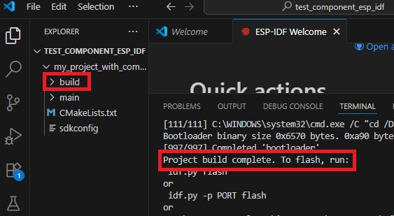
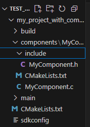
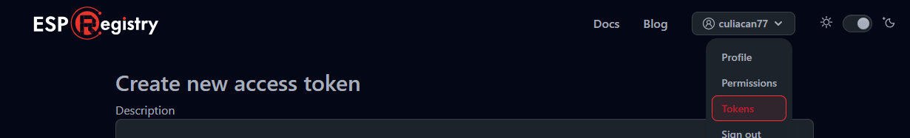
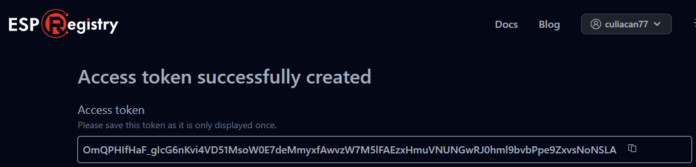

---
date:
  created: 2025-03-09
categories:
  - Logiciels
tags:
  - Logiciel
authors:
  - thomas
slug: Arduino IDE
---

# ESP IDF set up et utilisatoin 
Initialisation de l'environnement de développement intégré ESP

<!-- more -->

## Set up 
dans visual studio code, simplement installer l'extension ESP IDF
  

choisir le mode express
  

Choisir le chemin où enregistrer les fichiers relatifs à ESP-IDF
  

De mon côté ça ne fonctionnait pas encore et il a fallu encore localiser le fichier de commande **install.Bat** et l'exécuter pour réinstaller les dépendances.
 

## ouvrir terminal de commande
quand on utilise des commande dans la barre de recherche (palette de commande) il faut mettre > devant la commande. 
   
Si on utilise **ctrl** + **shift** + **p** ça met notre curseur dans la palette de commande pour que l'on puisse écrire notre commande, le > est déjà inclu.   
     
il faut utiliser la commande **ESP-IDF: Open ESP-IDF Terminal** pour ouvrir le terminal ESP IDF.

## connexion à l'ESP 32
j'ai un ESP32 S3 mini, je le connecte au PC via le câble USB-C, il me faut connaitre son serial port, pour ce faire chercher Ports
  

En bas de notre page on a les boutons pour ce qui est de compiler le code et le téléverser vers l'ESP.
On va choisir UART comme flash méthode, sélectioner le port, faire build et flash
  
Afin de voir le code s'executer (ici un hello world qui tourne en boucle) il faut encore cliquer sur monitor device afin de le voir dans le terminal.  
  
 

## commandes
Les commandes idf.py sont disponible dans les répertoires (directories en anglais = dossiers) contenant un fichier CMakeList.txt  
On parle de CLI: Command Line Interface (Interface en ligne de commande), cela permet de se passer des menus et interface graphique.

>idf.py build -> revient à cliquer sur l'icone de clée à molette pour build le projet.  
>idf.py menuconfig -> configurer les paramètres système de l'ESP tel que la fréquence du tick (fréquence FreeRTOS)  
>idf.py update-dependencies -> met à jour le projet au niveau des dépendances.  
>idf.py create-project -> crée un nouveau projet ESP IDF.  
>idf.py create component -> crée un nouveau component.  
>idf.py set-target -> définir le type de processeur sur lequel on va flasher notre programme.

## ESP Registry
C'est un [site](https://components.espressif.com/) permettant de télécharger des bibliothèques pour faire fonctionner des composants comme les leds WS2812.
On peut aussi créer nos propres component et les partager sur ESP Registry.

## Récupérer un component sur ESP Registry et l'intégrer à un projet / Architecture dossiers
le code principale que l'on écrit se situe dans le dossier main.
Chaque composant sur ESP.Registry comprent une commande permettant de télécharger les fichiers dans notre dossier de projet au sein d'un sous-dossier nommé **managed_components**.  

Pour commencer il faut ouvrir le terminal ESP_IDF (ctrl + shift + p -> Open ESP IDF terminal) et y coller la commande du component que l'on souhaite ajouter au projet, récupérée d'ESP Registry. Autre manière: coller > + la commande du component dans la barre de recherche de Visual studio Code.  
   
> comande à récupérer sur ESP Registry.

Par exemple: **idf.py add-dependency "supcik/status_led^2.0.0"** ça va créer un fichier idf.component.yml au sein du dossier main. le fichier .yml est comme une liste de course lisible/compréhensible par l'ordinateur et l'humain que CMake va interpréter pour télécharger les fichiers voulu lorsque l'on lance la commande **idf.py build**. Si le composant n'est pas ajouté on peut essayer **idf.py reconfigure** qui fait une sorte de refresh.

Résumé des actions de la commande prise sur esp-Registry et idf-py build:   

- créer le fichier .yml qui est une liste de ce dont on a besoin pour intégrer le Component.     

- CMake va traduire la liste pour qu'elle soit lisible par Ninja.    

- Ninja va compiler et executer les instructions.  

- les fichiers du component sont téléchargé dans le dossier managed_component  

J'ai été bloqué à cette étape, je n'avais pas de dossier managed_component. Le problème a pu etre résolu grâce à la commande **idf.py update-dependencies** qui a fait une sorte de rafraichissement, retéléchargé ce qui me manquais, mis à jour les fichiers.  
Attention: Lors de la création de mon projet de test ESP IDF "hello-world" j'ai du cocher une option qui m'a ajouté des component Arduino, ça complique les choses, j'en ai pas besoin pour le moment, j'efface le dossier arduino.
 

## Creation d'un component
On a vu comment récupérer un component sur ESP Registry, on va maintenant voir comment en créer un dans un projet dédier (ex: moteur 28BY-J-48) afin de le partager.

Pour commencer il faut faire un dossier dans notre explorateur windows. On va ouvrir ce dossier avec VSCode: file -> open folder  
ensuite ouvrir le terminal de commande et taper: 
> idf.py create-project my_project_with_components    

 
Cette commande nous a crée un dossier nommé my_project_with_components. on va changer de directory dans le terminal pour executer notre prochaine commande dans ce dossier :  
> cd my_project_with_components  --------> //change directory  
> idf.py set-target esp32c3      --------------------> //chose esp model  
> idf.py build                   ------------------------------------------> // build project  

J'ai peut être crée un dossier en trop (le dossier test_component_esp_idf), je modifierai cette partie si c'est le cas.

Le build est réussi si l'on a pas de message d'erreur et que l'on voit **project build complete. To flash, run: ...**  
La présence de dossier build dans l'arborescence du projet nous indique aussi que cela a fonctionné  
 

On va maintenant créer le sous dossier components qui contiendra les fichiers de code de notre composant. Pour ce faire, utiliser la commande:  
>idf.py create-component -C components MyComponent    -------> crée que le fichier .cpp et .h

Voilà le resultat dans VScode et l'explorateur de fichier:  
 
 
  
On a bien notre fichier .h et .c, reste à y écrire le code du composant.  

a tester/completer:

XX On peut aussi utiliser cette commande qui a l'avantage de nous créer un dossier avec tout le matériel nécessaire.  Je crois     
 >idf.py create-component YourComponentName    

 Il nous reste alors à completer les fichiers .h et .c avec notre code. 

XXXXXXXXXXXXXXXXXX cette section s'étoffera.  
xxxxxxxxxxxxxxxxxx ajouter ltypedef enum to hold the registers that can be read or written to the component.  
XXXXXXXXXXXXXXXXXX ajouter les "drivers" dans la CMakeList.txt  
XXXXXXXXXXXXXXXXXX Kconfig (équivaut à changer les valeurs de certains paramètre dans menuconfig ?)  

xxxxxxxxxxxAll the information you might need should be provided by the manufacturer, including the device address, registers, etc.xxxxxxxxxxxxxxxx

## publication d'un component sur ESP Component Registry - manière 1
**Note**: je n'ai pas testé cette manière de faire j'ai juste synthetisé la doc disponible sur esp Registry.
J'ai testé la méthode 2 qui est plus compliquée à mettre en place mais plus simple pour le maintient du code et des mises à jour.  

En partant du composant crée précedement, afin de pouvoir publier notre component sur ESP registry il faut encore ajouter:  
> le fichier .yml  
> la liscence.txt     
> le README.md  
   
Un fichier **.yml** (yamal) est un fichier facilement lisible par des humains, contenant les informations nécessaires à un programme informatique pour adapter son fonctionnement. il est appellé **manifest** en anglais. Il peut contenir des informations comme la langue, les protocoles de communication, etc.
Dans notre cas les informations ne semblent pas pertinante et sa présence sert plus à valider une case pour être accepté sur Repository.  

>  version: "0.0.1"  
>  description: "This is a test component"  
>  url: "https://mycomponent.com"  # The homepage of the component. It can be a GitHub repository page.  
> version: "0.0.1"  #partie dépendant de la liscence qu'on a choisie
>  license: "NameOfTheChosenLiscence"  # nom dépendant de la liscence qu'on a choisie

Le fichier de **liscence** décrit l'utilisation du component, c'est une sorte de créative common. On peut consulter https://choosealicense.com/ pour récupérer une liscence qui nous convient.  

Le fichier **README.md** est une description textuelle de la fonction et de l'utilisation du composant.  
  

Maintenant qu'on a les prérequis pour la publication on va utiliser **staging Registry** pour tester notre composant, c'est comme une simulation de ce que sera notre composant une fois publié sur Registry.

Pour se logger sur Staging Registry on va utiliser cette commande:  
>compote registry login --profile "staging" --registry-url "https://components-staging.espressif.com" --default-namespace <your-github-username>  

On va utiliser cette ligne de commande pour uploader sur staging registry:  
> compote component upload --profile "staging" --name test_cmp    
  
On va mettre à jour notre fichier .yml:  
>dependencies:
>  <your_default_namespace>/test_cmp:  -----> ?????
>    version: "*"
>    registry_url: https://components-staging.espressif.com  ----------> ?????

Maintenant que le composant est testé on va pouvoir le publier sur ESP Registry.  
On va se logguer sur le serveur registry:  
> compote registry login --profile "default" --registry-url "https://components.espressif.com" --default-namespace <your_github_username>  
ça va nous ouvrire une page web nous permettant de nous identifier via notre compte Github puis de **récupérer une clé** que l'on va ensuite **coller dans le terminal**

puis publier le composant avec:  

> compote component upload --name test_cmp    

## publication d'un component sur ESP Component Registry - Methode Github - introduction  
**note**: Manière testée.  
**Résumé**: On va créer un repository sur Github, y ajouter une Github action bloquera tout composant dans l'architecture de dossier est incorecte et qui se chargera de la synchronisation avec ESP Registry à chaque upload de version. Il nous faut également générer un token sur ESP Registry et le partager avec Github.  
**remerciement**: Merci à Jacque Supcik pour l'architecture du projet et les fichiers, j'ai ajouter des commentaires dans les fichiers là où il faut changer les noms en fonction de votre projet personalisé.

## step X - Github action
C'est le fichier **build.yml**, situé dans le dossier **.github** puis  **workflow**, il décrit les règles de vérification des fichiers synchronisés sur Git. Il upload sur ESP Registry en cas de nouvelle version. Récupérable sur mon [repo git](https://github.com/culiacan77/TEST_UPLOAD_TO_ESP_REGISTRY/blob/main/.github/workflows/build.yml)

## step X - token  
On va se connecter sur ESP Registry en utilisant notre identifiant Github:  
  

demander un **token**, c'est comme une clée d'accès secrète jetable dans le cas où elle serait compromise:
  
On peut sélectionner write:components et la créer. On arrive sur une page avec notre token. C'est la seul fois qu'on nous le montre. Comme il est secret on ne pourra plus le récupérer après. Dans notre cas de publication de component on s'en fiche, il faut juste le copier

Il va faloir l'**ajouter à Github**: dans notre repository on va dans settings -> Secrets and variables -> action -> New repository secret
  
On va copier le token d'ESP REgistry et lui donner un nom en majuscule et _  
Je le nomme TOKEN_GIT_TO_REGISTRY  

On peut effacer les token créer si ils sont compromi sur la page des token d'ESP Registry.
  

Dernier point concernant le secret/token, il faut l'indiquer dans le fichier build.yml:
  

## step X - pre-commit (yaml)  
Lorsque l'on modifie les fichier yml (en particulier lorsque j'y ajoute des commentaires) on peut avoir inséré des caractères qui vont poser problème à la compilation. Le pre-commit permet de corriger ça.  
Il faut ajouter un fichier .pre-commit-config.yaml (et pas yml) à la racine de notre projet, heureusement il y a une commande pour se faire:  
> pip install pre-commit  
> pre-commit install  

Pour lancer le pre-commit (à faire après chaque changement) on utilise la commande:  
> pre-commit run --all-files  

## step X - CMakelist
Ces fichier servent au compilateur à savoir quels fichiers compiler, où aller les chercher et quelles dépendances ils ont. 
Pour mon projet il faut 3 fichier CMakeLists.txt  
Un au niveau du projet global, un au niveau du dossier component et un au niveau du fichier main.cpp.  

## step x - Ajouter les fichier component.cpp, component.h et main.cpp
Logique, c'est eux qui définissent le fonctionnement du composant.
component.h déclare les fonctions, component.cpp les défini et elles sont appellées dans main.cpp  
On ne peut pas uploader de fichier main.cpp vide, il y a un minimum de code requis pour passer la compilation.

## step x - Ajouter les fichiers .yml
Il nous faut un fichier idf_component.yml à la racine du repository
indique aux outils externes les versions et prérequis que l'on souhaite ??

XXxxxxxxxxxxxxxxxxxxxxxxxxxxxxxxxxxxxxxxxxxxxxxxxxxxxxxxxxxxx schema des dossiers et de leur contenu min pour uplaod 

## step X - Version  

Enfin pour uploader notre componant sur ESP Registry il faut lui donner un **tag**, c'est à dire une version. le component sera mis à jour sur ESP Registry à chaque nouvelle version que l'on fait.  

Avec gitbash on va faire:  
>git tag v0.1.0  

puis envoyer vers git avec:  
> git push --tag  
  

Comme on le voit notre repository a le tag de version 0.0.0:  

## FreeRTOS
Système d'exploitation temps réel intégré dans ESP-IDF. Real Time Operating System.
permet de créer des tâches. Gérer les tâches dans une queue.
On lui assigne une durée maximum par tâches, une fois le temps écoulé il passe à la suivante. Sur esp-idf elle est libre, ex: 1000 Herz, ça veux dire qu'une tâche dure 1'000ème de seconde, soit 1 miliseconde. plus la valeur est élevé moins elle dure longtemps/plus elle la durée est courte.
On peut modifier cette valeur grace à la commande **idf.py menuconfig** -> Component config -> FreeRTOS -> Kernel
-----------------
MQTT = protocole efficace pr dialogue entre appareils.
Publisher = partage
SUbscriber = reçoit

un client peut faire les 2

structure organisé autour de topic (sujet)

broker = c'est le cerveau qui redirige les infos dans les topics.

Node-RED = programme qui permet d'implémenter la logique générale inter appareil, c'est comme une map des actions à faire en fonction des messages retournés par les différents appareils.

Un petit raspberry pi peut être un serveur à - de 100.-
un Nass - network attak ? storage marque synologie.

--------------------------------

projet hello world: C:\Users\thoma\Documents\Github\Timer_code\Test_decouverte-_ESP_IDF\main
Cmake installed by espIDF extension: C:\Users\thoma\esp\v5.4.2\esp-idf\tools\cmake
