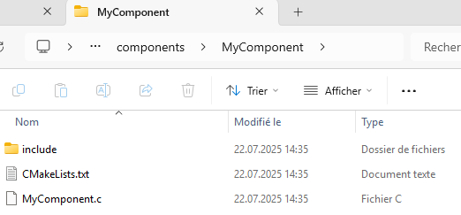

---
date:
  created: 2025-03-09
categories:
  - Logiciels
tags:
  - Logiciel
authors:
  - thomas
slug: Arduino IDE
---

# ESP IDF set up et utilisatoin 
Initialisation de l'environnement de développement intégré ESP

<!-- more -->

## Set up 
dans visual studio code, simplement installer l'extension ESP IDF
  

choisir le mode express
  

Choisir le chemin où enregistrer les fichiers relatifs à ESP-IDF
  

De mon côté ça ne fonctionnait pas encore et il a fallu encore localiser le fichier de commande **install.Bat** et l'exécuter pour réinstaller les dépendances.
 

## ouvrir terminal de commande
quand on utilise des commande dans la barre de recherche (palette de commande) il faut mettre > devant la commande. 
   
Si on utilise **ctrl** + **shift** + **p** ça met notre curseur dans la palette de commande pour que l'on puisse écrire notre commande, le > est déjà inclu.   
     
il faut utiliser la commande **ESP-IDF: Open ESP-IDF Terminal** pour ouvrir le terminal ESP IDF.

## connexion à l'ESP 32
j'ai un ESP32 S3 mini, je le connecte au PC via le câble USB-C, il me faut connaitre son serial port, pour ce faire chercher Ports
  

En bas de notre page on a les boutons pour ce qui est de compiler le code et le téléverser vers l'ESP.
On va choisir UART comme flash méthode, sélectioner le port, faire build et flash
  
Afin de voir le code s'executer (ici un hello world qui tourne en boucle) il faut encore cliquer sur monitor device afin de le voir dans le terminal.  
  
 

## ESP Registry
C'est un [site](https://components.espressif.com/) permettant de télécharger des bibliothèques pour faire fonctionner des composants comme les leds WS2812.
Il faut copier la commande dans le terminal d'ESP IDF (ctrl + shift +p) où ajouter > avant la commande dans la barre de recherche
 

## Ajout de components / Architecture dossiers
le code principale que l'on écrit se siture dans le dossier main.
Chaque composant sur ESP.Registry comprent une commande permettant de télécharger les fichiers dans notre dossier de projet au sein d'un sous-dossier nommé **managed_components**
Pour commencer il faut ouvrir le terminal ESP_IDF (ctrl + shift + p -> Open ESP IDF terminal) et y coller la commande du component que l'on souhaite ajouter au projet, récupérée d'ESP Registry, ex: **idf.py add-dependency "supcik/status_led^2.0.0"** ça va créer un fichier idf.component.yml au sein du dossier main, ce fichier est comme une liste de course que CMake va interpréter pour télécharger les fichiers voulu lorsque l'on lance la commande **idf.py build**. Si le composant n'est pas ajouté on peut essayer **idf.py reconfigure** qui fait une sorte de refresh.

en résumé ces 2 commande vont : 
- créer le fichier .yml qui est une liste de ce dont on a besoin pour intégrer le Component, fichier lisible par les humains et l'ordinateur.  
- CMake va traduire la liste pour qu'elle soit lisible par Ninja.  
- Ninja va compiler et executer les instructions.
- les fichiers du component sont téléchargé dans le dossier managed_component  

J'ai été bloqué à cette étape, je n'avais pas de dossier managed_component. Le problème a pu etre résolu grâce à la commande **idf.py update-dependencies** qui fait une sorte de rafraichissement, retélécharge ce qui nous manque, met à jour les fichiers.
Lors de la création de mon projet hello-world test j'ai du cocher une option qui m'a ajouté des component Arduino, ça complique les choses, j'en ai pas besoin pour le moment, j'efface le dossier arduino.
 
## commandes
Les commandes idf.py sont disponible dans les répertoires (directories en anglais = dossiers) contenant un fichier CMakeList.txt  
On parle de CLI: Command Line Interface (Interface en ligne de commande), cela permet de se passer des menus et interface graphique.

>idf.py build -> revient à cliquer sur l'icone de clée à molette pour build le projet.  
>idf.py menuconfig -> configurer les paramètres système de l'ESP tel que la fréquence du tick (fréquence FreeRTOS)  
>idf.py update-dependencies -> met à jour le projet au niveau des dépendances.  
>idf.py create-project -> crée un nouveau projet ESP IDF.  
>idf.py create component -> crée un nouveau component.  
>idf.py set-target -> définir le type de processeur sur lequel on va flasher notre programme.

## Creation d'un component
On va créer notre composant (ex: moteur 28BY-J-48) dans un projet dédié. Cela rend le partage beaucoup plus facile.

Pour commencer il faut faire un dossier, ouvrir ce dossier avec VSCode: file -> open folder  
ensuite ouvrir le terminal de commande et taper: 
> idf.py create-project my_project_with_components    
 
Cette commande nous a crée un dossier nommé my_project_with_components. on va changer de directory dans le terminal pour executer notre prochaine commande dans ce dossier :  
> cd my_project_with_components  --------> //change directory  
> idf.py set-target esp32c3      --------------------> //chose esp model  
> idf.py build                   ------------------------------------------> // build project  

Le build est réussi si l'on a pas de message d'erreur et que l'on voit **project build complete. To flash, run: ...**, la présence de dossier build dans l'arborescence du projet nous indique aussi que cela a fonctionné
 

On va maintenant créer le sous dossier components qui contiendra les fichiers de code de notre composant. Pour ce faire, utiliser la commande:  
>idf.py create-component -C components MyComponent    

Voilà le resultat dans VScode et l'explorateur de fichier:  
 
 
  
On a bien notre fichier .h et .c, reste à y écrire le code du composant.

XXXXXXXXXXXXXXXXXX cette section s'étoffera.
xxxxxxxxxxxxxxxxxx ajouter ltypedef enum to hold the registers that can be read or written to the component.
XXXXXXXXXXXXXXXXXX ajouter les "drivers" dans la CMakeList.txt
XXXXXXXXXXXXXXXXXX Kconfig (équivaut à changer les valeurs de certains paramètre dans menuconfig ?)

xxxxxxxxxxxAll the information you might need should be provided by the manufacturer, including the device address, registers, etc.xxxxxxxxxxxxxxxx

## publication d'un component sur ESP Component Registry
Afin de pouvoir publier notre component sur ESP registry il faut encore ajouter:  
> le fichier .yml  
> la liscence.txt     
> le README.md  
   
Un fichier **.yml** (yamal) est un fichier facilement lisible par des humains, contenant les informations nécessaires à un programme informatique pour adapter son fonctionnement. il est appellé **manifest** en anglais. Il peut contenir des informations comme la langue, les protocoles de communication, etc.
Dans notre cas les informations ne semblent pas pertinante et sa présence sert plus à valider une case pour être accepté sur Repository.  

>  version: "0.0.1"  
>  description: "This is a test component"  
>  url: "https://mycomponent.com"  # The homepage of the component. It can be a GitHub repository page.  
> version: "0.0.1"  #partie dépendant de la liscence qu'on a choisie
>  license: "MIT"  #partie dépendant de la liscence qu'on a choisie

Le fichier de liscence décrit l'utilisation du component, c'est une sorte de créative common. Si on vx simplement le partager sans contrepartie on px mettre:  

> XXXXXXXXXXXXXXX

Le fichier README.md est une description textuelle de la fonction et de l'utilisation du composant.  
  

Maintenant qu'on a les prérequis pour la publication on va utiliser **staging Registry** pour tester notre composant, c'est comme une simulation de ce que sera notre composant une fois publié sur Registry.

XXXXXXXXXXXXXXstaging Registry steps.
  
On va utiliser cette ligne de commande pour uploader sur staging registry:  
> compote component upload --profile "staging" --name test_cmp    

Puis on va ajouter ces lignes à notre fichier .yml:  
> dependencies:  
>  <your_default_namespace>/test_cmp:  
>    version: "*"  
>    registry_url: https://components-staging.espressif.com  

Maintenant que l'on a confirmé le bon fonctionnement du composant on peut le publier sur Registry.  
Il faut se logger avec cette commande:  

> compote registry login --profile "default" --registry-url "https://components.espressif.com" --default-namespace <your_github_username>  
  
puis publier le composant avec:  

> compote component upload --name test_cmp    

## FreeRTOS
Système d'exploitation temps réel intégré dans ESP-IDF. Real Time Operating System.
permet de créer des tâches. Gérer les tâches dans une queue.
On lui assigne une durée maximum par tâches, une fois le temps écoulé il passe à la suivante. Sur esp-idf elle est libre, ex: 1000 Herz, ça veux dire qu'une tâche dure 1'000ème de seconde, soit 1 miliseconde. plus la valeur est élevé moins elle dure longtemps/plus elle la durée est courte.
On peut modifier cette valeur grace à la commande **idf.py menuconfig** -> Component config -> FreeRTOS -> Kernel
-----------------
MQTT = protocole efficace pr dialogue entre appareils.
Publisher = partage
SUbscriber = reçoit

un client peut faire les 2

structure organisé autour de topic (sujet)

broker = c'est le cerveau qui redirige les infos dans les topics.

Node-RED = programme qui permet d'implémenter la logique générale inter appareil, c'est comme une map des actions à faire en fonction des messages retournés par les différents appareils.

Un petit raspberry pi peut être un serveur à - de 100.-
un Nass - network attak ? storage marque synologie.

--------------------------------

projet hello world: C:\Users\thoma\Documents\Github\Timer_code\Test_decouverte-_ESP_IDF\main
Cmake installed by espIDF extension: C:\Users\thoma\esp\v5.4.2\esp-idf\tools\cmake
