---
date:
  created: 2025-09-14
categories:
  - Logiciels
tags:
  - Logiciel
authors:
  - thomas
slug: ESP Registry component
---

# Création de component et publication sur ESP Registry
On va voir l'architecture de dossier et les fichiers nécessaires à la création d'un component et son partage sur ESP-Registry

<!-- more -->

## Creation d'un component
On a vu comment [récupérer un component sur ESP Registry](ESP_IDF.md), on va maintenant voir comment en créer un dans un projet dédier (ex: moteur 28BY-J-48) afin de le partager.

Pour commencer il faut faire un dossier dans notre explorateur windows. On va ouvrir ce dossier avec VSCode: file -> open folder  
ensuite ouvrir le terminal de commande et taper: 
> idf.py create-project my_project_with_components    

 
Cette commande nous a crée un dossier nommé my_project_with_components. on va changer de directory dans le terminal pour executer notre prochaine commande dans ce dossier :  
> cd my_project_with_components  --------> //change directory  
> idf.py set-target esp32c3      --------------------> //chose esp model  
> idf.py build                   ------------------------------------------> // build project  

J'ai peut être crée un dossier en trop (le dossier test_component_esp_idf), je modifierai cette partie si c'est le cas.    
attention j'ai choisi esp32c3 comme target, ce n'est pas le microprocesseur que j'utilise dans mon projet.  

Le build est réussi si l'on a pas de message d'erreur et que l'on voit **project build complete. To flash, run: ...**  
La présence de dossier build dans l'arborescence du projet nous indique aussi que cela a fonctionné  
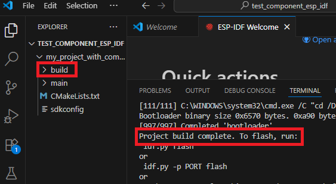 

On va maintenant créer le sous dossier components qui contiendra les fichiers de code de notre composant. Pour ce faire, utiliser la commande:  
>idf.py create-component -C components MyComponent    -------> crée que le fichier .cpp et .h

Voilà le resultat dans VScode et l'explorateur de fichier:  
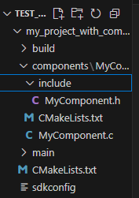 
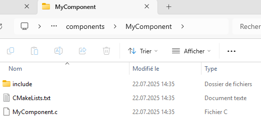 
  
On a bien notre fichier .h et .c, reste à y écrire le code du composant.  

a tester/completer:

XX On peut aussi utiliser cette commande qui a l'avantage de nous créer un dossier avec tout le matériel nécessaire.  Je crois     
 >idf.py create-component YourComponentName    

 Il nous reste alors à completer les fichiers .h et .c avec notre code. 

XXXXXXXXXXXXXXXXXX cette section s'étoffera.  
xxxxxxxxxxxxxxxxxx ajouter ltypedef enum to hold the registers that can be read or written to the component.  
XXXXXXXXXXXXXXXXXX ajouter les "drivers" dans la CMakeList.txt  
XXXXXXXXXXXXXXXXXX Kconfig (équivaut à changer les valeurs de certains paramètre dans menuconfig ?)  

xxxxxxxxxxxAll the information you might need should be provided by the manufacturer, including the device address, registers, etc.xxxxxxxxxxxxxxxx

## publication d'un component sur ESP Component Registry - manière 1
**Note**: je n'ai pas testé cette manière de faire j'ai juste synthetisé la doc disponible sur esp Registry.
J'ai testé la méthode 2 qui est plus compliquée à mettre en place mais plus simple pour le maintient du code et des mises à jour.  

En partant du composant crée précedement, afin de pouvoir publier notre component sur ESP registry il faut encore ajouter:  
> le fichier .yml  
> la liscence.txt     
> le README.md  
   
Un fichier **.yml** (yamal) est un fichier facilement lisible par des humains, contenant les informations nécessaires à un programme informatique pour adapter son fonctionnement. il est appellé **manifest** en anglais. Il peut contenir des informations comme la langue, les protocoles de communication, etc.
Dans notre cas les informations ne semblent pas pertinante et sa présence sert plus à valider une case pour être accepté sur Repository.  

>  version: "0.0.1"  
>  description: "This is a test component"  
>  url: "https://mycomponent.com"  # The homepage of the component. It can be a GitHub repository page.  
> version: "0.0.1"  #partie dépendant de la liscence qu'on a choisie
>  license: "NameOfTheChosenLiscence"  # nom dépendant de la liscence qu'on a choisie

Le fichier de **liscence** décrit l'utilisation du component, c'est une sorte de créative common. On peut consulter https://choosealicense.com/ pour récupérer une liscence qui nous convient.  

Le fichier **README.md** est une description textuelle de la fonction et de l'utilisation du composant.  
  

Maintenant qu'on a les prérequis pour la publication on va utiliser **staging Registry** pour tester notre composant, c'est comme une simulation de ce que sera notre composant une fois publié sur Registry.

Pour se logger sur Staging Registry on va utiliser cette commande:  
>compote registry login --profile "staging" --registry-url "https://components-staging.espressif.com" --default-namespace <your-github-username>  

On va utiliser cette ligne de commande pour uploader sur staging registry:  
> compote component upload --profile "staging" --name test_cmp    
  
On va mettre à jour notre fichier .yml:  
>dependencies:
>  <your_default_namespace>/test_cmp:  -----> ?????
>    version: "*"
>    registry_url: https://components-staging.espressif.com  ----------> ?????

Maintenant que le composant est testé on va pouvoir le publier sur ESP Registry.  
On va se logguer sur le serveur registry:  
> compote registry login --profile "default" --registry-url "https://components.espressif.com" --default-namespace <your_github_username>  
ça va nous ouvrire une page web nous permettant de nous identifier via notre compte Github puis de **récupérer une clé** que l'on va ensuite **coller dans le terminal**

puis publier le composant avec:  

> compote component upload --name test_cmp    

## publication d'un component sur ESP Component Registry - Methode Github - introduction  
**note**: Manière testée, utile pour le CI = continuous integration.  
**Résumé**: On va créer un repository sur Github, y ajouter une Github action bloquera tout composant dans l'architecture de dossier est incorecte et qui se chargera de la synchronisation avec ESP Registry à chaque upload de version. Il nous faut également générer un token sur ESP Registry et le partager avec Github.  
**remerciement**: Merci à [Jacque Supcik](https://github.com/supcik?tab=overview&from=2025-09-01&to=2025-09-13) pour l'architecture du projet et les fichiers, j'ai ajouter des commentaires dans les fichiers là où il faut changer les noms en fonction de votre projet personalisé.  

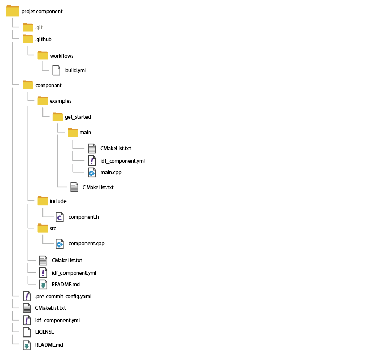  
*Figure 1 : arborescence minimale d'un component*

## step X - Github action
Les Github actions sont décrites par le fichier **build.yml**, situé dans le dossier **.github** puis  **workflow**. Il décrit les règles de vérification des fichiers synchronisés sur Git. Il upload sur ESP Registry en cas de nouvelle version. Récupérable sur mon [repo git](https://github.com/culiacan77/TEST_UPLOAD_TO_ESP_REGISTRY/blob/main/.github/workflows/build.yml)

## step X - token  
On va se connecter sur ESP Registry en utilisant notre identifiant Github:  
  

demander un **token**, c'est comme une clée d'accès secrète jetable dans le cas où elle serait compromise:
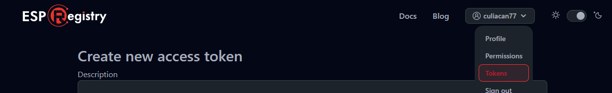  
On peut sélectionner write:components et la créer. On arrive sur une page avec notre token. C'est la seul fois qu'on nous le montre. Comme il est secret on ne pourra plus le récupérer après. Dans notre cas de publication de component on s'en fiche, il faut juste le copier
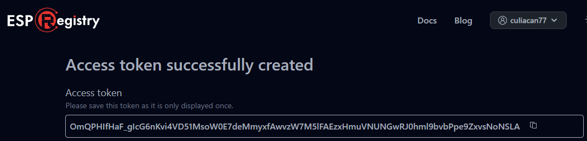

Il va faloir l'**ajouter à Github**: dans notre repository on va dans settings -> Secrets and variables -> action -> New repository secret
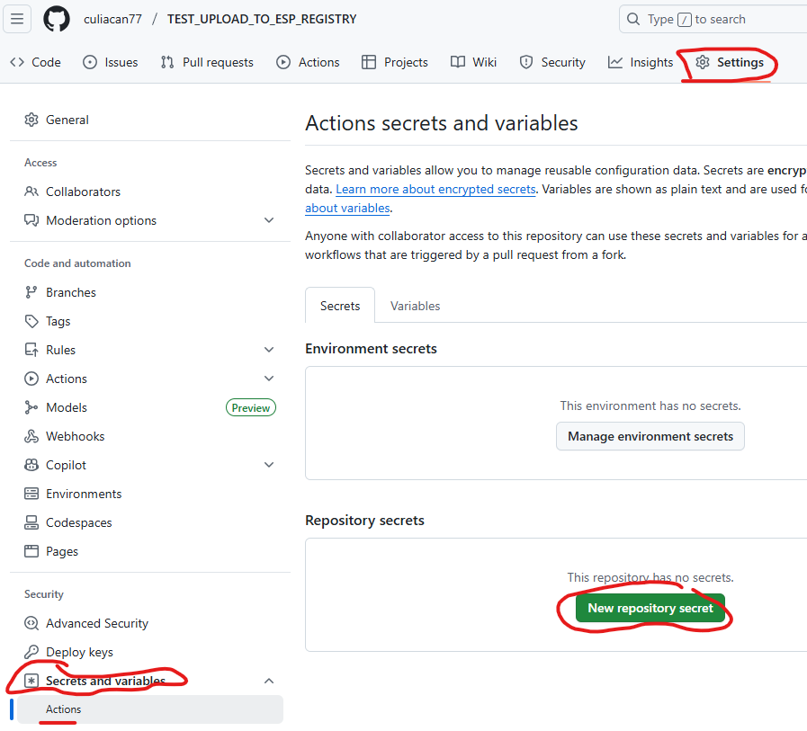  
On va copier le token d'ESP REgistry et lui donner un nom en majuscule et _  
Je le nomme TOKEN_GIT_TO_REGISTRY  
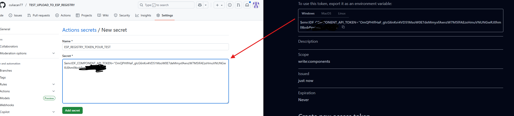

On peut effacer les token créer si ils sont compromi sur la page des token d'ESP Registry.
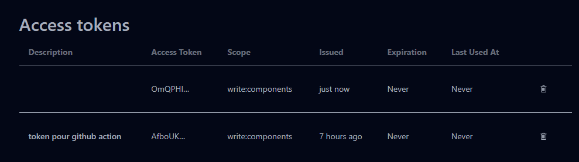  

Dernier point concernant le secret/token, il faut l'indiquer dans le fichier build.yml:
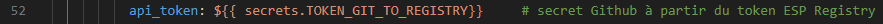  

## step X - Kconfig  
Le fichier Kconfig permet de définir la valeur des variables et booleans.   
Je n'ai pas encore utilisé cela à mon niveau car ça complexifie le projet.  

## step X - pre-commit (yaml)  
Lorsque l'on modifie les fichier .yml (en particulier lorsque j'y ajoute des commentaires) on peut avoir inséré des caractères qui vont poser problème à la compilation. Le [pre-commit](https://pre-commit.com/) permet de corriger ça.  
Il faut ajouter un fichier .pre-commit-config.yaml (et pas yml) à la racine de notre projet, heureusement il y a une commande pour se faire:  
> pip install pre-commit  
> pre-commit install  

xxxx tester sans
Pour lancer le pre-commit (à faire après chaque changement) on utilise la commande:  
> pre-commit run --all-files  

## step X - CMakelist
Ces fichier servent au compilateur (en fait ils servent à des programmes qui serviront au compilateur) à savoir quels fichiers compiler, où aller les chercher et quelles dépendances ils ont. 
Pour mon projet il faut 3 fichier CMakeLists.txt. Celà permet d'utiliser les #include pour intégrer les composants qu'on a crées. En fait le projet est parcouru et son architecture de dossier est enregistré, ce qui permet de ne pas avoir a préciser le path de ce qu'on inclu.  
Un au niveau du projet global, un au niveau du dossier component et un au niveau du fichier main.cpp. En rêgle générales il en faut un à la racine et un dans chaque composant (attention le dossier main est considéré comme un composant).
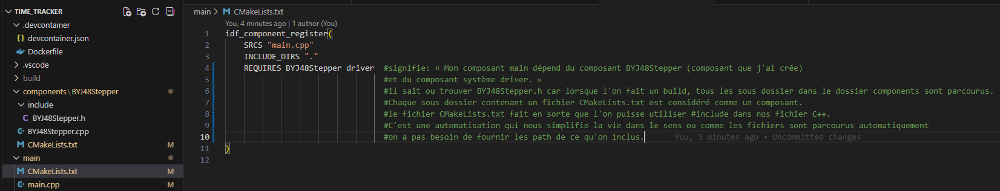  

## step x - Ajouter les fichier component.cpp, component.h et main.cpp
Logique, c'est eux qui définissent le fonctionnement du composant.
component.h déclare les fonctions, component.cpp les défini et elles sont appellées dans main.cpp.  
Le dossier include contient tous les fichiers .h  
Le dossier src contient tous les fichiers .cpp sauf main.cpp qui a son propre dossier.    
On ne peut pas uploader de fichier main.cpp vide, il y a un [minimum de code requis](https://github.com/culiacan77/TEST_UPLOAD_TO_ESP_REGISTRY/blob/main/componant/examples/get_started/main/main.cpp) pour passer la compilation.  

## step x - LISCENCE et README
Le fichier LISCENCE défini les droit d'utilisation de notre component. Le plus simple c'est MIT qui donne une liberté d'utilisation totale.  
Le README est une description du projet, on peut y mentionner les points importants.  

## step x - Ajouter les fichiers .yml
Il nous faut un fichier idf_component.yml à la racine du repository.
Il indique aux outils externes les versions et prérequis que l'on souhaite.  
Les fichiers .yml sont utilisés par les outils externes. Exemple d'utilité: va faire télécharger les bonnes dépendances.

## step X - Version  

Enfin pour uploader notre componant sur ESP Registry il faut lui donner un **tag**, c'est à dire une version. le component sera mis à jour sur ESP Registry à chaque nouvelle version que l'on fait.  

Avec gitbash on va faire:  
>git tag v0.1.0  

puis envoyer vers git avec:  
> git push --tag  
  

Comme on le voit notre repository a le tag de version 0.0.0:  
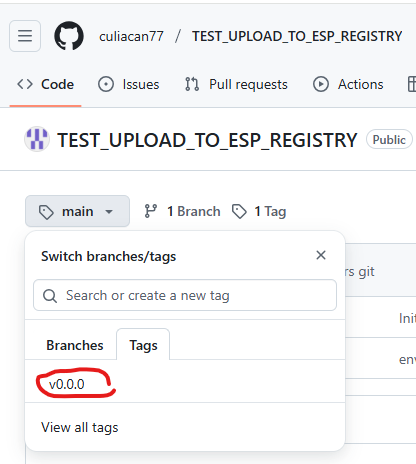

## template - Cookie cutter  
On l'a vu créer toute cette arborescence est fastidieux. On peut faire de notre arborescence un template et utiliser Cookiecutter pour instancier des copie.  
Commande d'installation de Cookiecutter:  
> pip install cookiecutter  

Pour vérifier que l'installation a fonctionnée:  
> cookiecutter --version

On va commencer par créer un nouveau dossier à la racine que l'on nommera {{cookiecutter.project_name}} (les accolades sont importantes). On met tous nos dossier / fichiers dans ce nouveau dossier.  Au même niveau que ce nouveau dossier {{cookiecutter.project_name}} on va ajouter un fichier **cookiecutter.json**:  

>{  
>  "project_name": "esp32_component",  
>  "author_name": "Your Name",  
>  "version": "0.1.0"  
>}  

Ce fichier sert à définir des variables. On peut utiliser ces variables dans les fichiers .h et .cpp.  
A la création d'une nouvelle instance du template, CookieCutter nous demande d'attribuer une valeur à ces variables.  
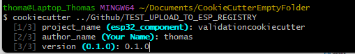    
> Grâce à ça on peut customiser rapidement nos template sans avoir à plonger dans les fichiers .h et .cpp  

Il nous faut faire une modification du fichier **build.yml**, en effet celui contient des "{{ }}", ces doubles accolades sont interprétés par cookieCutter comme des champs à remplacer lors de la génération d'une copie, ce qui n'est pas le cas. La solution c'est d'utiliser l'**échapement**, on remplace {{ }} par {{ '{{ }}' }}.  

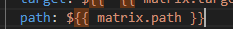  
*Figure 1 : CookieCutter interprète les accolades doubles du fichier build.yml comme un champ à modifier*
    
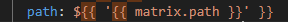   
*Figure 2 : problème résolu*
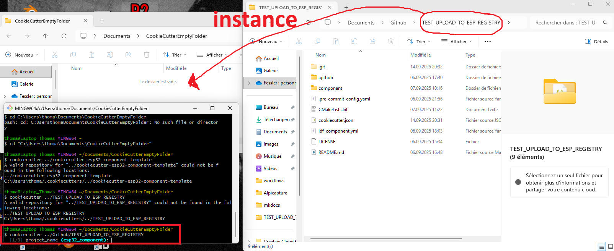
*depuis un dossier vide je donne le chemin vers le dossier que je veux instancier*

Comme mon fichier de template est aussi un repo git, j'ai un dossier .git, cela pose un problème à CookieCutter car son contenu n'est pas en UTF-8. On ajoute quelque lignes au fichier cookiecutter.json pour lui dire d'ignorer ce dossier:  
>   "_copy_without_render": [  
>     ".git",  
>     ".git/*"  
>  ]
ça va quand même copier le fichier .git du template dans l'instance, c'est pas idéale car il contient l'historique du template, ça nous intéresse pas, de plus si on veut le synchroniser sur un repo github on doit commencer par supprimer le dossier .git puis faire un git init. Dans tout les cas on peut le supprimer. Je n'ai pas réussi à automatiser cette étape.

On peut enfin utiliser cette commande depuis l'emplacement que l'on souhaite pour instancier le template (il faut donner le path depuis le dossier vers le tepmlate):  
> cookiecutter ../Github/component_for_ESP_Registry_TEMPLATE

