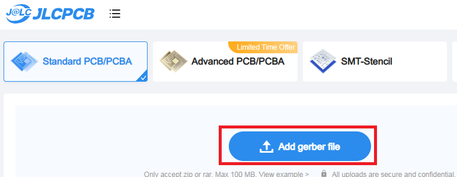
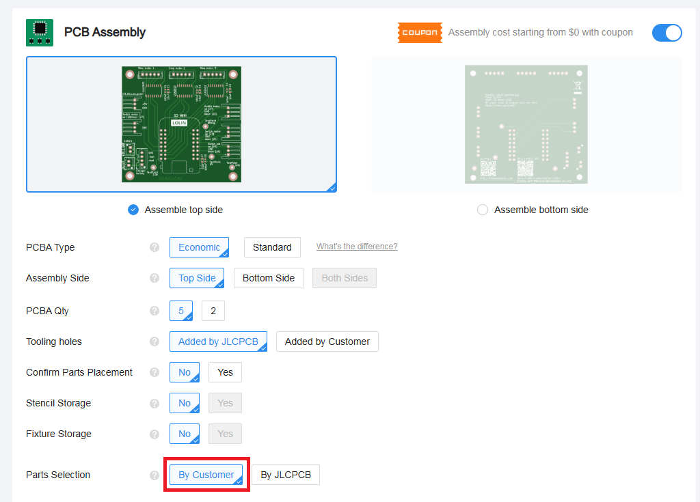
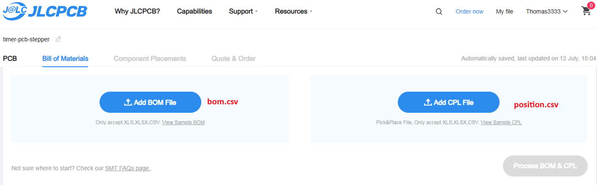
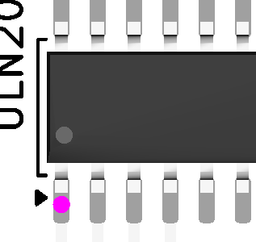
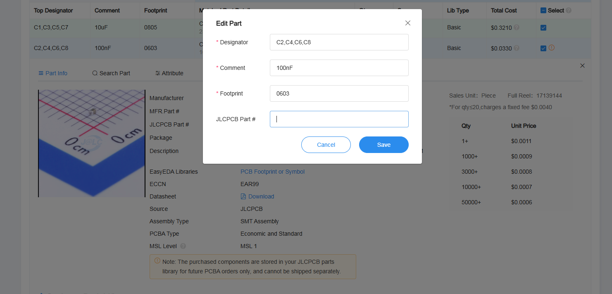
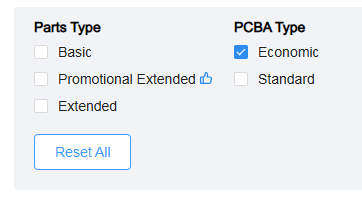
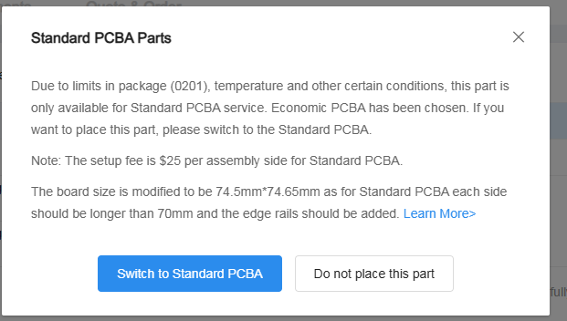
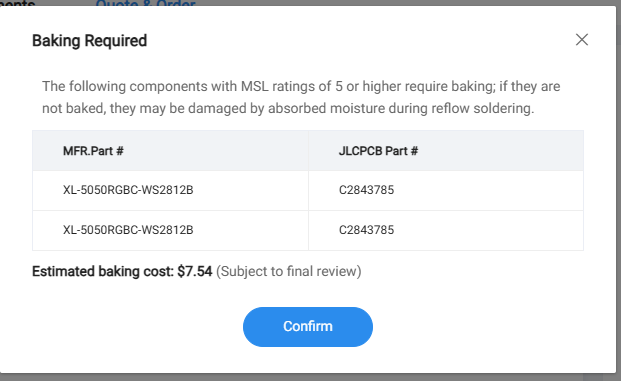
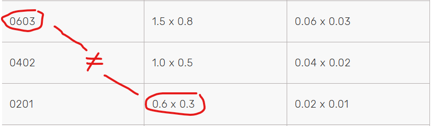

---
date:
  created: 2025-07-12
categories:
  - site
  - PCB
tags:
  - site
  - PCB
authors:
  - thomas
slug: JLCPCB
---

# JLCPCB - JLCPCB Parts
Commande de PCB et recherche de pièces

<!-- more -->

## JLCPCB
C'est un site permettant de passer commande de Printed Circuit Board (PCB - circuit imprimé), on fourni les fichier gerber ainsi que la BOM (bill of material) précédement générés via Kicad et JLCPCB se charge de la réalisation. On peut leur demander de souder les éléments sur le PCB.     

## JLCPCB Part
Site annexe de JLCPCB, c'est sur ce site que l'on trouve les éléments composants nos circuits imprimés, en indiquant le numéro attribué à ces composants dans Kicad, JLCPCB sait de quelle pièce il s'agit et peut les récupérer dans son stock.

## commande
Order now:
  

Ajouter le fichier Gerber généré via le bouton Fabrication toolkit de Kicad.
   

On peut laisser toutes les options par défaut mais quelques-unes sont intéréssantes:  

- PCB Qty = nombre de PCB commandé, min 5.  
- PCB Color = moins la couleur est demandé plus elle est cher. sur les grandes commandes ça n'a pas beaucoup d'impacte financier.  
- Mark on PCB = si on a prévu un JLCJLCJLCJLC pour le numéro de série, choisir Order Number(Specify Position) sinon il le met n'importe où.  

Dans la Partie PCB assembly choisir la face comportant les composants et mettre Parts Selection sur By Customer pour que JLC utilise les numéros d'article qu'on a renseigner dans Kicad.
  

On peut passer à l'étape suivante et charger la BOM ainsi que le fichier de position des composants.
  

Il faut vérifier que les composant soient dans la bonne orientation. le rond rose doit être aligné sur la flèche noir qui indique la 1ère pin.  
  

Si il ne trouve pas un composant, il peut nous en proposer un, à nous de vérifier sur JLCPCB part qu'il convient et de corriger notre empreinte dans Kicad.
    

Dans les filtres de recherche on a le choix entre **PCA** (Printed Circuit Board Assembly) **Economic** et **Standard**, économic coûte moins cher et est disponible avec les pièces facile pour eux à assembler, Standard induit un surcoût car les pièces sont par exemple plus petites où nécessite un traitement anti humidité supplémentaire.  
      

En cas d'utilisation de composants nécessitant un assemblage Standard, on va recevoir des message d'avertissement expliquant le surcoût:  
   
En dehors de l'aspect financier celà change les dimensions de la board, mais nous n'avons pas besoin de la redessiner, JLCPCB le fait automatiquement, il ajoute un rail de chaque côté, qui leur sert lors de l'assemblage. Nous pouvons enlever ce rail par après.
    
## convention nomenclature composants
Certains composant SMD (surface mound display) contiennent un code à 4 chiffres indiquant leur footprint (leur dimension au sol sur le PCB) les 2er chiffres font référence à la longueur, les 2 suivant à la largeur en inch et il faut les diviser par 10, de plus ils sont parfois arrondis. Ces dimensions sont assez conventionelles.
Il peut arriver que le code faisant référence aux inch soit identique à la dimension en mm d'un autre composant, Attention à ne pas confondre 0603 et 06mm x 0.3mm. 
Quand on voit ces chiffres dans la nomination d'un élément ça peut porter à confusion sur son empreinte (confusion type: c'est le code où les dimensions en mm ?)
  