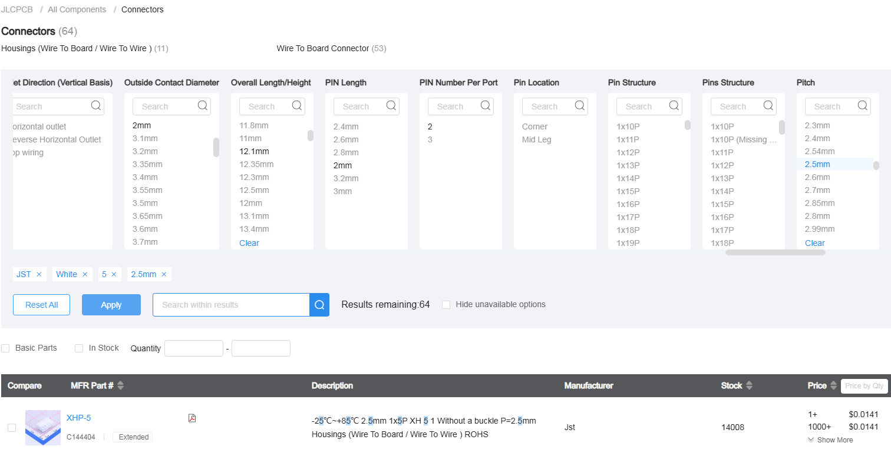

---
date:
  created: 2025-05-19
categories:
  - Logiciels
tags:
  - Logiciels
authors:
  - thomas
slug: software_Kikad 
---

# Kicad

Prise en main de Kicad.  

<!-- more -->

## menu principale  

On retrouve:    

- **Editeur de Schéma** = la visualisation théorique de notre système  
- **Editeur de Symbole** = création d'éléments à intégrer au Schéma lorsqu'ils n'existent pas dans la bibliothèque du soft  
- **Editeur de PCB KiCad** = édition du circuit imprimé reliant les composants
- **Editeur d'empreinte** = délimitation des footprint des composants et paramètrage de leur propriétés
- **Editeur de fichier Gerber** = ?? Les fichiers Gerber sont les fichiers d'export utiles au fabricant
- **Convertisseur d'Image** = permet de passer une image en composant schématique pour l'intégrer au PCB (décoration)
- **Gestionnaire de Plugin** = sert à installer les extensions    

 

## Editeur de Schéma  

C'est ici que l'on dessine le schéma de notre PCB, on ajoute les composants et indique comment ils sont reliés entre eux.    

SHORTCUT:    
**ctrl** + **F1** = Affiche la liste des raccourcis.    
**mouse over component** + **m** = move component sans les wires.
**mouse over component** + **g** = move component avec les wires.
**r** = rotate component.  
**w** = switch to wiring mode.  

Avec un **double clic sur un composant**, on défini leur propriété et charge leur empreinte 
   

L'outil **trace** et bus permettent de réaliser les connexions.  

    
 
Icone **non connexion**    

   
Afin d'éviter d'avoir des connexions partout comme ci dessous voir pire, on utilise les labels paramétrés en entrée et sortie.
      
Quand on double clic sur un **label** on peut **choisir** si il s'agit d'une **entrée** ou d'une **sortie**  
  
Les **entrées et sorties ayant le même nom sont connectées entre elles**.   
   
Une sortie peut être connectée à plusieurs entrées mais plusieurs sorties ne peuvent pas être conectés à une entrée.  
   

  Lorsque l'on veut réaliser le schéma d'un élément comportant plusieurs composants on risque de ne pas le trouver dans la librairie. Il faut alors placer chaque composant pour le recréer.  
  Ici en exemple le driver des moteurs dont il faut lire la documentation pour découvrir qu'il est composé d'un chip ULN2003 et d'un connecteur JST (on a déterminé le modèle grâce au pitch = espace entre les connexions). Dans cet exemple on a pas gardé les led et leurs resistances, on en a pas besoin.  
    
  Mais juste voir le composant, bien que permettant de déterminer quellques indices sur les composants n'est pas suffisant. Il faut chercher des schéma du module. le mot clé dans la recharche google c'est le **nom du module + schematic**

Pour se simplifier la vie au niveau des connections du GND et de l'alimentation on utilise les symboles GND et VCC, ça permet de rendre le schéma plus lisible car on a moins de conexions partout.
  
  
Exemple schéma symboles placés:
    

//////Il reste à définir les zones d'exclusion autour des pin, ce sont des zones où aucun autre composant ne doit être placé.  

Une fois les zones symboles en place, les connexions effectuées, il faut trouver chaque composant sur le site [JLC PCB part](https://jlcpcb.com/parts/all-electronic-components) où [LCSC],(https://lcsc.com/) récupérer le numéro d'article et son package (=footprint/empreinte) afin de terminer la partie schématique. Ces deux site appartiennent au producteur de PCB à qui l'on va fournir les fichiers finaux. Il récupérera les composants dans ces stocks, les souderas sur le PCB et créera le circuit imprimé reliant les composants. 

Afin de trouver notre pièce il faut indiquer son type puis utiliser les nombreux filtre pour faire apparaître que les pièces qui nous intéressent. c'est fastidieux, suivant quoi il faut consulter des doc où mesurer pour avoir plus d'infos à entrer dans les filtres.
 

filtre:
 

nr part et package.
 

Il faut maintenant ajouter ces 2 infos dans le symbol. Pour ce faire on double clique sur le composant pour faire apparaître l'éditeur de sympole et clique sur le **+** pour ajouter un champ qu'on nomme **LCSC** et on y met le **JLCPCB part #**. Dans **empreinte** on entre ce qu'on a trouvé comme **Package**   
 

