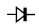

---
date:
  created: 2025-05-19
categories:
  - Logiciels
tags:
  - Logiciels
authors:
  - thomas
slug: software_Kikad 
---

# Kicad

Prise en main de Kicad.  

<!-- more -->

## menu principale  

On retrouve:  
> Editeur de Schéma = la visualisation théorique de notre système  
> Editeur de Symbole = création d'éléments à intégrer au Schéma lorsqu'ils n'existent pas dans la bibliothèque du soft.
> Editeur de PCB KiCad = édition du circuit imprimé reliant les composants.
> Editeur d'empreinte = délimitation des footprint des composants et paramètrage de leur propriétés.
> Editeur de fichier Gerber = ?? Les fichiers Gerber sont les fichiers d'export utiles au fabricant.
> Convertisseur d'Image = permet de passer une image en composant schématique pour l'intégrer au PCB (décoration)
> Gestionnaire de Plugin = sert à installer les extensions.    

 

## Editeur de Schéma  

C'est ici que l'on dessine le schéma de notre PCB, on ajoute les composants et indique comment ils sont reliés entre eux.    

Avec un **double clic sur un composant**, on défini leur propriété et charge leur empreinte 
   

L'outil **trace** et bus permettent de réaliser les connexions.  

   

| **Composant**    | ***Unité** | **Symbole** | 
|--------------|----------------------------|----------------------------------------------------------|
| **Capacitor**  | farad|      | 
| **resistance** |ohms  |            |   
| **inductor**  | henry|      | 
| **diode** | - |            |   
| **diode** | - |            |  
| **motor** | torque |            |   
| **battery** | ampere-hour |            |   
| **bouton** | - |  |  
| **switch** | - |  |  
| **3 point switch** | - |  |  