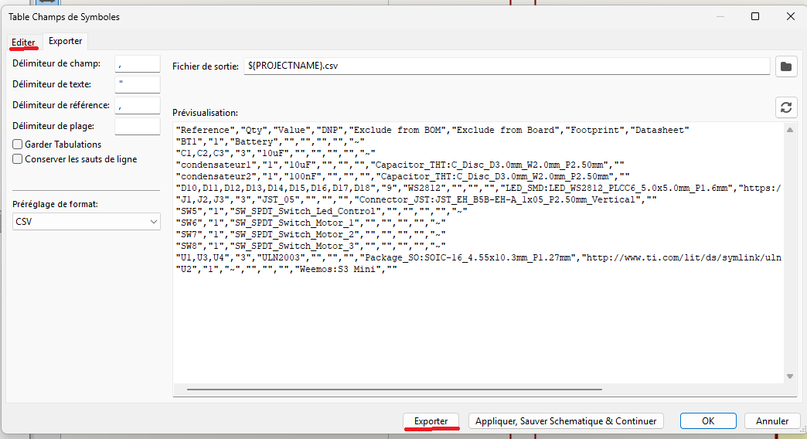
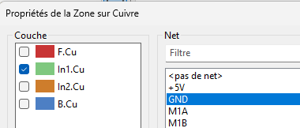
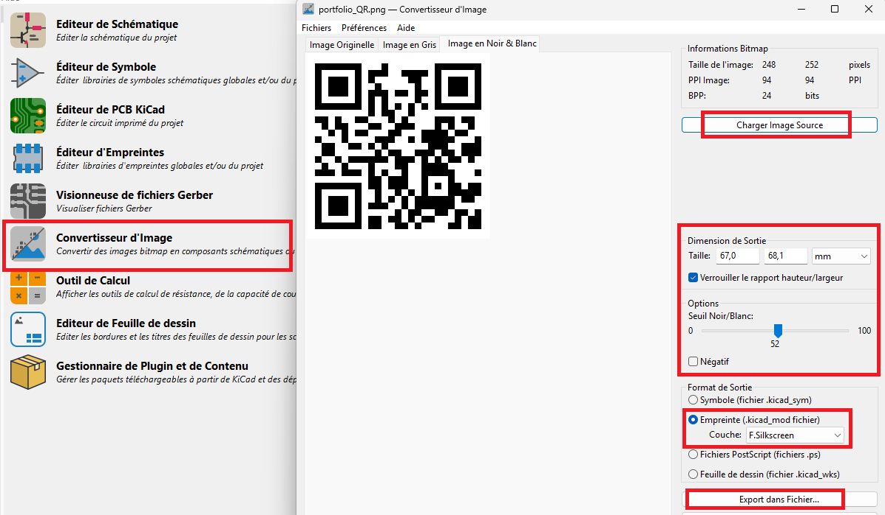
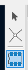

---
date:
  created: 2025-05-19
categories:
  - Logiciels
tags:
  - Logiciels
authors:
  - thomas
slug: software_Kikad 
---

# Kicad

Prise en main de Kicad.  

<!-- more -->

## menu principale  

On retrouve:    

- **Editeur de Schéma** = la visualisation théorique de notre système  
- **Editeur de Symbole** = création d'éléments à intégrer au Schéma lorsqu'ils n'existent pas dans la bibliothèque du soft  
- **Editeur de PCB KiCad** = édition du circuit imprimé reliant les composants
- **Editeur d'empreinte** = délimitation des footprint des composants et paramètrage de leur propriétés
- **Editeur de fichier Gerber** = ?? Les fichiers Gerber sont les fichiers d'export utiles au fabricant
- **Convertisseur d'Image** = permet de passer une image en composant schématique pour l'intégrer au PCB (décoration)
- **Gestionnaire de Plugin** = sert à installer les extensions    

 

## Editeur de Schéma  

C'est ici que l'on dessine le schéma de notre PCB, on ajoute les composants et indique comment ils sont reliés entre eux.    
Pour commencer on peut choisir le format de notre plan (A4 / A3 / ...) et son titre dans **fichier**-> **Ajustage page**  

     
  

SHORTCUT:    
**esc** = outil sélection de base.
**box select** gauche à droite = sélectionne les objets complètement sélectionnés.  
**box select** droite à gauche = sélectionne les objets partiellements sélectionnés.    
**ctrl** + **left clic**= toggle selection state.  
**shift** + **left clic** = add to selection.  
**ctrl** + **left clic** = remove from selection.  
**ctrl** + **F1** = Affiche la liste des raccourcis.    
**mouse over component** + **m** = move component sans les wires.
**mouse over component** + **g** = move component avec les wires.
**r** = rotate component.  
**w** = switch to wiring mode.  
En wiring mode : **double clic** = finish drawing (!esc = cancel drawing)

EMPREINTE / FOOTPRINT  
Avec un **double clic sur un composant**, on défini leur propriété et charge leur empreinte.
L'empreinte détermine comment le robo qui va crée notre PCB doit préparer les zone sur lesquelles il va souder les composants. Elles contiennent les "cooper pads" qui matchent avec les pins du composant. 
   

On peut aussi utiliser l'éditeur d'empreinte et ses filtres.  
Au milieu nos composant, à droite les empreintes dispo selon filtres.

L'outil **trace** et bus permettent de réaliser les connexions.  

    
 
Icone **non connexion**    

   
Afin d'éviter d'avoir des connexions partout comme ci dessous voir pire, on utilise les labels paramétrés en entrée et sortie.
      
Quand on double clic sur un **label** on peut **choisir** si il s'agit d'une **entrée** ou d'une **sortie**  
    
Attention à ne pas se faire avoir. ce n'est pas le sens de la flèche qui détermine si c'est une entrée où une sortie mais si elle est relié par sa tête où son pied
    
Les **entrées et sorties ayant le même nom sont connectées entre elles**.   
   
Une sortie peut être connectée à plusieurs entrées mais plusieurs sorties ne peuvent pas être conectés à une entrée.  
   

  Lorsque l'on veut réaliser le schéma d'un élément comportant plusieurs composants on risque de ne pas le trouver dans la librairie. Il faut alors placer chaque composant pour le recréer.  
  Ici en exemple le driver des moteurs dont il faut lire la documentation pour découvrir qu'il est composé d'un chip ULN2003 et d'un connecteur JST (on a déterminé le modèle grâce au pitch = espace entre les connexions). Dans cet exemple on a pas gardé les led et leurs resistances, on en a pas besoin.  
    
  Mais juste voir le composant, bien que permettant de déterminer quellques indices sur les composants n'est pas suffisant. Il faut chercher des schéma du module. le mot clé dans la recharche google c'est le **nom du module + schematic**

Pour se simplifier la vie au niveau des connections du GND et de l'alimentation on utilise les symboles GND et VCC, ça permet de rendre le schéma plus lisible car on a moins de conexions partout.
  
  
Exemple schéma symboles placés:
    

Controle des règles électriques afin de savoir si il y a des erreurs.    
    
//////Il reste à définir les zones d'exclusion autour des pin, ce sont des zones où aucun autre composant ne doit être placé. ces zones seront fait decuivre et serviront de base pour souder le composant.  

Une fois les zones symboles en place, les connexions effectuées, il faut trouver chaque composant sur le site [JLC PCB part](https://jlcpcb.com/parts/all-electronic-components) où [LCSC],(https://lcsc.com/) récupérer le numéro d'article et son package (=footprint/empreinte) afin de terminer la partie schématique. Ces deux site appartiennent au producteur de PCB à qui l'on va fournir les fichiers finaux. Il récupérera les composants dans ces stocks, les souderas sur le PCB et créera le circuit imprimé reliant les composants. 

Afin de trouver notre pièce il faut indiquer son type puis utiliser les nombreux filtre pour faire apparaître que les pièces qui nous intéressent. c'est fastidieux, suivant quoi il faut consulter des doc où mesurer pour avoir plus d'infos à entrer dans les filtres. Voici quelques termes afin de mieux s'y retrouver dans la nomenclature des composants.

VOC:    
**SMD - SMT** = surface mount. Pin soudé sur PCB.  
**TH - THT** = through hole. Pin traversante.  
**DIP** = Dual inline package / 2x TH.  
**AWG** American wire gauge, système de mesure de diamètre de câble.  
**V** = vertical.  
**R - RA** = horizontal / right angle.    

  

filtre:
 

nr part et package.
 

Il faut maintenant ajouter ces 2 infos dans le symbol. Pour ce faire on double clique sur le composant pour faire apparaître l'éditeur de sympole et clique sur le **+** pour ajouter un champ qu'on nomme **LCSC** et on y met le **JLCPCB part #**. Dans **empreinte** on entre ce qu'on a trouvé comme **Package**   
 
  

Après avoir déplacé des symboles, leur nom (U1, U2, etc) ne sont plus dans un ordre logique et ça peut compliquer notre compréhension du schéma. On peut **renommer les composants dans l'ordre** dans **outils** -> **annotation de la schématique**

On choisi si on trie de gauche à droite où haut en bas dans la section ordre.
   

BILL OF MATERIALS  
c'est notre liste de course, abrégé **BOM** ça dit au fabricant du PCB quels composant prendre dans ses stock.  
      

On peut voir plus modifier les préférence de la BOM dans l'onglet Editer. Cliquer sur exporter pour créer le fichier.
      

Pour **visualiser la BOM** et changer les propiétés des éléments, on utilise l'**icône de spreadsheet** (nommée éditer champs des symboles) on a aussi la possibilité d'**exclure de la BOM**:
   
 
On peut aussi exclure un élément de la BOM en doublecliquant sur son symbol dans le schématic.
      
 

##   Editeur de PCB

C'est ici que l'on va définir la taille du PCB, définir l'emplacement des composants et relier les composants entre eux via les pistes (tracks en anglais).
accessible soit depuis le menu principale, soit depuis l'éditeur de schématique avec l'icone verte
> - fig 1
 
    
      
> - fig 2  
 

SHORTCUT:    

**x** = outil trace.  
**alt** + **3** = visu 3D  
**f** = flip component to the opposite side of PCB
**v** = insert un via   

VOCABULAIRE / ABREVIATION:  
  
**f.Cu** = Front Cooper -> face sup du PCB.  
**B.Cu** = Back Cooper -> face inf du PCB. 
**Ratsnest** = ligne bleu indiquant les connexion du schématic que l'on a pas encore tracé sur le PCB.  
**Through hole pad** = trous conducteur faisant partie de l'empreinte et permettant de connecté le dessus et le dessous du PCB.  
**Via** = trous conducteur permettant de connecté le dessus et le dessous du PCB.

Avant toute chose on va définir le format de la page: **File** -> **Page Settings/Ajustage page**.
Puis les caractéristiques (nbr couches) de notre PCB: **File** -> **Board Setup/Option du CI** -> **Couchess Physiques**. C'est ici qu'on défini le stackup = empilement de couches de PCB. On va en mettre 4, celles du haut et du bas sont pour les composants. On va mettre une masse GND et power sur les 2 du milieu.  

On va sélectionner le layer juste sous la couche supérieur.  
  

Puis l'outil de traçage de zone remplie  

au 1er clic une fenêtre s'ouvre et nous demande de choisir ce que la zone représentera. ici GND  

Une fois le tracé dessiné il faut encore le remplir car il est vide. On utilise soit **b** soit **edition**->**remplissage des zones**

C'est un outil intéligent qui va éviter le contact avec les track de cuivre si il y en a sur la zone. à chaque mise à jour du schématic ou des tracé il faut utiliser **b** pour mettre à jour les zones remplies. 
Ici comme notre zone GND occupe tout notre 2ème layer. le but c'est d'utiliser des via pour créer le contact avec le GND. ça permet une optimisation de place sur les couches dédiées aux composants. Pour **établir la connexion des via** à la zone GND, **double clic sur le via**, et sélectionner GND où 5V dans le **dropdown Net name**. Une fois de plus, à chaque modification il faut faire **b** pour mettre à jour la zone remplie. Comme on le voit ici, le via est connecté.

C'est également là qu'on pourra définir les **Net Classes** où règle d'Equipots en français, ce sont des groupes de réseaux de signaux qui peuvent être associés à des règles de conception spécifiques, comme la largeur de piste ou l'espacement entre pistes.

Overview des outils et fonctionalités.  
Il faut plus voir les calques comme des filtres, les différentes couches du PCB sont dans objet (voir plus bas "Issue"). 
   

Pour l'instant on a que les composants et leur footprint. Pour **ajouter le PCB** il faut le dessiner dans le **calque Edge.Cuts**
Avec l'outil rectangle on dessine son contour. si on double clic avec la flèche noir sur le rectangle on peut définir précisément sa taille
   

On peut changer la **snap grid** pour que les éléments soient magnétisés différement au fond
   

Comme on se trouve sur une **surface composée de plusieurs couches**, on peut déterminer sur laquelle notre piste où portion de notre piste va passer. Lors du dessin de la piste faire un clic droit où presser **v**  
  
  
Un objet placé sur le **dessus** est généralement **rouge**, il est **bleu** lorsqu'il est placé en **dessous** du PCB.  
 

Il est temps de relier les pads des différents composants qui doivent être connectés entre eux. Tant qu'il y a des ratsnest c'est qu'il y a des connexion à faire. On peut voir en bas à droite des stat intéressantes à ce sujet:  
 
Utiliser l'outil pour rellier les composants avec une piste conductrice.   
 

Il est important de configurer la **largeur des pistes**. Une fois de plus on se rend dans **fichier** -> **Option du CI** -> **règles de conception** -> **taille prédéfinies**.  
Avec **w** on peut parcourir les différentes tailles de pistes.  
On utilise **0.4** pour les connexion **signal** et **0.7** pour l'**alimentation**.
 
 

Afin de s'assurer que tout est en ordre, un peu comme pour le schématique on peut utiliser l'outil de vérification (Design rule chechink aka DRC):  

Cette option est aussi accessible sous **Inspecter**->**Contrôle des règles de conception**

Mon projet est synchronisé sur Github, afin de pousser la version local sur git il faut qu'elle passe les **github actions** que l'on a définies. Cela permet d'agir comme un filtre et de bloquer la synchronisation de fichiers non valides sur git. Pour ce faire le dossier doit contenir des dossier **.rpt**, il s'agit de rapport d'erreur du DRC et de l'ERC.

On peut avoir un aperçu de notre PCB en 3D avec **affichage** -> **visu 3D**

Une fois le PCB termnié on va **générer le fichier Gerber** 
  
Ensuite il faut cliquer sur **plot** et **Generate Drill Files** -> **Generate Drill Files** puis **close**. On vient de créer les instruction de manufacture de notre PCB.

Avec les différents calques, les différentes couches et tous les symboles il peut être difficile de sélectionner ce que l'on veut. Pour ça il y a les **filtres de sélection** en bas à droite.
  

Issue: no component on PCB editor:
  
Il faut activer la vue de la bonne couche du PCB:
    

## Ajout d'image
Dans l'onglet **convertisseur d'images** charger une image puis définir sa taille et l'enregistrer en tant qu'empreinte silkscreen (elle sera imprimé en blanc) et l'exporter.
    
Dans l'éditeur de projet, sous **préférences** -> **configurer les librairies d'Empreintes**, onglet **librairie spécifique au projet** on va charger le dossier dans lequel on a enregistré nos images.
  
  
Pour importer l'image il faut utiliser l'outil symbole, chercher notre dossier d'image et placer l'image choisi comme n'importe quel symbol.  
   
     

##   manage and control Gerber files

