---
date:
  created: 2025-03-15
categories:
  - Composants
  - Electronique
tags:
  - Composants
  - Electronique
authors:
  - thomas
slug: Led RGB WS2812
---

# Arduino IDE /Platform IO et composants

Cet article présente la mise en place de l'IDE arduino pour contrôler différents composants.  

<!-- more -->

## signal PWM - Pulse with modulation  
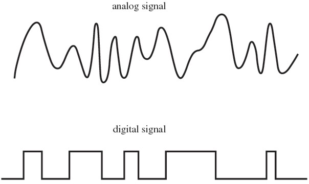  
Le signal analogue est un signal nuancé pouvant prendre une large palette de valeurs, alors que le signal digital n'a que deux états: 0 où 1, c'est binaire, 0% où 100%.    

⚠️ en courant continue, pour "nuancer" le courant afin d'allumer une led à 80% d'intensité, on alterner rapidement entre éteint et allumée, en allant assez vite on voit pas les coupures, et la led a baissé son intensité d'éclairage. C'est une technique pour obtenir un résultat analogue avec une méthode digitale. Le temps éteind n'est pas forcément égale au temps allumé, ça dépend de l'intensité souhaité. Ce type de signal s'appelle **PWM**, le ratio de temps allumé/éteind s'appelle le **duty cycle**. Un duty cycle de 80% signifie que dans un cycle la lampe est allumée durant 80% du temps puis éteinte 20%.

## modifier l'intensité d'une led
voici notre montage:  
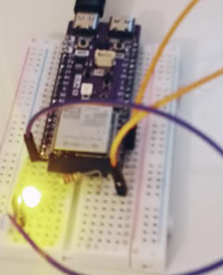  

La fonction analogWrite permet d'envoyer un signal PWM, concretement la lampe s'éteint et s'allume très vite, le ratio entre le temps éteind et allumé dépend du 2ème argument de la fonction, c'est le duty cycle. 
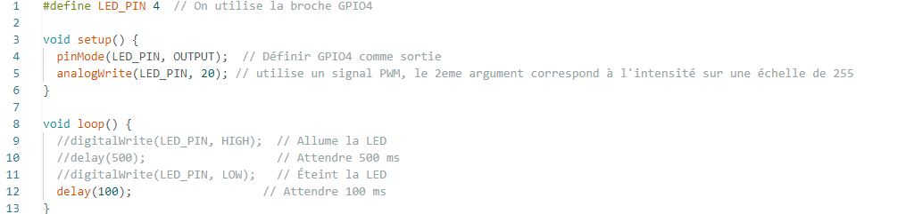   

La fonction analogWrite() ne nous donne pas de contrôle sur la fréquence.
Pour rappel la fréquence c'est le nombre de cycle par seconde.
Si on enlevet le commentaire du code dans la boucle et qu'on enleveait la fonction analogWrite dans le corps de la fonction setup, on pourait gérer la durée des cycles avec les delay.

## installation d'une librairie externe  
Dans cet exemple je récupère la librairie du MPU6050, accéléromètre 3 axes incluant un gyroscope sur [github](https://github.com/jarzebski/Arduino-MPU6050).  
je dézipe le dossier et le stock soit dans le dossier Arduino -> Libraries qui a été crée sur mon ordinateur lors de l'installation de l'IDE si je veux pouvoir accéder à cette librairie depuis n'importe quel projet sur mon ordinateur (global) où dans un dossier dédier à mon projet (local) si je souhaite ensuite en faire un repository et le partager sur Git.
Il faut ensuite ajouter #include "libs/MPU6050/MPU6050.h" // On indique le chemin relatif.    
On peut maintenant utiliser les fonctions de la librairie.     
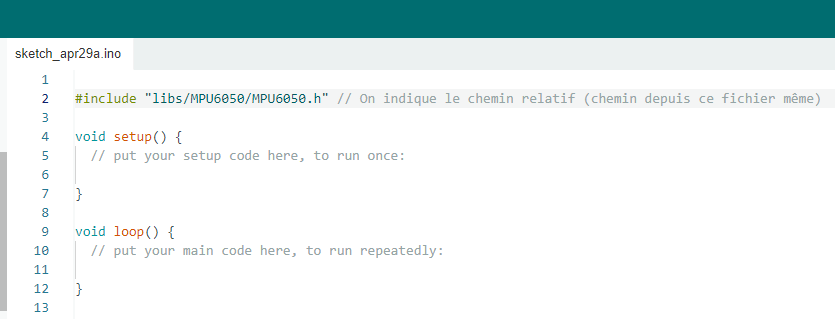      
L'inconvénient c'est que l'on a pas les fichiers .ino d'exemple comme lorsque l'on passe par la libraire d'Arduino IDE (global)

## inclure une librarie dans Arduino IDE
Attention si la librairie ne contient pas un fichier "library.properties" on ne verra pas la librairie dans le menu librairie de la barre latéral gauche. Pour que les exemples apparaissent dans Fichier > Exemples, le dossier à l'intérieur de la librairie doit s'appeler exactement examples (au pluriel, tout en minuscule).  

Si l'on souhaite que la librairie soit accessible à tous les futures projets arduino sur cet ordinateur on peut opter pour l'installation global, va Sketch -> include Library -> add .ZIP Library. Cela va dézipper la librairie qu'on lui indique dans le dossier Arduino -> Libraries crée lors de l'installation de l'Arduino IDE.   
  
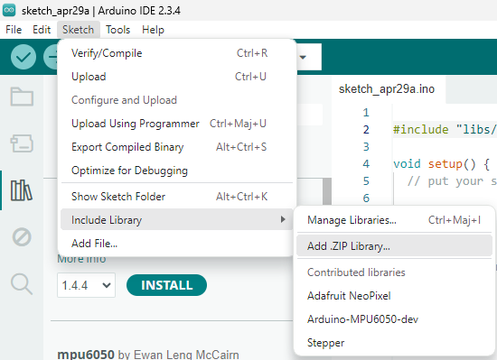      
Avantage: on a accès aux exemples.
 
## activer une librairie inclue dans l'Arduino IDE
dans l'onglet library chercher NeoPixel d'adafruit    
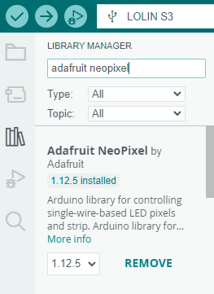  
  
On peut ouvrir un projet simple en cliquand sur les 3 petits poins->Examples->simple   
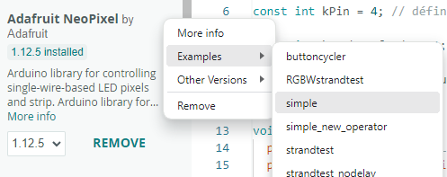 
Il va mainenant faloir l'inclure, pour ce faire on retourne dans Sketch -> Include Library -> choisir la librairie.  
Attention, ça la fait pas apparaître dans le library manager (icone de livre dans la barre de gauche) ça c'est réservées pour les librairies qui viennent avec l'IDE

Comme on le voit la librairie est incluse dans le projet.
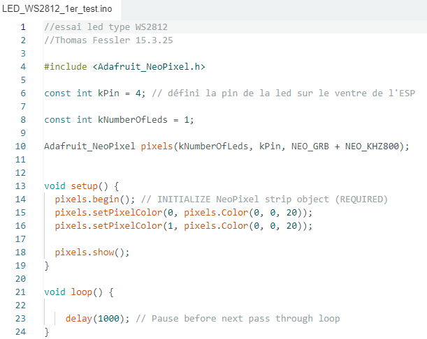  
Ici on a défini sur quelle pin est câblée la led et on peut définir sa teinte avec pixels.Color(), ici 20/255 de bleu.   

## configurer et flasher le programme  
Arduino IDE a besoin de savoir quel système va acceuillir le programme, via quel port le système est câblé et quel est la vitesse d'update du moniteur.  
Pour la **board de développement**, la sélectionner dans la liste:  
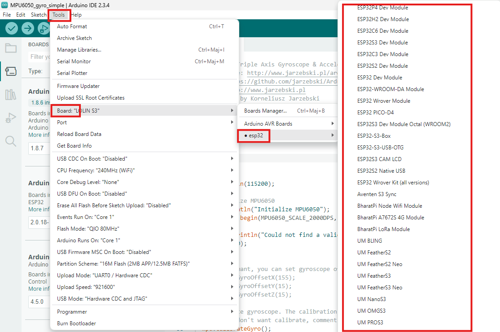  
Pareil pour le **port**:      
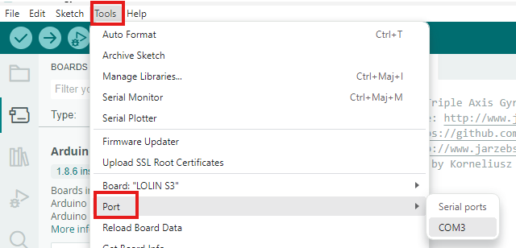    
Pour la **baud rate** (nombre de bits échangés à la seconde) il faut l'indiquer en tant qu'argument de **Serial.begin()** et sélectionner le même nombre dans le **serial monitor**.
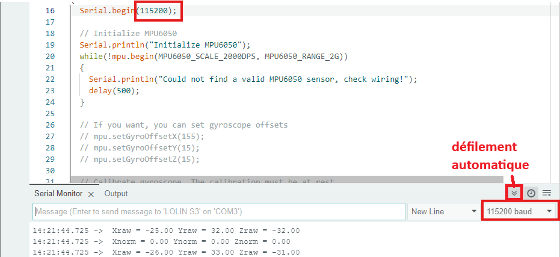  

## Layers entre l'éditeur de code et le processeur

Arduino IDE est une manière simplifiée de programmer l'ESP32, bien que ESP IDF y soit inclus, il est caché et difficilement accessible. Il y a beaucoup de choses qui sont faites sans qu'on le remarque, automatiquement en arrière plan. L'avantage de retirer la complexité c'est que c'est plus simple, on a moins de choses sur lesquelles se concentrer. L'inconvénient c'est qu'on a moins de contrôle, il y a une perte de finesse et une certaine limitation dans ce qui est faisable.  

ESP IDF est beaucoup plus proche de l'ESP32 (plus "bare metal"), on peut mettre en place FreeRTOS pour le pseudo temps réel, gérer les interruptions etc. L'inconvénient, en plus d'être plus difficile, c'est qu'il a beaucoup moins de bibliothèques écrites par la communautée qu'Arduino.  

Pour tirer le meilleur des deux mondes on peut utiliser Visual Studio Code avec l'extension PlatformIO.  
Il s'agit d'un gestionnaire de construction (Build System), il nous permet d'utiliser le framework arduino, ainsi que les fonctionalités et l'accès aux paramètres plus fins d'ESP IDF.  

Il y a encore une dernière couche avant le processeur: Le HAL (Hardware Abstraction Laye). C'est le layer qui s'occupe d'activer les bon transistors et zones mémoires à partir de notre code, (bare metal) Le HAL adapte le code au microprocesseur, grâce à lui on pourrait par exemple le porter d'un ESP32 vers un STM32.    

Le schéma suivant présente les différentes configurations expérimentés.  
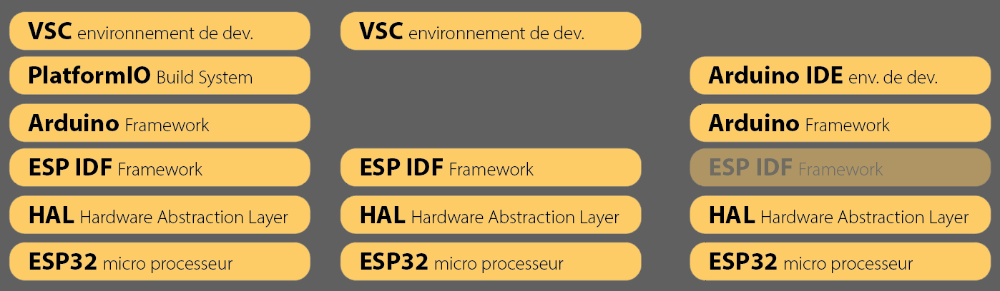    
A gauche la version la plus complète, permettant l'accès aux librairies Arduino et les fonctions natives de l'ESP.  
Au milieu ce que j'ai utilisé pour le Timer, on enlève la couche de simplification Arduino. On doit construire le code un peu différement, comme point de départ on a pas void setup() où void loop() mais app_main().  
A droite ce que j'utilise pour tester rapidement un composant et sa bibliothèque.  
!! Arduino IDE et Arduino sont deux choses différentes  

  
Pour rappel une API c'est les commandes valides au sein du Framework, les fonctions préfaites inclues dans le framework  
Un wrapper c'est un framework simple qui enveloppe un framework plus complexe afin de présenter une interface plus simple (pour masquer la complexité)      

-> On utilises l'IDE VS Code, le Build System PlatformIO, pour appeler l'API d'une librairie tierce au sein du Framework ESP IDF inclu dans le Framework Arduino(wrapper).

## Mise en place de PlatformIO

## Questions

Je m'attendais à mesurer 3.3v dans l'exemple avec la diode pourquoi le multimètre me donne t'il une valeur inférieur ?
>le signal PWM et l'intensité défini dans **analogWrite(LED_PIN, 20)** font que le multimètre nous donne la valeur moyenne de la tenssion (un oscilloscope nous donnerait la valeur en fonction du temps et on verrait 0v puis 3.3v etc)  

Quelle est la fréquence de pulsation ?
>ça dépend de la méthode, avec un signal PWM on a pas la main dessus, à priori 5000 herz soit 5000 cycles par secondes 

comment chainer 2 led au niveau du câblage ?  
>simplement relier les sorties dout de la 1ère led à la 2ème. J'étais confus sur quoi faire avec les sorties dout de la 2ème led, il ne faut pas les relier au gnd.   
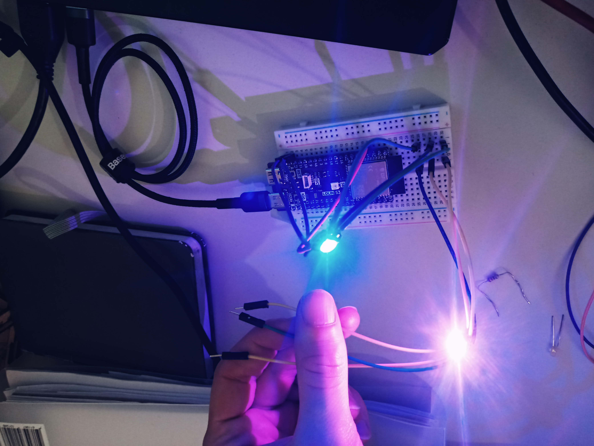 
  

Pourquoi les WS2812 n'on pas de résistance dans le circuit comme avec la diode ?
>En fait il ne s'agit pas d'une simple led, il y a un contrôleur intégré possèdent un circuit interne qui contrôle la tension, le signal PWM et l'ampérage de chaque led qui la compose (afin de produire les couleurs rvb elles ne sont pas identiques au niveau de leur composants). Elles nécessitent entre 1.8v et 3.4v (rvb n'ont pas les même besoins) avec 20 ampères par couleur.  

Les leds WS2812 sont elles en parralèle où en série ?
>3 choses portent à confusion:  
-- les 3 Leds r g et b composant la WS2812 sont connectés en série, les modules WS2812 sont connectés en parallèle. Sur internet on dit qu'on les daisy chain.  

>-- le fait que les fils entrent dans le module puis en ressortent pour entrer dans le prochain module, visuellement on dirait qu'elles sont branchées en série car on ne vois pas de noeud / boucle. 
Pourtant lorsque l'on mesure la résistance de l'entrée de l'allimentation et sa sortie avec l'ohm mètre on a un signal qui nous dit que ça communique. On peut donc représenter la connection comme ceci:

>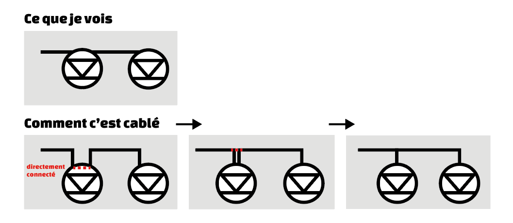 
(on a représenté que l'alimentation)

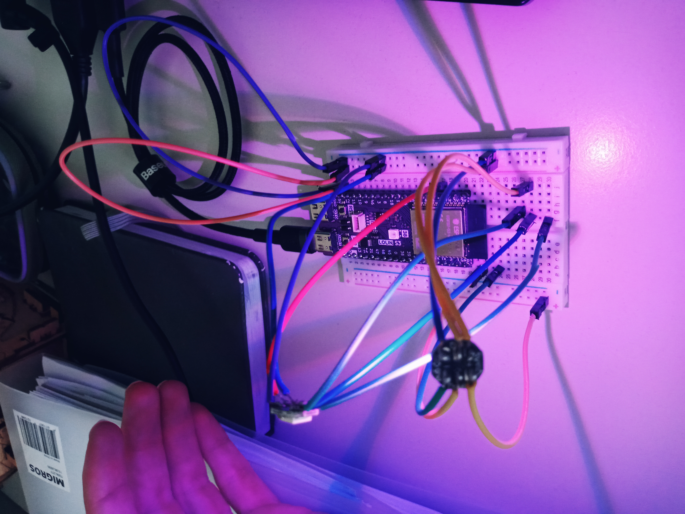 
Ici le câblage prête un peu moins à confusion.

> le câble transmettant le signal de donné (fil du milieu) est connecté en série.  

chaque element de ws2812 reçoit 5v car elles sont en parallèle. si elles étaient en série elles auraient  combien ? 

>  $$
    \frac {\text{tension totale}}{\text{nombre d'élément}} 
  $$

## Utilisation d'un bouton 3 points

Le but est de modifier le comportement de la led en fonction de la position du bouton 3 points.  
Il va falloir définir une fonction pour chaque position du bouton et câbler les éléments correctement.  
On va asigner une pin à un booléan, si elle lit une valeur de courant élevé (HIGH) le bool est true, si elle lit une valeur basse (LOW) il est false.
Il existe un seuil à partir duquel la valeur est HIGH où LOW on peut le consulter page 53 de la [documentation de l'Esp32 par Espressif]( https://www.espressif.com/sites/default/files/documentation/esp32_datasheet_en.pdf)
Pour 3.3V entre **75 - 100%** du voltage on lit **HIGH**, entre **0 - 25%** on lit **LOW**.    

Si la pin n'est relié à rien la présence de champ electromagnétique peut influencer la valeur lue par le microprocesseur. On dit que la valeur est **flottante**.  
  
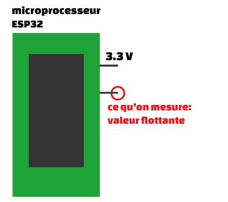  
.

On peut faire un montage avec une résistance après l'alimentation, on parle de **pull up** car on tire la tension vers le haut dans la lecture de la pin lorsque le circuit est ouvert
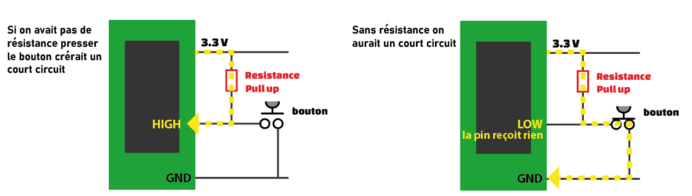 
. 

Où mettre la résistance avant l'alimentation, on parle de **pull down** car on tire la tension vers le bas dans la lecture de la pin lorsque le circuit est ouvert
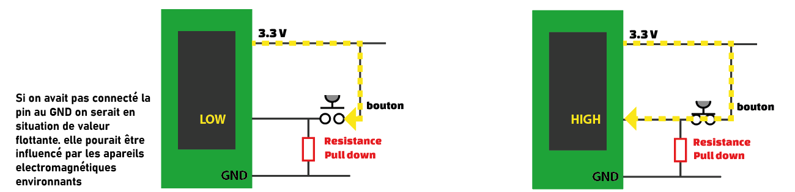    
.
 

Dans la pratique l'Esp32 a des **résistance interne**. Il faut par contre définir si la pine est au bénéfice d'une résistance pull up où pull down.

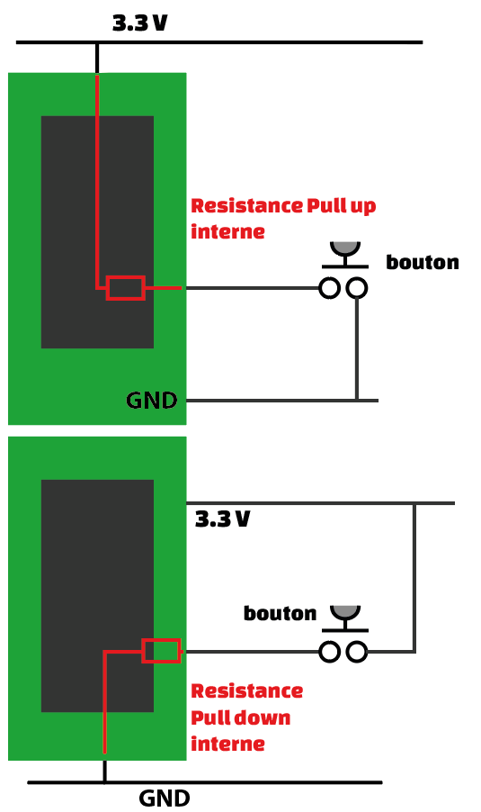  

.

Voici comment cabler notre interupteur 3 points en pull down si l'on n'utilise pas de pull down interne  
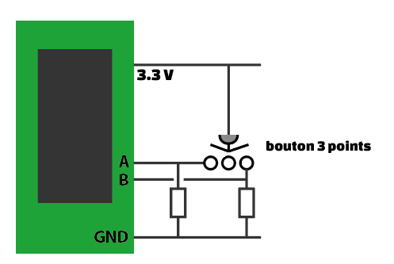  

Voici le schéma de montage 
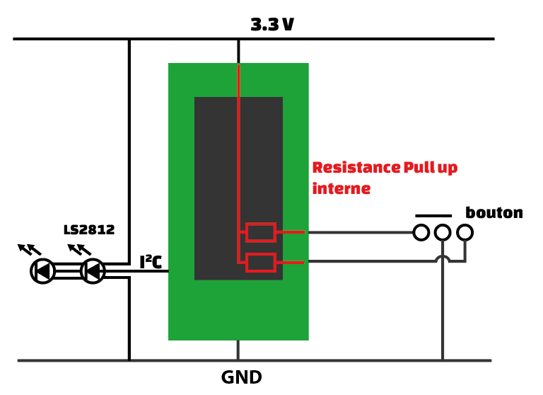  

##Diviseur de tension
notre montage resemble à un diviseur de tension

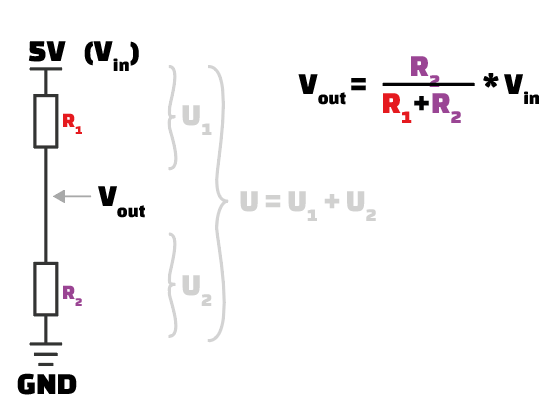  
.

Voici comment la 1ère et la 2ème résistance influence la tension intermédiaire
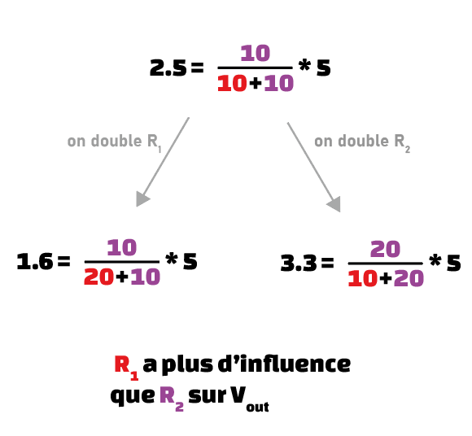  
.

Démonstration de la formule du diviseur de tension
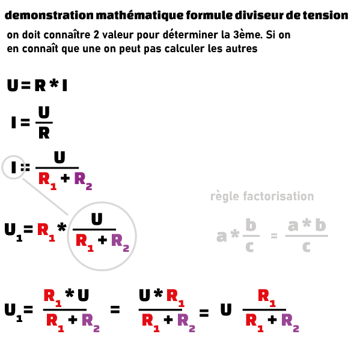  

## MPU6050
accéléromètre incluant un gyroscope.
les sorties SCL SDA permettent d'échanger déchanger les données du gyroscope vers notre board de dévloppement, On appelle ça le bus I2C, ex l'ESP32S3, SDA pour Serial DAta, transmet les données d'angles et d'accélération, le SCL pour Serial CLock, est l'horloge qui donne le rythme afin que le MPU et l'ESP32S3 se synchronisent. ça permet de lire les données au bon rythme, sans quoi le SDA serait illisible.
La sortie INT transmet un signal beaucoup moins complexe que SDA SCL, juste Haut où Bas (en fonction du voltage). ça sert à informer l'ESP32 qu'on a des données pour lui, ainsi on peut le décharger du MPU6050 quand on en a pas besoin et il peut faire autre chose. Cet pin permet également à l'ESP32 de vider la mémoire FIFO (First in, first out) du MPU6050 et ainsi lire les données les plus récentes (car FIFO c'est que la 1ère donées que l'on lit est la 1ère à avoir été stocké, ce qui en fait la plus ancienne)
<figcaption>Ceci est le commentaire dans le rectangle grisé sous l'image.</figcaption>
</figure>