---
date:
  created: 2025-02-22
categories:
  - Mkdocs
tags:
  - introduction
authors:
  - thomas
slug: Mkdocs
---

# Mkdocs presentation et fonctionnement

Cet article présente et explique comment ajouter des articles dans Mkdocs.  

<!-- more -->

## Qu'es-ce que Mkdocs  et Markdown
[Mkdocs](https://www.mkdocs.org/) est une générateur de site conçu pour créer de la documentation. C'est avec Mkdocs que nous réalisons celle-ci.
J'utilise Visual Studio Code pour éditer le code.

[Markdown](https://www.markdownguide.org/basic-syntax/#links) est un language de balisage permettant de styliser du text.

Exemple synthaxe Markdown vs HTML:
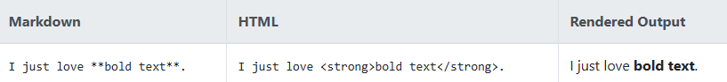

## Comment previsualiser les changements Mkdocs

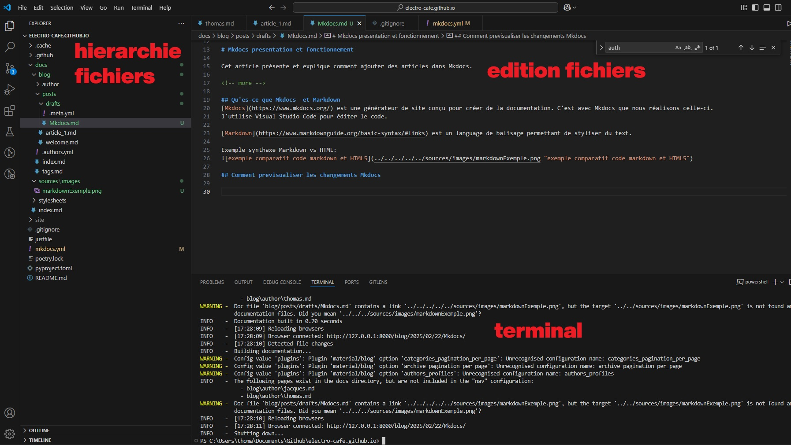
On peut ajouter des dossier dans la partie explorer (ici nommée hierarchie fichiers), c'est ce que j'ai fait pour pouvoir joindre des images à mes pages (dossier sources contenant le dossier images contenant les images)

La partie d'édition de fichier permet de créer du text, changer sa mise en forme, joindre des images etc.

Le terminal nous permet de simuler notre page en local.
Pour ce faire taper **poetry run mkdocs serve** puis enter, la ligne de commande s'exécute. avec ctrl + clic sur le lien ça ouvre la page web en local:

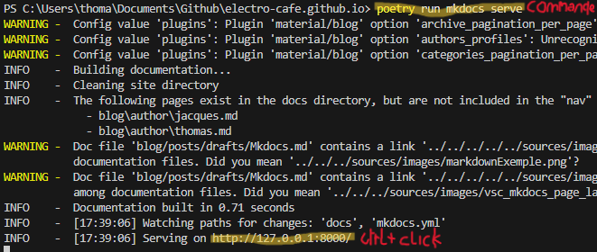

On peut ajouter nos fichiers dans le dossier draft. Il ne sont visible qu'en local. 
Ils apparaissent avec la mention brouillon

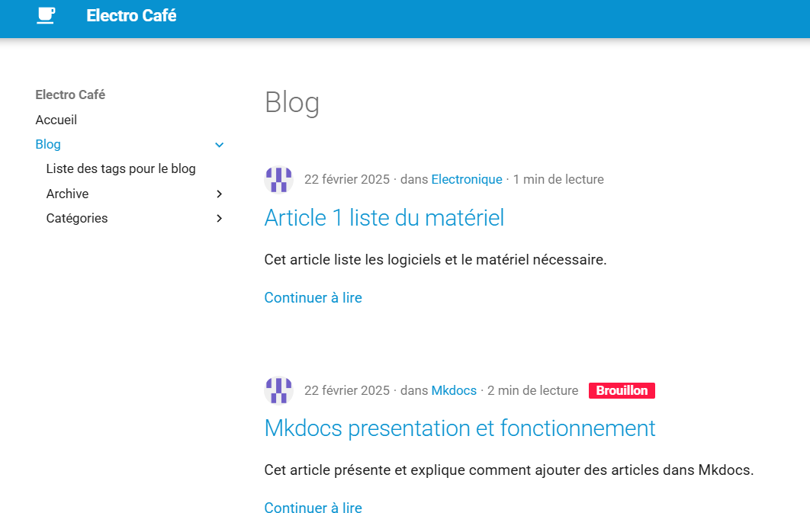

Dans le terminal faire **ctrl + c** pour mettre fin à la synchronisation du site en local.

Astuce: **flèche vers le haut** pour parcourir l'historique des commandes entrées dans le terminal.

## insérer des images dans un article
on va créer un dossier contenant les images **au même niveau que les articles du blog**  ici nommé mkdocs  
P.S. Précédement le dossier était plus à la racine et je devais naviguer comme suit vers les images: "../../../../sources/images/staged_changes.png" cela fonctionnait en local mais pas en online.  
<figure markdown="span">
  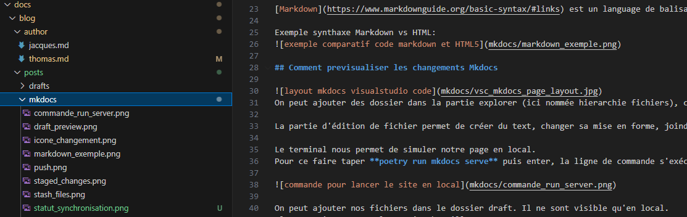
  <figcaption>à gauche le dossier mkdocs contenant les images. à droite l.30 l'implémentation des images</figcaption>
</figure>

## Publier changements sur Github

les changements sont indiqué à droite de l'écran sous source control. Ici il y en a 6
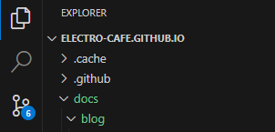

Ils sont ici listés, on ajoute ceux qu'on désire avec le +
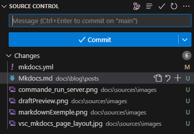

les ajouts passent en "staged change". On ajoute une description des changement dans la case message pour mieux s'y retrouver si on doit utiliser l'historique des changements.
On clique sur Commit, c'est comme faire une photo de l'état du projet, afin de marquer une étape dans son historique et de pouvoir y revenir au besoin.

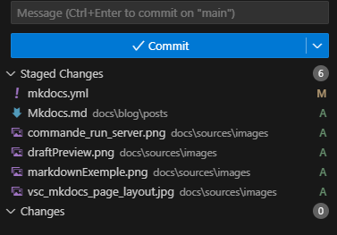

Puis Sync changes

<figure markdown="span">
  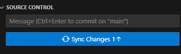
  <figcaption>push to git</figcaption>
</figure>

## synchroniser repository github avec notre dossier local

Utile pour travailler avec la dernière version mise à jour par les collègues.  
Il va falloir utiliser [gitbash](https://git-scm.com/downloads).

<figure markdown="span">
  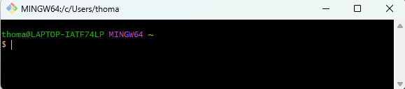
  <figcaption>terminal de commande gitbasht</figcaption>
</figure>

Il faut dire à gitbash ou est situé notre dossier local avec cette commande:  
 **cd /c/Users/thoma/Documents/Github/electro-cafe.github.io**    
 
<figure markdown="span">
  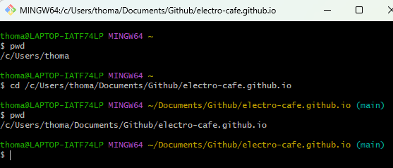
  <figcaption>ici j'ai demandé où gitbash se "situe" puis je l'ai "placé" dans mon dossier copie local du repository github. Quand je lui redemande où il se situe, il nous indique qu'il est dans le dossier demandé</figcaption>
</figure>

Voici quelques commandes utiles 

- **pwd** → Affiche le chemin complet du répertoire actuel dans lequel vous travaillez.

- **git remote add origin https://github.com/electro-cafe/electro-cafe.github.io.git**
→ Lie votre dépôt local à un dépôt distant sur GitHub appelé origin.

- **cd "folderpath"**
→ git bash will locate on the folder you give him the path.

- **git status**
→ Montre fichiers modifiés, en attente de commit, non suivis, etc.

- **git pull origin main**
→ Récupère la dernière version sur github et met à jour notre dossier local.

- **git add .**
→ Ajoute tous les fichiers modifiés et nouveaux fichiers au prochain commit.

- **git commit -m "xxx"**
→ défini le message décrivant les changements du commit.

**git push origin main**
→ Envoie (push) le commit vers GitHub.

<figure markdown="span">
  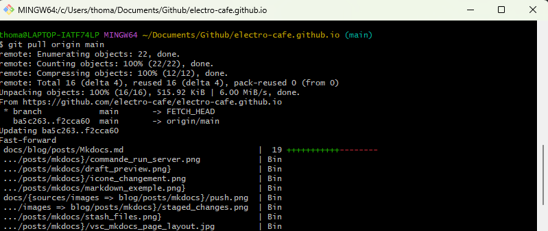
  <figcaption>ici on voit que mon dossier local est mis à jour selon la dernière version sur github</figcaption>
</figure>