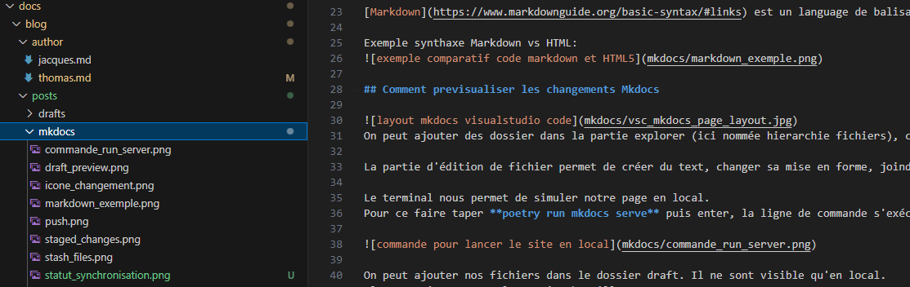
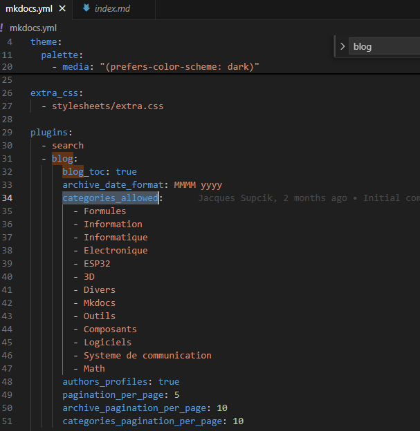
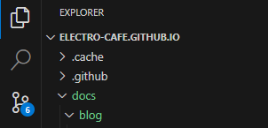
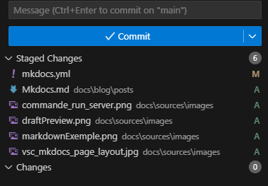
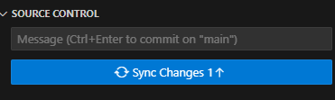
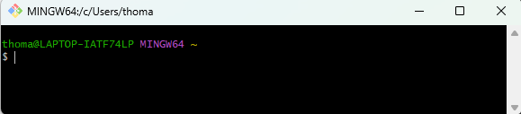

---
date:
  created: 2025-02-22
categories:
  - Mkdocs
tags:
  - introduction
authors:
  - thomas
slug: Mkdocs
---

# Mkdocs, Github et terminal

Cet article présente et explique comment ajouter des articles dans Mkdocs puis envoyer les changements vers Github à l'aide du terminal  

<!-- more -->

## Qu'es-ce que Mkdocs  et Markdown
[Mkdocs](https://www.mkdocs.org/) est une générateur de site conçu pour créer de la documentation. C'est avec Mkdocs que nous réalisons celle-ci.
J'utilise Visual Studio Code pour éditer le code.

[Markdown](https://www.markdownguide.org/basic-syntax/#links) est un language de balisage permettant de styliser du text.

Exemple synthaxe Markdown vs HTML:

## Comment previsualiser les changements Mkdocs

On peut ajouter des dossier dans la partie explorer (ici nommée hierarchie fichiers), c'est ce que j'ai fait pour pouvoir joindre des images à mes pages (dossier sources contenant le dossier images contenant les images)

La partie d'édition de fichier permet de créer du text, changer sa mise en forme, joindre des images etc.

Le terminal nous permet de simuler notre page en local.
Pour ce faire taper **poetry run mkdocs serve** puis enter, la ligne de commande s'exécute. avec ctrl + clic sur le lien ça ouvre la page web en local:

On peut ajouter nos fichiers dans le dossier draft. Il ne sont visible qu'en local. 
Ils apparaissent avec la mention brouillon

Dans le terminal faire **ctrl + c** pour mettre fin à la synchronisation du site en local.

Astuce: **flèche vers le haut** pour parcourir l'historique des commandes entrées dans le terminal.  

## categories, tags et slug
Grace à l'extension mkdocs-blog, on peut trier les articles avec une **categorie** et un **tags**, si l'on veut en ajouter il faut les définir dans le fichier mkdocs.yml  
Le **slug** est la dernière partie de l'url. On est libre de metre le texte que l'on souhaite tant que l'on remplace les espaces par des -  

## insérer des images dans un article
on va créer un dossier contenant les images **au même niveau que les articles du blog**  ici nommé mkdocs  
P.S. Précédement le dossier était plus à la racine et je devais naviguer comme suit vers les images: "../../../../sources/images/staged_changes.png" cela fonctionnait en local mais pas en online.  
<figure markdown="span">
  
  <figcaption>à gauche le dossier mkdocs contenant les images. à droite l.30 l'implémentation des images</figcaption>
</figure>

## Créer un nouvel article
Il suffit de dupliquer un article, changer et lui donner le nom que l'on souhaite.
Au sein de l'article on modifie les tags et catégorie pour mieux le classer.  
Si l'on souhaite lui attribuer une nouvelle catégorie il faut ajouter cette catégorie dans le fichier mkdocs.yml.  
    
  
⚠️ l'article doit être mis dans le dossier **post** sinon il n'est pas visible.  

## Publier changements sur Github

les changements sont indiqué à droite de l'écran sous source control. Ici il y en a 6

Ils sont ici listés, on ajoute ceux qu'on désire avec le +

les ajouts passent en "staged change". On ajoute une description des changement dans la case message pour mieux s'y retrouver si on doit utiliser l'historique des changements.
On clique sur Commit, c'est comme faire une photo de l'état du projet, afin de marquer une étape dans son historique et de pouvoir y revenir au besoin.

Puis Sync changes

<figure markdown="span">
  
  <figcaption>push to git</figcaption>
</figure>

## synchroniser repository github avec notre dossier local

Utile pour travailler avec la dernière version mise à jour par les collègues.  
Il va falloir utiliser [gitbash](https://git-scm.com/downloads).

<figure markdown="span">
  
  <figcaption>terminal de commande gitbasht</figcaption>
</figure>

Il faut dire à gitbash ou est situé notre dossier local avec cette commande:  
 **cd /c/Users/thoma/Documents/Github/electro-cafe.github.io**    
 
<figure markdown="span">
  
  <figcaption>ici j'ai demandé où gitbash se "situe" puis je l'ai "placé" dans mon dossier copie local du repository github. Quand je lui redemande où il se situe, il nous indique qu'il est dans le dossier demandé</figcaption>
</figure>

Voici quelques commandes utiles 

- **pwd** → Affiche le chemin complet du répertoire actuel dans lequel vous travaillez.

- **git remote add origin https://github.com/electro-cafe/electro-cafe.github.io.git**
→ Lie votre dépôt local à un dépôt distant sur GitHub appelé origin.

- **cd "folderpath"**
→ git bash will locate on the folder you give him the path.

- **git status**
→ Montre fichiers modifiés, en attente de commit, non suivis, etc.

- **git pull origin main**
→ Récupère la dernière version sur github et met à jour notre dossier local.

- **git add .**
→ Ajoute tous les fichiers modifiés et nouveaux fichiers au prochain commit.

- **git commit -m "xxx"**
→ défini le message décrivant les changements du commit.

**git push origin main**
→ Envoie (push) le commit vers GitHub.

<figure markdown="span">
  
  <figcaption>ici on voit que mon dossier local est mis à jour selon la dernière version sur github</figcaption>
</figure>

## terminal
Le terminal permet d'executer des programmes ou scripts, de rechercher et déplacer des fichiers de manière précise, installer ou mettre à jour des logiciels.  
Sur windows il en existe plusieur:   
- **L'invite de commande**: terminal de base de windows, un peu ancien et limité.  
- **Powershell**: plus moderne, puissant, avec sa propre syntaxe.  
- **Git Bash**: une version de bash (le terminal de Linux/Mac) installée avec Git pour Windows.  

Voici quelques commandes utiles:    

|     | **Fonction** | **abréviation** | 
|--------------|----------------------------|----------------------------------------------------------|
| **pwd**  | 	Affiche le chemin du dossier actuel  | Print Working Directory | 
| **ls** | 	Liste les fichiers et dossiers dans le dossier actuel | list |  
| **cd** | 	Change de dossier | change directory |  
| **touch** | 	Crée un fichier vide |   |  
| **rm** | 	Supprime un fichier | remove |  
| **mv** | 	Déplace ou renomme un fichier ou dossier | move |  
| **cp** | 	Copie un fichier ou dossier | copy |  
| **grep** | 	Recherche dans un fichier/dossier selon expression régulière |   |  
| **echo** | 	affiche un message ou variable dans le terminal.  ex: nombre de fichier trouvé |  |  

---

et contrôles utiles:

|     | **Fonction** | **abréviation** | 
|--------------|----------------------------|----------------------------------------------------------|
| **Ctrl + A**  | 	Aller au début de la ligne  |  | 
| **Ctrl + E** | 	Aller à la fin de la ligne |  |  
| **Ctrl + C** | 	Annuler/interrompre une commande |  |  
| **tab** | 	Auto-complétion des fichiers/commandes |   |  
| **Ctrl + U** | 	Supprime tout ce qui est à gauche du curseu | |  
| **Ctrl + k** | 	Supprime tout ce qui est à droite du curseu | |  
| **↑ / ↓** | 		Naviguer dans l’historique des commandes |  |  
| **..** | 	remonte d'un  dossier |   | 

pour la recherche de fichier, les **expressions régulières** -Regex- permettent une recherche très fine. C'est un peu comme faire une recherche google en excluant certains termes, mais en plus puissant.

## poetry
C'est gestionnaire de projet et de dépendances Python, il permet l'installation de librairies ainsi qu'un contrôl précis des versions des bibliothèques utilisées. Peut-être qu'une librairie (collection de fonctions) a été mise à jour et qu'elle ne possède plus les fonctionalités dont l'on a besoin.  
Poetry permet également de créer des environnement virtuel pour que le projet n’entre pas en conflit avec d’autres projets. Un **environnement virtuel est un environement isolé**, ainsi les commandes executés au sein de cet environement ne viendront pas polluer le système Python global.   
Afin d'installer poetry il a fallu installer **Pyp.py** -l'installateur officiel de librairies de python- et **Pyp.X**, un programme qui permet d’installer et exécuter des programmes Python dans un environnement virtuel (au sein d'un dossier .Venv).

