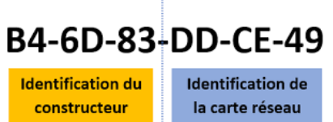
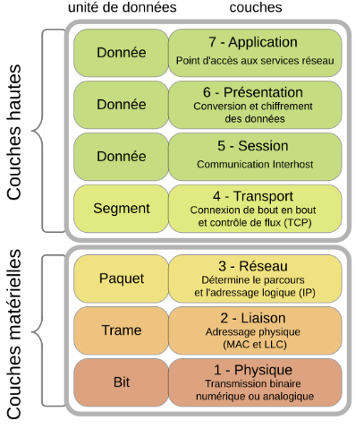

---
date:
  created: 2025-07-19
categories:
  - reseau
tags:
  - reseau
  - communication
authors:
  - thomas
slug: reseau
---

# Reseau et communication 
Comment les appareils communiquent-ils entre eux ?

<!-- more -->

>Je n'ai pas encore eu l'occasion de mettre en pratique cette thérorie, j'ai peut être compris certains aspects de travers, cet article est sujet à modificaiton.

## Adresse IP
Au sein d'un réseau les appareils ont une adresse IP. C'est comme l'adresse de notre boîte aux lettres, ça sert à connaître l'expéditeur d'une requête et à lui adresser des information.  
Il en existe différente sorte, on va détailler l'IPv-4.

## Structure Adresse IPv
Elle est composée de 4 chiffres allant chaqu'un de 0 à 255 et séparés par des points.   
**Ex: 176.17.155.200**  
L'adresse IP contient Généralement les 3 premiers chiffres représentent le réseau et le dernier chiffre la machine.  
Dans notre exemble le  partie, une pour identifier le réseau et l'autre pour identifier l'hôte (la machine).  
réseau est donc 176.17.155 et la machine 200.  
Par convention le numéro du routeur est 1 donc son adresse, selon notre exemple, serait 176.17.155.1  
On nomme ce système d'adresse **IPV4** car l'on a **4 bloc de 8 bits** (8bits = 256 nombre).
La séparation réseau/hôte n'est pas fixe, elle dépend du **masque de sous-réseau**.    

## Masque de sous-réseau (Subnet Mask)
Le masque de sous-réseau permet de définir combien de bits sont réservés au réseau, et donc combien il reste pour les machines.
Dans notre exemple, on utilise un masque /24 car on a 3 fois 8 bits pour représenter l'adresse du réseau, on peut l'indiquer comme tel: **176.17.155.0/24**.  
Il reste donc il reste donc 8 bits pour les machines, ce réseau peut donc contenir 255 machines et un routeur. -> 256 adresses.  
Cela peut arriver qu'il nous faille plus d'adresse pour les machines, on utilise donc un masque de sous réseau avec une adresse réseau de 2 octets ex: 176.17.0.0/16. Ainsi on peut connecter 511 machine et un routeur.

## Routeur
Les réseaux sont séparés par des routeurs (gateway en anglais). c'est eux qui transmettent les demandes des machines d'un réseau à un autre réseau et transmet les requêtes d'une machine vers internet.

Au sein d'un réseau on ne doit pas avoir 2x la même adresse. 

Les appareils ne sont pas directement connectés au routeur, ils sont connectés à un switch qui lui est connecté au routeur. 

## Mac Adresse
Media Access Control Adresse:
  

Quand une machine veut s'ajouter sur un réseau, le routeur ne connaît pas encore son adresse, normal c'est lui qui distribue les adresse. Il reçoit cependant la Mac adresse (48 bits) de la machine. toutes les machines pouvant se connecter à un réseau on ont une unique, assigné par le fabricant lors de leur création. Il sait donc à qui envoyer l'adresse. Il stock en interne dans un tableau la correspondance Macadresse - Adresse IP.  

Les fabricants (vendor) ont un début de mac adresse unique, ils modifie juste la fin pour chacun des objects qu'ils produisent.

## Modèle OSI
Open Systems Interconnection est une norme de communications de tous les systèmes informatiques en réseau.  
  
Ce modèle aide à comprendre ce qui se passe dans les communication d'un réseau. Il peut aider à définir où se situe els problèmes de communication.

## TCP/IP
Le modèle TCP/IP est une version simplifiée et plus proche du réel que le modèle OSI.
Il est composé de 4 couches principales, qui s’occupent de faire transiter les données d’un programme à l’autre, à travers les réseaux.

| **Couche**       | **Rôle**        | **Exemple**                                           | 
|--------------|----------------------------|----------------------------------------------------------|
| **Application**  | Gère les données visibles du programme utilisateur	 | HTTP, MQTT, DNS             | 
| **Transport** | 	Gère la fiabilité et l’ordre des messages   | TCP (fiable), UDP (rapide)           | 
| **Internet** | Acheminement entre les réseaux, via les adresses IP     | 	IP, ICMP                   | 
| **Accès réseau** | 	Transmission locale sur WiFi ou Ethernet           | 	WiFi, Ethernet, ARP        | 
