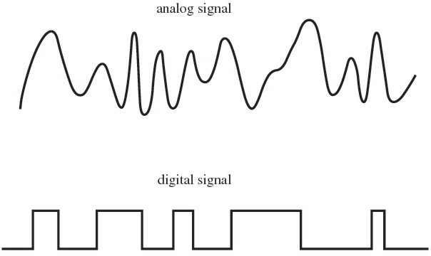
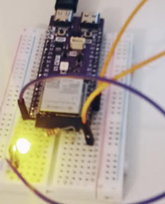
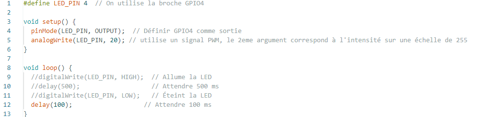
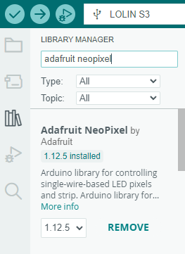
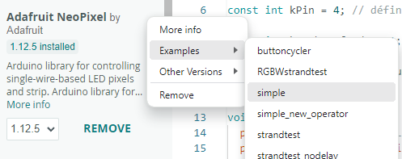
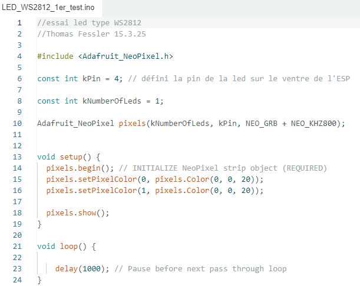
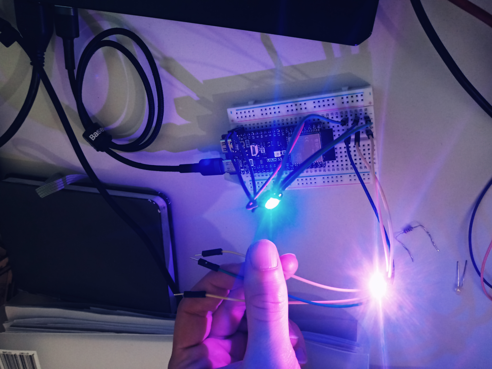
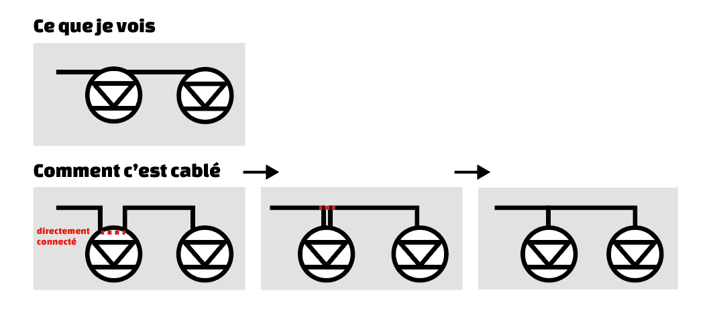
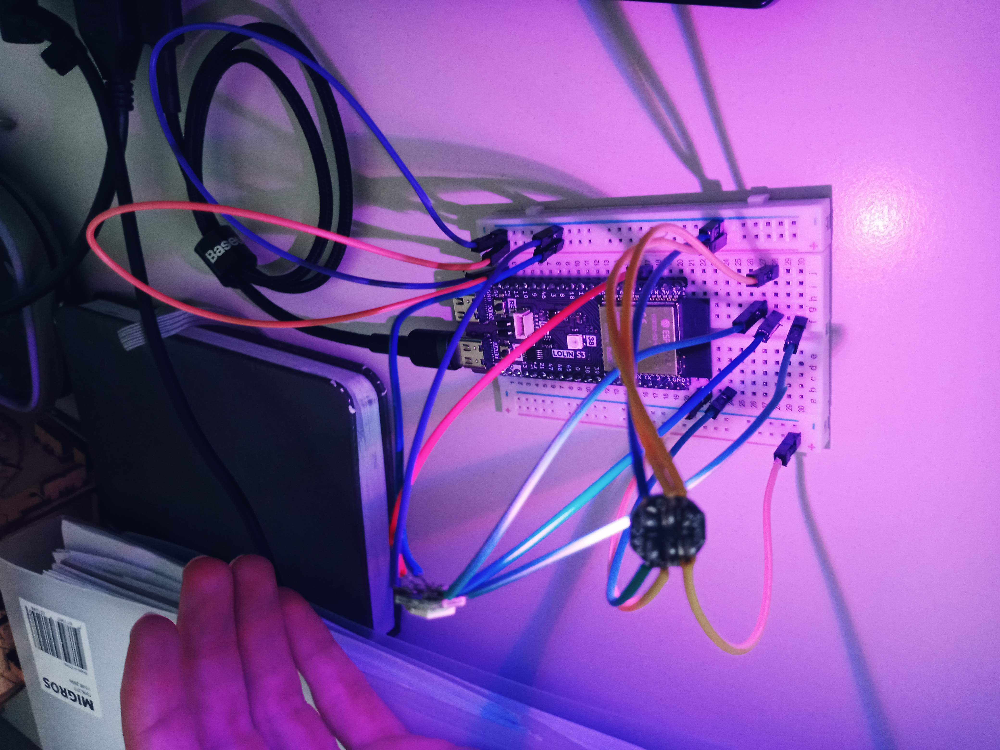

---
date:
  created: 2025-03-15
categories:
  - Composants
  - Electronique
tags:
  - Composants
  - Electronique
authors:
  - thomas
slug: Led RGB WS2812
---

# Led RGB WS2812

Cet article présente la mise en place de l'IDE arduino pour contrôler une led RGB type WS2812.  

<!-- more -->

## signal PWM - Pulse with modulation  
  
Le signal analogue est un signal nuancé pouvant prendre une large palette de valeurs, alors que le signal digital n'a que deux états: 0 où 1, c'est binaire, 0% où 100%.    

⚠️ en courant continue, pour "nuancer" le courant afin d'allumer une led à 80% d'intensité, on alterner rapidement entre éteint et allumée, en allant assez vite on voit pas les coupures, et la led a baissé son intensité d'éclairage. C'est une technique pour obtenir un résultat analogue avec une méthode digitale. Le temps éteind n'est pas forcément égale au temps allumé, ça dépend de l'intensité souhaité. Ce type de signal s'appelle **PWM**, le ratio de temps allumé/éteind s'appelle le **duty cycle**. Un duty cycle de 80% signifie que dans un cycle la lampe est allumée durant 80% du temps puis éteinte 20%.

## modifier l'intensité d'une led
voici notre montage:  
  

La fonction analogWrite permet d'envoyer un signal PWM, concretement la lampe s'éteint et s'allume très vite, le ratio entre le temps éteind et allumé dépend du 2ème argument de la fonction, c'est le duty cycle. 
   

La fonction analogWrite() ne nous donne pas de contrôle sur la fréquence.
Pour rappel la fréquence c'est le nombre de cycle par seconde.
Si on enlevet le commentaire du code dans la boucle et qu'on enleveait la fonction analogWrite dans le corps de la fonction setup, on pourait gérer la durée des cycles avec les delay.

## Neopixel library
dans l'onglet library chercher NeoPixel d'adafruit    
  
  
On peut ouvrir un projet simple en cliquand sur les 3 petits poins->Examples->simple   
 

Comme on le voit la librairie est incluse dans le projet.
  
Ici on a défini sur quelle pin est câblée la led et on peut définir sa teinte avec pixels.Color(), ici 20/255 de bleu.   

## Questions

Je m'attendais à mesurer 3.3v dans l'exemple avec la diode pourquoi le multimètre me donne t'il une valeur inférieur ?
>le signal PWM et l'intensité défini dans **analogWrite(LED_PIN, 20)** font que le multimètre nous donne la valeur moyenne de la tenssion (un oscilloscope nous donnerait la valeur en fonction du temps et on verrait 0v puis 3.3v etc)  

Quelle est la fréquence de pulsation ?
>ça dépend de la méthode, avec un signal PWM on a pas la main dessus, à priori 5000 herz soit 5000 cycles par secondes 

comment chainer 2 led au niveau du câblage ?  
>simplement relier les sorties dout de la 1ère led à la 2ème. J'étais confus sur quoi faire avec les sorties dout de la 2ème led, il ne faut pas les relier au gnd.   
 
  

Pourquoi les WS2812 n'on pas de résistance dans le circuit comme avec la diode ?
>En fait il ne s'agit pas d'une simple led, il y a un contrôleur intégré possèdent un circuit interne qui contrôle la tension, le signal PWM et l'ampérage de chaque led qui la compose (afin de produire les couleurs rvb elles ne sont pas identiques au niveau de leur composants). Elles nécessitent entre 1.8v et 3.4v (rvb n'ont pas les même besoins) avec 20 ampères par couleur.  

Les leds WS2812 sont elles en parralèle où en série ?
>3 choses portent à confusion:  
-- les 3 Leds r g et b composant la WS2812 sont connectés en série, les modules WS2812 sont connectés en parallèle. Sur internet on dit qu'on les daisy chain.  

>-- le fait que les fils entrent dans le module puis en ressortent pour entrer dans le prochain module, visuellement on dirait qu'elles sont branchées en série car on ne vois pas de noeud / boucle. 
Pourtant lorsque l'on mesure la résistance de l'entrée de l'allimentation et sa sortie avec l'ohm mettre on a un signal qui nous dit que ça communique. On peut donc représenter la connection comme ceci:

> 
(on a représenté que l'alimentation)

 
Ici le câblage prête un peu moins à confusion.

> le câble transmettant le signal de donné (fil du milieu) est connecté en série.  

chaque element de ws2812 reçoit 5v car elles sont en parallèle. si elles étaient en série elles auraient  combien ? 

>  $$
    \frac {\text{tension totale}}{\text{nombre d'élément}} 
  $$

