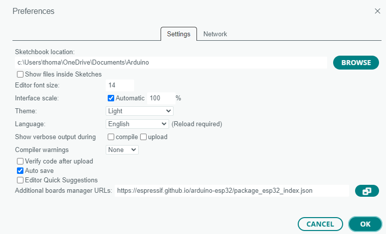

---
date:
  created: 2025-03-09
categories:
  - Systeme de communication
tags:
  - Systeme de communication
authors:
  - thomas
slug: communication ESP32-composants
---

# Système de communication ESP32-composants
Comment l'ESP32 fait elle pour échanger et recevoir des informations avec les composants

<!-- more -->

<!-- a completer et mettre en forme:
## Langage binaire

L’ESP32, comme tout microcontrôleur, fonctionne en langage binaire. Cela signifie qu'il ne comprend que des 0 et des 1, qui correspondent respectivement à des niveaux bas et hauts de tension électrique. Cette logique binaire est la base de la communication entre l’ESP32 et les composants électroniques connectés.

Les signaux binaires peuvent être envoyés sous différentes formes :

Numérique (digital) : soit un état haut (1), soit un état bas (0).

Analogique (PWM - Pulse Width Modulation) : un signal crénelé où la durée pendant laquelle le signal est haut ou bas permet de représenter des valeurs intermédiaires.

Un signal crénelé (ou signal PWM) est utilisé pour simuler une sortie analogique en modulant la durée des impulsions. Par exemple :

Si le signal est haut 80 % du temps, on considère que la valeur est 1.

Si le signal est haut 15 % du temps, on considère que la valeur est 0.

## Les bus de communication

Pour échanger des informations avec des composants, l’ESP32 utilise des bus de communication. Ce sont des systèmes de transmission qui permettent l’échange de données entre le microcontrôleur et les périphériques connectés.

Types de bus courants

I2C (Inter-Integrated Circuit) : Utilisé pour connecter plusieurs composants avec seulement deux fils :

SDA (Serial Data Line) : pour envoyer et recevoir des données.

SCL (Serial Clock Line) : pour synchroniser l'envoi des données.

SPI (Serial Peripheral Interface) : Plus rapide que l'I2C, mais nécessite plus de fils.

UART (Universal Asynchronous Receiver-Transmitter) : Utilisé pour la communication série simple, comme entre un ordinateur et l'ESP32.

## Exemple : Contrôler une LED à couleur variable

Prenons l'exemple d'une LED RVB adressable, qui possède les broches suivantes :

Broche

Fonction

Vcc

Alimentation positive (5V ou 3.3V selon le modèle)

Din

Entrée des données (commande de couleur)

GND

Masse

Dout

Sortie des données vers une autre LED (chaînage)

## Connexion avec l’ESP32

L’ESP32 envoie un signal PWM sur la broche Din de la LED pour modifier sa couleur. Voici un exemple de code pour allumer la LED en rouge, puis la faire passer au bleu :

#include <Adafruit_NeoPixel.h>

#define LED_PIN 4  // GPIO où la LED est connectée
#define NUM_LEDS 1 // Nombre de LED

Adafruit_NeoPixel strip(NUM_LEDS, LED_PIN, NEO_GRB + NEO_KHZ800);

void setup() {
  strip.begin();
  strip.show(); // Éteindre les LED au démarrage
}

void loop() {
  strip.setPixelColor(0, strip.Color(255, 0, 0)); // Rouge
  strip.show();
  delay(1000);
  strip.setPixelColor(0, strip.Color(0, 0, 255)); // Bleu
  strip.show();
  delay(1000);
}

Dans cet exemple :

La LED est connectée au GPIO4.

La couleur est définie par une combinaison de valeurs Rouge (R), Vert (G) et Bleu (B).

La fonction setPixelColor() permet de modifier la couleur de la LED.

L’ESP32 envoie un signal binaire sous forme de pulses électriques pour commander les couleurs de la LED via le bus de communication.

  

