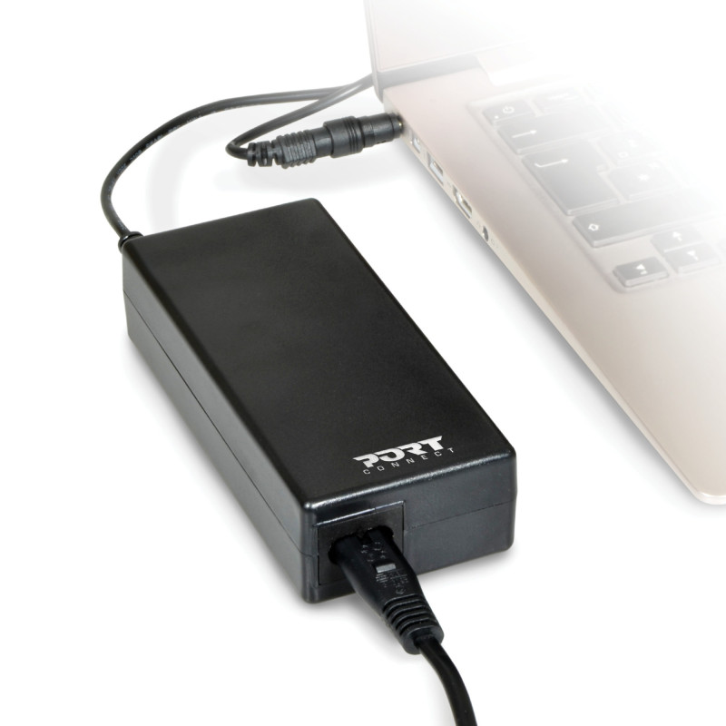
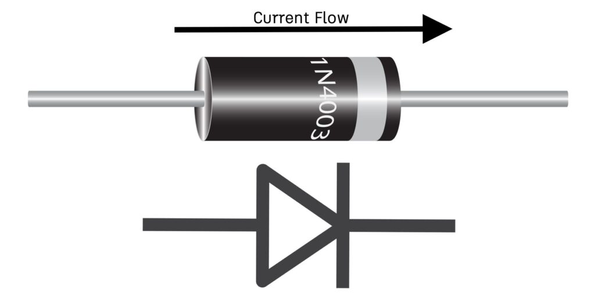
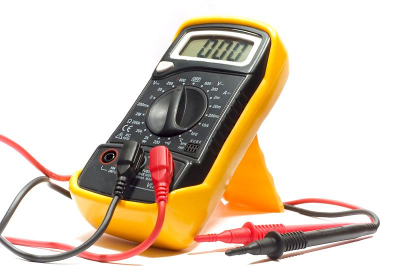

---
date:
  created: 2025-03-02
categories:
  - Outils
  - Composants
tags:
  - Outils
  - Composants
authors:
  - thomas
slug: composants_electronique_et_outils 
---

# composants electronique et outils 

Cet article présente les composants, et les outils nécessaire à la mesure et à la fabrication de circuits électronique.  

<!-- more -->

## bloc d'alimentation PC  
  
Les ordinateurs fonctionnent en **courant continu**. Comme en europe nos prises fournissent du courant alternatif il faut le modifier. c'est le rôle des blocs d'alimentation PC, ça explique pourquoi ils comportent cet élément absent d'un câble d'aspirateur par exemple.  

Il se compose entre autre d'un **redresseur** (où diode) qui ne laisse passer que la partie positive du courant alternatif et d'un **condensateur** qui va **lisser** le courant.

  
## Diode 
  
Ce composant permettant la circulation du courant que dans un sens (de la longue pate à la courte)

## Multimètre 
  
Permet de mesurer le potentiel (courant alternatif, courant continu), la résistance et l'ampérage (intensité).  
⚠️ Vérifier que l'ampérage max du multimètre n'est pas dépassé.  
⚠️ Il ne faut pas mesurer le courant alternatif d'un système fonctionnant en courant continu sous peine de détruire l'appareil.

|     | **sous tension** | **hors tension** | 
|--------------|----------------------------|----------------------------------------------------------|
| **en parallèle**  | Potentiel-tension (V)| résistance (Ω) | 
| **en série** | Ampérage (A)  |   

- mesure **en série**: on ouvre la boucle pour faire passer le courant au travers du multimètre. (le multimètre est intégré à la boulce) 
- mesure **en parallèle**: on vient prendre la mesure avant et après un élément de la boucle. le multimètre crée une nouvelle boucle.

