---
date:
  created: 2025-03-02
categories:
  - Outils
  - Composants
tags:
  - Outils
  - Composants
authors:
  - thomas
slug: composants_electronique_et_outils 
---

# composants electronique et outils 

Cet article présente les composants, et les outils nécessaire à la mesure et à la fabrication de circuits électronique.  

<!-- more -->

## bloc d'alimentation PC  
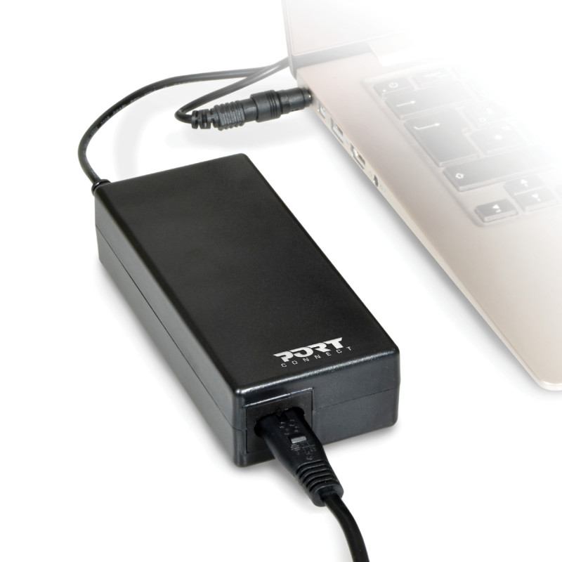  
Les ordinateurs fonctionnent en **courant continu**. Comme en europe nos prises fournissent du courant alternatif il faut le modifier. c'est le rôle des blocs d'alimentation PC, ça explique pourquoi ils comportent cet élément absent d'un câble d'aspirateur par exemple.  

Il se compose entre autre d'un **redresseur** (où diode) qui ne laisse passer que la partie positive du courant alternatif et d'un **condensateur** qui va **lisser** le courant.

  
## Diode 
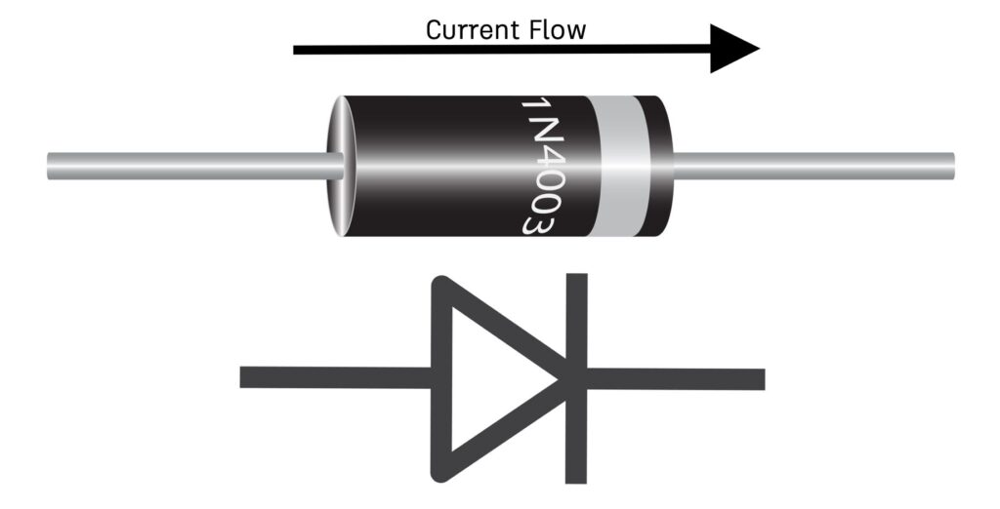  
Ce composant permettant la circulation du courant que dans un sens (de la longue pate à la courte)

## Led WS2812 
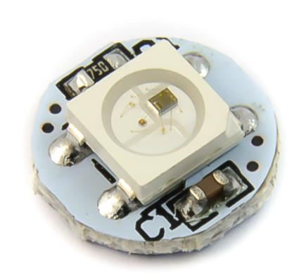  
les led neopixel WS2812 peuvent être chainées ensemble. leur librairie comprend une fonction rainbow() qui étale les couleurs de l'arc-en-ciel le long de la chaine (sans animer leur défilement).

## PCB
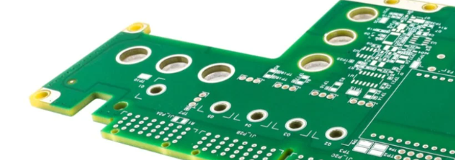   
printed circuit board. le support reliant les composant électroniques à l'aaide de circuit imprimés   

## step moteur 28byj-48   
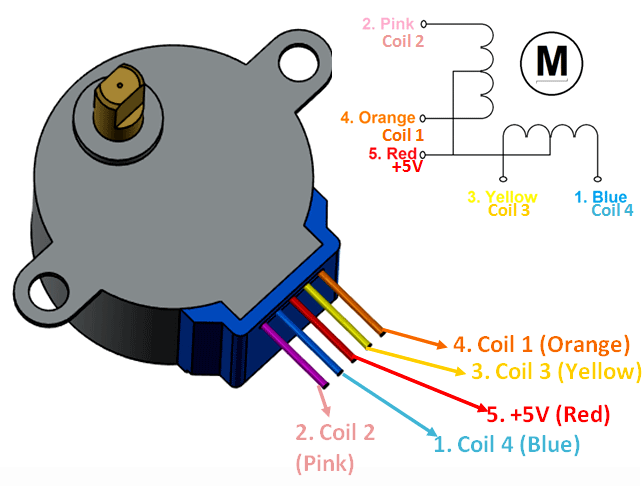    
composé de **4 coils** produisant un champ électromagnétique et faisant tourné le moteur sur un maximum de **2048 step**.   
L'ordre d'activation des coils est 1 3 2 4. sûrement pour des raisons pratiques au niveau de la conception du moteur. Cela signifie qu'il faut soit cabler les pin en inversant la 2 et la 3, soit donner les arguments pin au constructeur en dans l'ordre 1 3 2 4.  
  
Puissance et consomation:   
5V, 50Ω, on peut calculer l'ampérage ainsi U = R * I -> 5 = 50 * 0.1. U = 100mA  
Et la puissance comme ceci: P=U * I -> 0.5 = 5 * 0.1. P = 0.5W
Mais tout ça c'est **pour un seul coil**, comme il en utilise deux en même temps il faut doubler le résultat
donc le **moteur** a un **ampérage** d'environ **240mA** nécessitant une puissance d'environ 1W.  

Les moteurs peuvent être **unipolaire** où **bipolaire**, ce qui porte ä confusion c'est qu'un moteur unipolaire a 2 coils lä où le bipolaire en a 1. en fait bi et uni font référence au sens du courant possible dans 1 coil.  
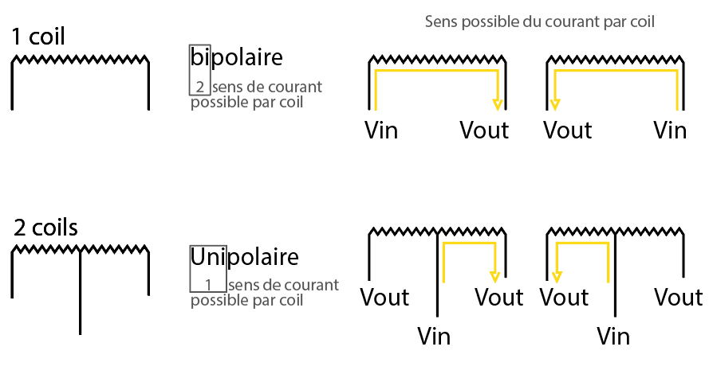   
Si le courant peut voyager de gauche à doite où de droite à gauche dans un moteur bipolaire c'est grace à un pont H ou H-bridge en anglais.  
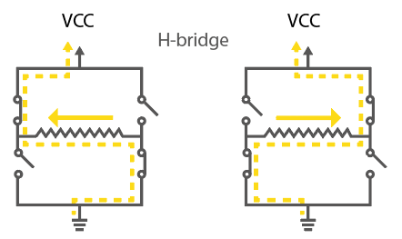   

Lorsque le courant parcourt un câble, il crée un champ magnétique autour de celui-ci (comme les anneaux de saturnes) lorsque l'on enroule le câble afin de former un coil, les champs magnétiques en chaque portion du câble s'aditionnent. On utilise la **règle de la main droite** pour **déterminer le Nord**. Si l'on prend le coil en main en remplissant cette **condition**:  
>doits pointant dans le sens du courant le long des coils      

Alors le pouce indique le Nord.    
Si on utilise la main droite et remplissons les 2 conditions, alors le pouce pointe vers le Sud.    
  
**⚠️ Attention** ce n'est pas parce que l'alimentation est à gauche du coil que le nord est à droite. ça dépend du sens de bobinage:  
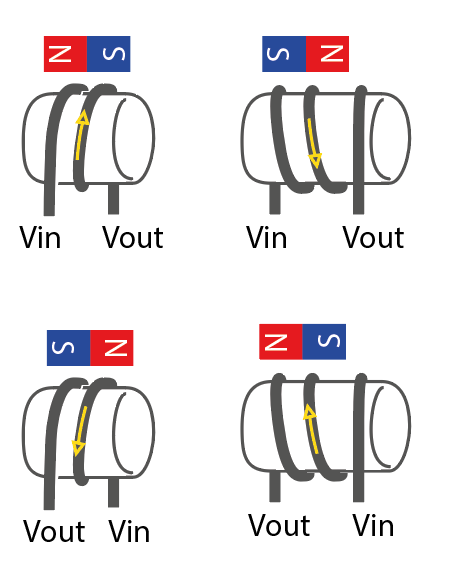     

## capacitor / Condensateur
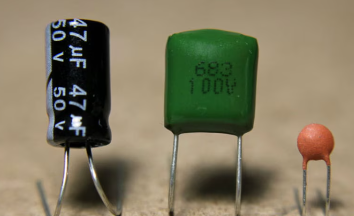     
Il déteste que la tension change brusquement, il tente de la maintenir. Il **Stock l'énergie** et la **redistribue** lors des chutes. Après avoir été chargé, son voltage est égale à celui de sa source. L'énergie qu'il stock, où charge par unité de voltage est nommée **capacitance**, plus sa capacité est élevée plus longtemps il peut fournir de l'énergie. L'**unité de la capacitance** sont les **Farad**, en électronique on parle de micro, nano et pico -farads. Le capacitor est composé de deux plaques conductrices, entre elle il y a une couche isolante résistant à un certain voltage indiqué sur le capacitor. Il ne faut pas le dépasser. Un capacitor stock l'énergie sous forme de champ électrique, contrairement à une batterie qui utilise une réaction chimique. 

## Inductor / inductance  
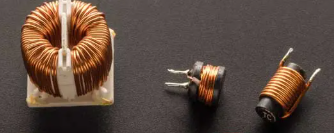  
C'est une bobine de fil de cuivre qui, comme le condensateur, cherche à maintenir un état stable du courant (inductance). Lui il travaille sur l'intensité.  
Quand du courant parcour la bobine, un champ magnétique se forme. Ce champ magnétique "stock" de l'énergie. Si l'intensité du courant vient à baisser, le champ magnétique peut la restorer en se "consommant", il ne stoppera pas la baisse mais la freinera.
Les moteurs électirques fonctionnent grâce à une série d'inducteurs enroulés dans le stator (partie fixe du moteur). Une fois parcouru par le courant, elles attirent le rotor (partie mobile du moteur). Le problème c'est que lorsque l'on "allume" l'inducteur suivant, le précédent conserve un peu son intensité, ce qui fait qu'il attire encore un peu le rotor. Une tension élevée permet de lutter contre ça. 

## FOC - Field oriented control  
Les moteurs électriques à courant continus utilisent un driver qui se charge d'électriser les inducteurs selon la séquence du moteur.    
Pour ceux qui utilisent du courant alternatifs c'est plus compliqués. Si l'on se contente d'envoyer le courant une fois dans un sens du circuit, une fois dans l'autre, le changement de courant est brutal. Sur un diagramme ça aurait l'aspect de marches d'escaliers.  Ces à coups de courant génèrent des vibrations, et des saccades. Si le moteur doit tourner très vite, l'inertie pourrait nullifier ces côtés négatifs mais pour un bras robotique c'est génant. En utilisant le PWM, les Mosfets du driver peuvent s'ouvrir 10% du temps puis 20% etc. Comme les bobines du moteur ont de l'inductance (elles agissent comme un filtre lisseur), elles ne ressentent pas les micro-coupures du PWM. Ainsi on arrive à une forme sinusoidale.  
Le FOC c'est le calcul en temps réel (des milliers de fois par seconde) ces temps d'ouvertur pour que le courant sur les trois fils U, V, W ait l'aspect d'ondes sinusoïdales parfaites et progressives.  
En résumé, ce composant reçoit les signaux PWM calculés par le processeur en amont, récupère le courant de la batterie puis le transmet de manière optimale sur les phases u v w au bon moment. Cela permet d'éviter de perdre de l'énergie, du couple et de fluidité.  
Il peut y avoir une confusion lorsque l'on parle de FOC, strictement parlant ça désigne l'algorithme / le logiciel qui tourne dans le processeur (de l'esp32 par exemple). Les composants comportant la mention FOC, reçoivent les signaux PWM et transmettent les signaux électriques sinusoïdaux. Dans ce cas FOC est une nomination commerciale signifiant "Ce composant est optimisé et câblé pour recevoir les signaux PWM d'un algorithme FOC.

## diode de roue libre
Lorsqu'un moteur tourne, ses bobines génère un champ magnétique. le champ magnétique participe à faire circuler le courant (c'est comme la différence de voltage de la batterie qui pousse le courant) on appelle ça la Force Electromotrice (FEM) de retour Si l'on coupe d'un coup l'alimentation de courant, le champ magnétique continue à pousser le courant encore présent. Cela le fait monter en tension et son passage va endomager les composants. Afin d'éviter cela on utilise une diode de roue libre 

## Batterie
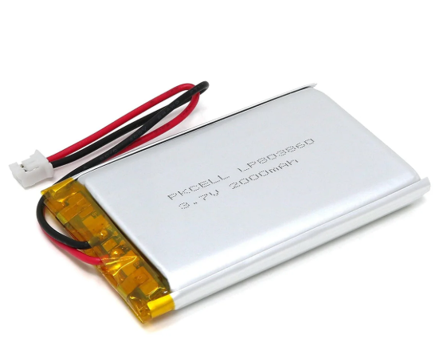  
Ici on a une batterie Li-Po (pour lithium-polymère), rechargeable, légère. La capacité d'une batterie s'exprime en ampere-heure (Ah) où en miliampere-heure. Cela indique la quantité de charge electrique que la batterie peut stoker ainsi que le temps qu'elle peut fournir de l'énergie. Si elle fournie plus d'énergie elle tiendra moins longtemps.  
1 Ah =  3600 coulombs

> 1 ampère = 1 coulomb / seconde    

Une batterie de 10 Ah peut fournir 1 ampère pendant 10h ou 10 ampère pendant une heure.

## résistance

## Multimètre 
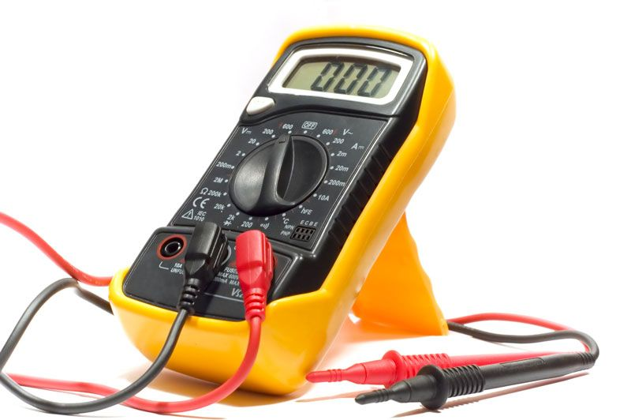  
Permet de mesurer le potentiel (courant alternatif, courant continu), la résistance et l'ampérage (intensité).  
⚠️ Vérifier que l'ampérage max du multimètre n'est pas dépassé.  
⚠️ Il ne faut pas mesurer le courant alternatif d'un système fonctionnant en courant continu sous peine de détruire l'appareil.

|     | **sous tension** | **hors tension** | 
|--------------|----------------------------|----------------------------------------------------------|
| **en parallèle**  | Potentiel-tension (V)| résistance (Ω) | 
| **en série** | Ampérage (A)  |   

- mesure **en série**: on ouvre la boucle pour faire passer le courant au travers du multimètre. (le multimètre est intégré à la boulce) 
- mesure **en parallèle**: on vient prendre la mesure avant et après un élément de la boucle. le multimètre crée une nouvelle boucle.

## Oscilloscope
Permet de mesurer l'intensité du courant sous forme de graphe, utile pour lire les PWM.  
Ici le modèle BSide09, oscilloscope qui fait aussi multimètre.  
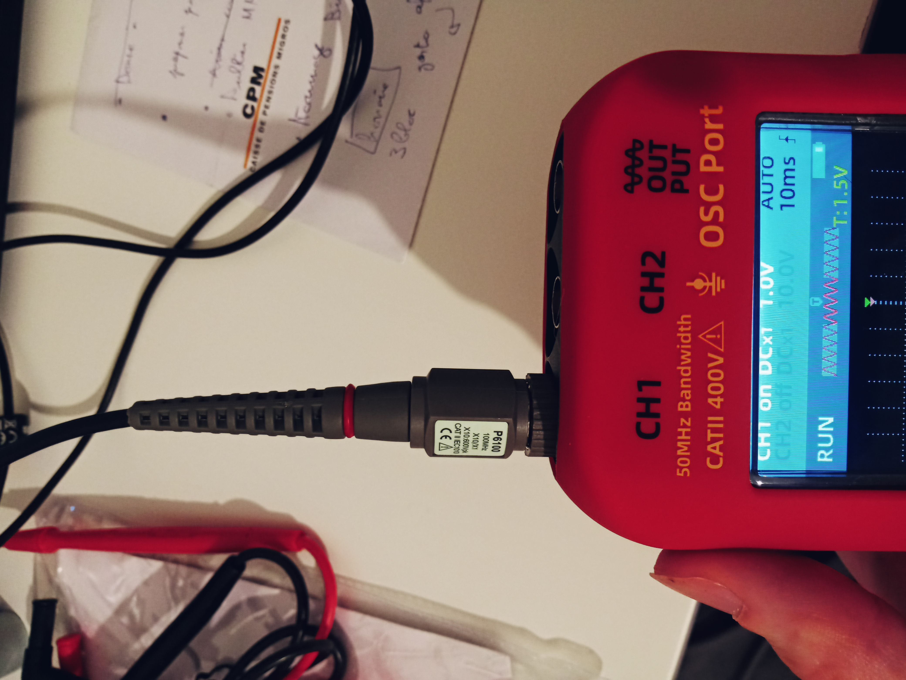   
le probe vient se connecter sur le dessus de l'appareil. On peut en avoir jusqu'à deux. 
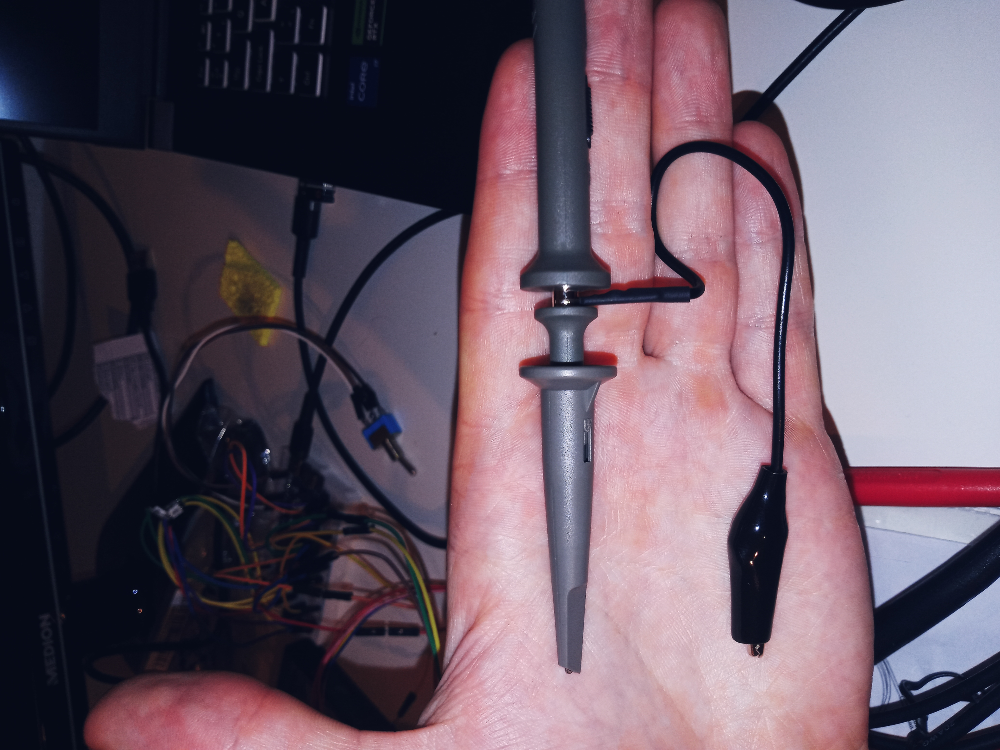  
le probe est équipé d'une pince crocodile que l'on doit **connecter au GND avant de connecter le probe** au signal.
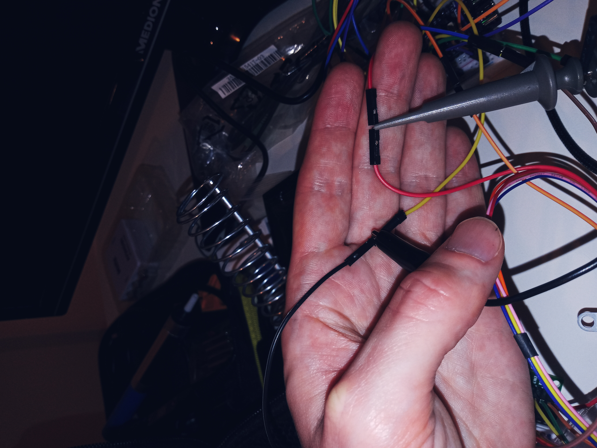    
probe connecté au GND et au signal
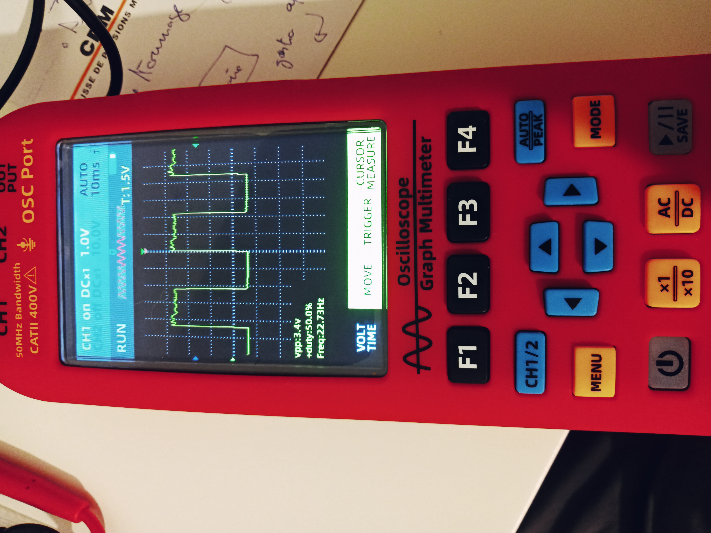  
On peut lire le signal sur l'écran. Lorsque l'on est dans l'onglet **Volt/Time**, les flèches bleus servent à changer l'échelle du temps (horizontal) et de l'ampérage (vertical).  
**Mode** = alterne entre multimètre et oscilloscope.  
**F1**, **F2**, **F3**, **F4** = change d'onglet  
**CH1/2** = alterne entre la probe 1 et 2 si connecté.  
**Move** = déplacé le graph.  
**Trigger** = XXX  
**Save** = prende un screenshot  

## interrupteur 3 point
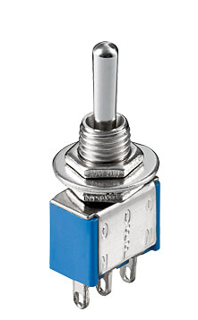 

## fer à souder
Lors de la première utilisation d'une pane, la nourrire d'étain jusqu'à ce que la pointe soit recouverte d'étain et que ce dernier tombe de la pane en goutte. Si un film noir apparaît sur le bout de la pane c'est qu'elle est foutue, elle ne transférera plus la chaleur.

## tresse à dessouder  
couper un bout grand comme la dernière phalange du pouce et le maintenir par une extremité sur la soudure à absorber à l'aide d'une pince. Si il est trop court la chaleur se dissoud dans la pince.  

## tableau composants/unité/symbole
certains composant ont plusieurs unités, j'ai représenté que les plus importantes  

| **Composant**    | ***Unité** | **Symbole** | 
|--------------|----------------------------|----------------------------------------------------------|
| **Capacitor**  | farad|  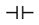    | 
| **resistance** |ohms  |      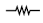      |   
| **inductor**  | henry|      | 
| **diode** | - |      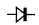      |   
| **diode** | - |            |  
| **motor** | torque |            |   
| **battery** | ampere-hour |            |   
| **bouton** | - | 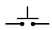 |  
| **switch** | - | 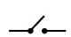 |  
| **3 point switch** | - | 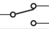 |  

## paramètres du courant, extrèmes théoriques  
Afin de mieux comprendre, voici les cas extrème de "modulation" du courant (sa tension et son intensité) dans un circuit. Dans la pratique, ce qui suit ne serait pas possible car ces exemples ne prennent pas compte des changements que subit le courant lorsque les composants chauffent. Cela ne prend pas non plus la résistance due au diamètre des câbles en compte (plus ils sont fin plus la résistance est grande). Une batterie ne peut pas fournir son maximum, la tension chute un peu quand on lui le demande. Un montage doit utiliser une batterie un peu plus puissante  -> risque ? comment les contrer.

--> Obtenir la tension la plus haute:  
En courant altenratif on utilise un tranformateur.  
En courant continu Il faut un convertisseur Boost. est-ce un transormateur + un élément. lire page wikipedia  
--> Obtenir l'ampérage le plus haut:  
Dans les 2 cas on utilise un convertisseur Buck.   
  
dans les 2 cas la puissance reste identique, si la tension où l'intensité augmente, l'autre doit diminuer car la puissance ne peut pas augmenter.   

Quand on parle de la puissance, ex 10W, cela signifie que la batterie peut fournir 10W durant une heure avant d'être vide. Ainsi on alimenterait 2h un circuit nécessitant 5W.

un composant a besoin que la batterie puisse le voltage indiqué dans son datasheet sans quoi il ne fonctionnera pas. C'est tout où rien.  
Un composant va tirer l'ampérage dont il a besoin. Qu'importe que la batterie puisse lui le fournir où non. C'est la le risque. Si la batterie ne peut pas répondre au besoin en intensité elle va surchauffer ce qui risque de créer une réaction chimique accélérant encore sa surchauffe jusqu'à ce qu'elle prenne feux.    

Analyse de cas d'un circuit alimenté en 10V 10 ampères:  

| **besoin composant**    | ***Puissance** | **réalisable** | **modif. requise |   
|--------------|----------------------------|----------------------------------------------------------|------------|  
| **20V / 20A**  | 400W | ❌   | impossible sans ajouter une source d'alimentation |  
| **20V / 10A**  | 200W | ❌   | impossible sans ajouter une source d'alimentation |   
| **10V / 20A**  | 200W | ❌   | impossible sans ajouter une source d'alimentation. La tension est bonne mais la demande en ampérage va faire surchauffer la batterie |  
| **5V / 5A**  | 25W | ❌   | convertisseur Buck sinon les 10V grilleraient le composant |      
| **10V / 5A**  | 50W | ❌✅   | Il faut mettre une resistance non ? |      
| **5V / 10A**  | 50W | ❌   | convertisseur Buck |      
| **20V / 5A**  | 100W | ❌   | boost |      
| **5V / 20A**  | 100W | ❌   | convertisseur Buck |      

trop de voltage dans le composant: il grille.
pas assed de voltage dans le composant:  
trop d'ampérage dans le composant:  
pas assez   

trop de tension demandée par le composant à la batterie:
pas assez de tension demandée par le composant à la batterie:
trop d'ampérage  demandé par le composant à la batterie:
pas assez d'ampérage demandé par le composant à la batterie:

Dans un montage en série:
La tension n'est pas identique dans tout le circuit, elle baisse après chaque élément, en fonction de la tension requise par l'élément.  
L'ampérage est identique dans tout le circuit.  
  
Dans un montage en parallèle:  
La tension d'entrée est aussi celle que l'on retrouve sur chaque branche (elle sont identique) et à la sortie de l'ambranchement. Comme l'on a pas de baisse de tension c'est l'ampérage qui chute en fonction des composants présent sur chaque branche (il n'est donc pas forcément identique).  
L'ampérage se divise entre les branches en fonction de leur résistance, plus une branche résiste, moins elle aura d'ampérage.

## guideline alimentation circuit
En général, dans un circuit en série, on calcule les besoin en tension basés sur les composants, on regarde de quel ampérage ils ont besoin et quel résistance ils font amener au circuit. On ajoute la resistance du circuit et à parir de ces données on calcule la tension nécessaire et on peut acheter la bonne batterie.   
Voici un exemple: 

| **element** | **résistance**    | ***ampérage** | **tension** |  
|--------------|----------------------------|----------------------------------------------------------|----|     
| **circuit** | 1 | - | - |   
| **composant** | 2  | 3A | 9V |    

-> Le composant a besoin de 9 volt, dans ce cas, comme le montage est dimensionné pour 9V, la multiplication de la somme des tensions donne bien 9V-. (1+2) * 3, On peut simplement utiliser une batterie 9V  
Mais tout n'est pas toujours aussi simple:  

| **element** | **résistance**    | ***ampérage** | **tension** |  
|--------------|----------------------------|----------------------------------------------------------|----|     
| **circuit** | 3 | - | - |   
| **composant** | 2  | 3A | 9V |    

-> Nous utilisons le même composant, il demande toujours 9V mais cette fois le circuit présente plus de résistance. La batterie nécessaire se calcule comme suit: (3+2) * 3 = 15. La baterie est plus puissante.  

En général c'est tout ce qu'on fait: mettre une batterie plus puissante si le voltage n'est pas suffisant. Ajouter une résistance si le voltage est trop puissant. Utiliser des câbles plus gros pour diminuer la resistance si trop de voltage est perdu.  
Attention on ne peut pas avoir plus de voltage que celui fourni par la batterie, à moins d'utiliser un transformateur (gain de voltage perte d'intensité)  
Attention les résistances n'ont pas de stat de tension nécessaire à leur fonctionnement comme les composants. Elles ont qu'une stat de résistance. On l'utilise dans le calcul **V**out = **V**in * (R2 / (R1 + R2)). Elles ont également une statt de puissance (en Watts) c'est ce qu'elle peut supporter.
les résistance font chuter la tension du circuit situé après elle. Elle font chuter l'ampérage global.  

L'ampérage fait monter les composants en chaleur. Un court circuit c'est lorsque la resistance est proche de zéro, l'ampérage grimpe en flêche. les composants fondent  

Tant que la résistance est plus petite que la résistance de notre corps (1000 ohm lorsque l'on est mouillé)on ne risque pas grand chose si ce n'est de se brûler.
Les organes du corps recoivent les ordres sous forme d'influx neveux, dans les faits ce sont de toutes petites impulsions électriques de l'ordre du miliampère. Un ampérage très faible de 0.03A suffit à parasiter le signal et faire fonctionner les organes n'importe comment. Ainsi c'est l'ampérage qui est mortel mais c'est la tension qui permet à l'électricité de nous parcourrir.  

en prenant une réistance ohmique de sécurité de 1000 ohm pour le corps humain, même en basse tension, si on a 50volt à 20 ampère ça représente un danger mortel.

un truc que je comprend pas a propos du montage en parallèle. comment 2 composants avec des besoin en tension différents ne font ils pas chuter la tension différement d'une branche à l'autre ?