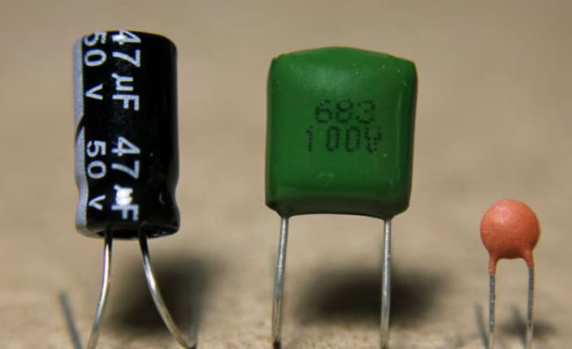
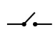

---
date:
  created: 2025-03-02
categories:
  - Outils
  - Composants
tags:
  - Outils
  - Composants
authors:
  - thomas
slug: composants_electronique_et_outils 
---

# composants electronique et outils 

Cet article présente les composants, et les outils nécessaire à la mesure et à la fabrication de circuits électronique.  

<!-- more -->

## bloc d'alimentation PC  
  
Les ordinateurs fonctionnent en **courant continu**. Comme en europe nos prises fournissent du courant alternatif il faut le modifier. c'est le rôle des blocs d'alimentation PC, ça explique pourquoi ils comportent cet élément absent d'un câble d'aspirateur par exemple.  

Il se compose entre autre d'un **redresseur** (où diode) qui ne laisse passer que la partie positive du courant alternatif et d'un **condensateur** qui va **lisser** le courant.

  
## Diode 
  
Ce composant permettant la circulation du courant que dans un sens (de la longue pate à la courte)

## Led WS2812 
  
les led neopixel WS2812 peuvent être chainées ensemble. leur librairie comprend une fonction rainbow() qui étale les couleurs de l'arc-en-ciel le long de la chaine (sans animer leur défilement).

## PCB
   
printed circuit board. le support reliant les composant électroniques à l'aaide de circuit imprimés   

## step moteur 28byj-48   
    
composé de **4 coils** produisant un champ électromagnétique et faisant tourné le moteur sur un maximum de **2048 step**.   
L'ordre d'activation des coils est 1 3 2 4. sûrement pour des raisons pratiques au niveau de la conception du moteur. Cela signifie qu'il faut soit cabler les pin en inversant la 2 et la 3, soit donner les arguments pin au constructeur en dans l'ordre 1 3 2 4.  
  
Puissance et consomation:   
5V, 50Ω, on peut calculer l'ampérage ainsi U = R * I -> 5 = 50 * 0.1. U = 100mA  
Et la puissance comme ceci: P=U * I -> 0.5 = 5 * 0.1. P = 0.5W
Mais tout ça c'est **pour un seul coil**, comme il en utilise deux en même temps il faut doubler le résultat
donc le **moteur** a un **ampérage** d'environ **240mA** nécessitant une puissance d'environ 1W.

## capacitor
   
**Stock l'énergie** et la **redistribue**. Après avoir été chargé, son voltage est égale à celui de sa source. L'énergie qu'il stock, où charge par unité de voltage est nommée **capacitance**, plus sa capacité est élevée plus longtemps il peut fournir de l'énergie. L'**unité de la capacitance** sont les **Farad**, en électronique on parle de micro, nano et pico -farads. Le capacitor est composé de deux plaques conductrices, entre elle il y a une couche isolante résistant à un certain voltage indiqué sur le capacitor. Il ne faut pas le dépasser. Un capacitor stock la charge électrique sans l'énergie électrique en énergie chimique comme le fait une batrie. 

## Batterie
  
Ici on a une batterie Li-Po (pour lithium-polymère), rechargeable, légère. La capacité d'une batterie s'exprime en ampere-heure (Ah) où en miliampere-heure. Cela indique la quantité de charge electrique que la batterie peut stoker ainsi que le temps qu'elle peut fournir de l'énergie. Si elle fournie plus d'énergie elle tiendra moins longtemps.  
1 Ah =  3600 coulombs

> 1 ampère = 1 coulomb / seconde    

Une batterie de 10 Ah peut fournir 1 ampère pendant 10h ou 10 ampère pendant une heure.

## résistance

## Multimètre 
  
Permet de mesurer le potentiel (courant alternatif, courant continu), la résistance et l'ampérage (intensité).  
⚠️ Vérifier que l'ampérage max du multimètre n'est pas dépassé.  
⚠️ Il ne faut pas mesurer le courant alternatif d'un système fonctionnant en courant continu sous peine de détruire l'appareil.

|     | **sous tension** | **hors tension** | 
|--------------|----------------------------|----------------------------------------------------------|
| **en parallèle**  | Potentiel-tension (V)| résistance (Ω) | 
| **en série** | Ampérage (A)  |   

- mesure **en série**: on ouvre la boucle pour faire passer le courant au travers du multimètre. (le multimètre est intégré à la boulce) 
- mesure **en parallèle**: on vient prendre la mesure avant et après un élément de la boucle. le multimètre crée une nouvelle boucle.

## Oscilloscope
Permet de mesurer l'intensité du courant sous forme de graphe, utile pour lire les PWM.  
Ici le modèle BSide09, oscilloscope qui fait aussi multimètre.  
   
le probe vient se connecter sur le dessus de l'appareil. On peut en avoir jusqu'à deux. 
  
le probe est équipé d'une pince crocodile que l'on doit **connecter au GND avant de connecter le probe** au signal.
    
probe connecté au GND et au signal
  
On peut lire le signal sur l'écran. Lorsque l'on est dans l'onglet **Volt/Time**, les flèches bleus servent à changer l'échelle du temps (horizontal) et de l'ampérage (vertical).  
**Mode** = alterne entre multimètre et oscilloscope.  
**F1**, **F2**, **F3**, **F4** = change d'onglet  
**CH1/2** = alterne entre la probe 1 et 2 si connecté.  
**Move** = déplacé le graph.  
**Trigger** = XXX  
**Save** = prende un screenshot  

## interrupteur 3 point
 

## tableau composants/unité/symbole
certains composant ont plusieurs unités, j'ai représenté que les plus importantes  

| **Composant**    | ***Unité** | **Symbole** | 
|--------------|----------------------------|----------------------------------------------------------|
| **Capacitor**  | farad|      | 
| **resistance** |ohms  |            |   
| **inductor**  | henry|      | 
| **diode** | - |            |   
| **diode** | - |            |  
| **motor** | torque |            |   
| **battery** | ampere-hour |            |   
| **bouton** | - |  |  
| **switch** | - |  |  
| **3 point switch** | - |  |  