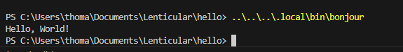
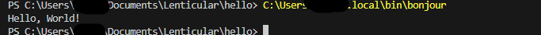
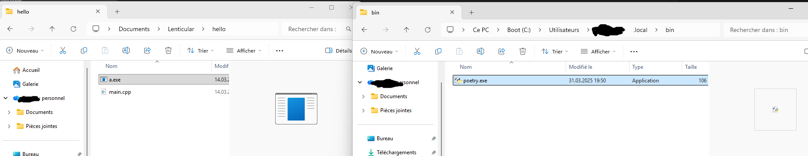
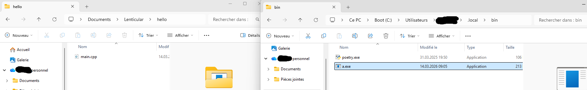
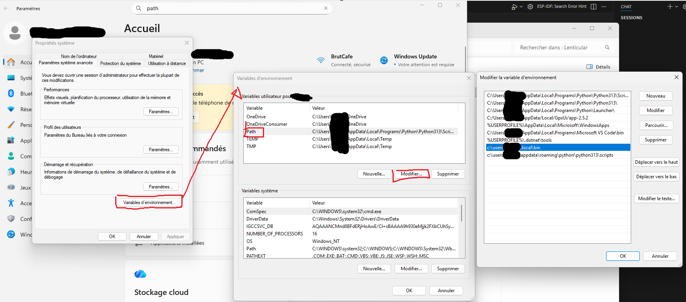
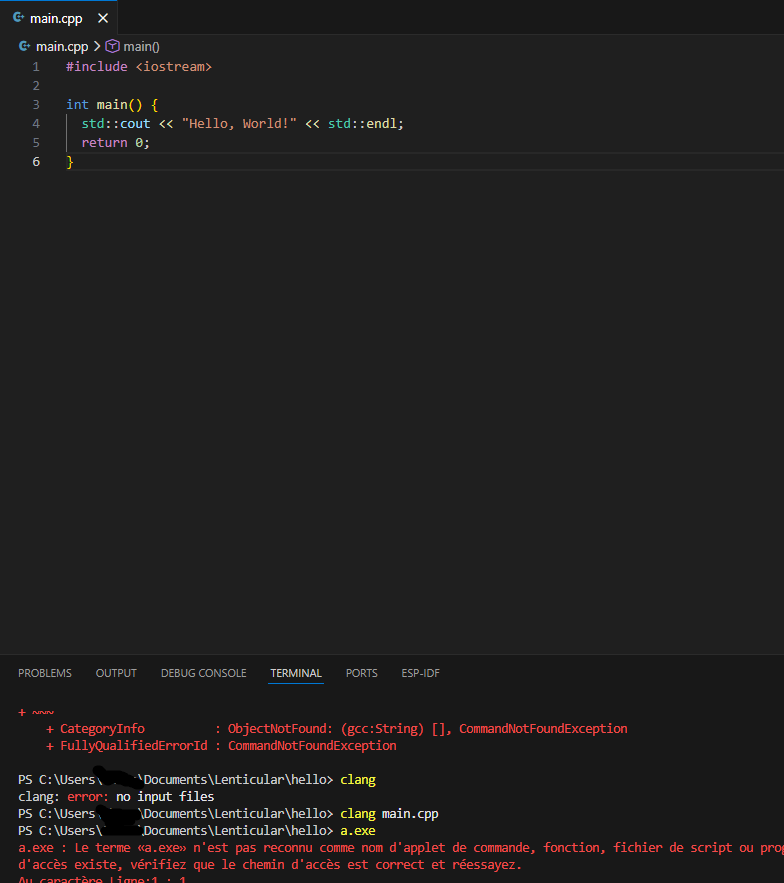
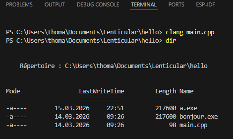

---
date:
  created: 2026-03-15
categories:
  - Informatique
tags:
  - bienC++venue
authors:
  - thomas
slug: programme&executable
---

# Programme et executable

Un programme c'est le fichier de text écrit par le programmeur.
Un executable c'est ce que l'ordinateur peut executer. Pour passer du programme à l'executable, il faut que le compilateur traduise le language de programmation en language binaire. Les executables sont les fichiers .exe.
Dans le language courant on dit aussi programme.
Lorsqu'on lance un executable, le programme s'execute

<!-- more -->


# appeler un programme

En général on a l'habitude de double cliquer sur les icônes de fichiers pour les ouvrir / les lancer. Si on a pas d'icône sur le bureau, on peut utiliser le **terminal** où la **console**, indiquer le chemin relatif où absolu vers le programme que l'on souhaite lancer et le nom de ce programme:  
**.\bonjour** --> chemin relatif: ".\" indique le dossier dans lequel le terminal se situe et "bonjour" est le nom du programme que l'on souhaite executer.  
**C:\Users\xxx\.local\bin\bonjour** --> chemin absolut: On part depuis la racine de l'ordinateur.     
Exemple d'appel depuis les variables d'environement grâce au chemin local puis global.  
    
  


On peut aussi donner uniquement le nom du programme, le terminal va automatiquement chercher dans tous les dossier qui sont dans le path (les variable d'environnement en français) si il s'y trouve, le programme sera lancer.
  
Ci dessous j'ai déplacé mon fichier executable de mon dossier vers les variable d'environnement (bin en est une). a.exe peut donc être appelé par le terminal depuis n'importe où.  
  
    
Voici comment consulter les variables d'environnement: 
      

# creation et mise à jour d'executable
A chaque **modification** du code source (le fichier .cpp). Il faut **sauvegarder puis refaire un nouvel executable**. Pour ce faire on utilise **clang** (abréviation de "C language", il faut le télécharger à moins que l'on utilise un environnement de développement qui l'intègre.) La commande clang [nom du programme] va créer un fichier executable nommé "a" (nom par defaut) dans le dossier contenant notre programme. Par exemple **clang main.cpp** 

   
Ici nous affichons le contenu du directory (le dossier) nous avons bien notre programme main.cpp et le programme a.exe   
     
On voit aussi bonjour.exe, il s'agit du même executable que a.exe mais on a pu le nommer selon notre convenance. pour ce faire on a utiliser la commande **clang [-o nom donné à l'executable] main.cpp** On va donc écrire **clang -o bonjour main.cpp**     

Sous Windows on est pas obligé de mettre .exe dans le nom de notre executable mais ça permet à l'ordinateur de reconnaître qu'il s'agit d'un executable et de le lancer grâce à un double clic. Sans .exe on peut toujours lancer le programme via une ligne de commande.   


# commandes terminal

dir = affiche les fichiers/dossier contenu dans le dossier où se situe actuellement le terminal  
cd = change directory, déplace le terminal dans un autre dossier  
pwd = print working directory, indique le dossier ou se situe le terminal

# modifier une variable lors de l'execution du programme
 Jusqu'à maintenant on a vu comment créer un programme et l'executer, maintenant on va voir comment modifier son execution grâce aux  arguments de la ligne de commande (ce que l'on tape dans le terminal pour appeler le programme).   
 Cela demande de mettre en place une structure spécifique dans notre programme, on va ajouter 2 paramètres à la fonciton principale main():  
 int argc: Il s'agit d'un entier qui compte combien il y a d'élément dans la commande (nom du programme inclu)
 char* argv[]: il s'agit d'un tableau de pointeur de type char. en gros un tableau de string mais C++ étant dérivé de C qui utilise les pointeurs de charactères... on est obligé de faire comme ça. la première entrée de ce tableau (argv[0]) c'est le nom qu'on donne à l'executable. La deuxième entrée du tableau c'est l'argumant de la ligne de commande (le nom que l'on souhaite voir affiché dans notre exemple).  

 Les noms argc et argv sont des conventions, on aurait aussi pu mettre int patate, char* carotte[].  Ce qui compte c'est qu'on aille un entier et un tableau de caractère. Le compteur est ici car contrairement aux vectors, les tableaux ne connaissent pas leur taille.   


```cpp
#include <iostream>
#include <string>

int main(int argc, char* argv[]) {
    // On vérifie si l'utilisateur a donné un nom
    if (argc > 1) {
        std::string nom = argv[1]; // Récupère le premier mot après le nom du programme
        std::cout << "Hello " << nom << " !" << std::endl;
    } else {
        std::cout << "Hello tout le monde !" << std::endl;
    }
    return 0;
} 
```   

Les commandes .\hello Damien et .\hello Simon (pour peu qu'on ait compilé notre programme sous le nom hello) retourneron Hello Damien et Hello Simon. 

Il y a une autre manière de faire mais elle est moins dynamique, on va utiliser une macro (un mot placeholder qui sera remplacé par l'argument de la commande de compilation). Dans notre cas ça va créer un programme dont on aura remplacé toutes les instances de la macro par un nom, on ne pourra pas revenir en arrière, notre hello world saluera toujours la même personne à chaque appel (à moins de recompiller avec un autre paramètre pour remplacer la macro). On parle de changement lors de la compilation.


#include <iostream>

```cpp
int main() {
    // NOM est une variable qui n'existe pas encore, elle sera créée par le compilateur
    std::cout << "Hello " << NOM << " !" << std::endl;
    return 0;
}
```   

commande de compilation: clang++ -o hello -DNOM="\"Damien\"" main.cpp.

Soyons attentif au fait que le programme n'est pas le même, que dans le 1er exemple c'est lors de l'appel de l'executable que le changement ce produit, qu'on peut avoir un résultat différent à chaque appel, via des argument différents lors de l'appel.  l'argument (argv) permet de changer le comportement du programme pendant qu'il tourne.  
Dans le deuxième exemple c'est lors de la compilation que le changement ce produit, que quel que soit l'appel le résultat sera le même. Pour un autre résultat il faut compiler le programme sous un autre nom avec un autre argument. -> Le flag de compilation -D a permis de modifier le programme lors qu'on en a fait un executable.